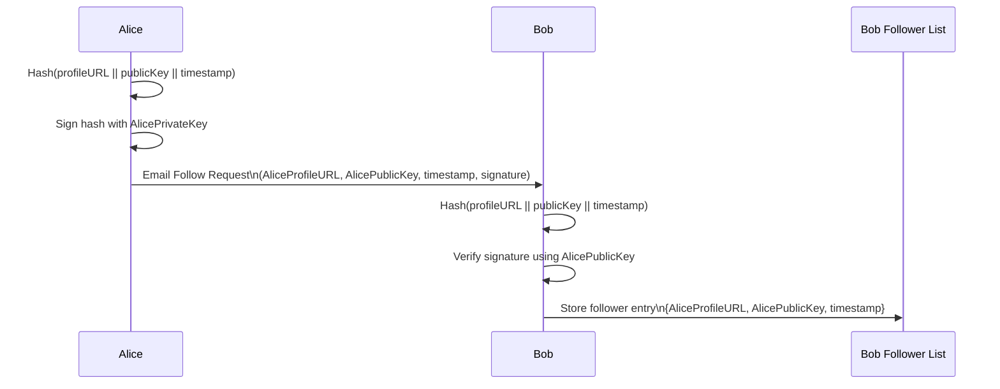
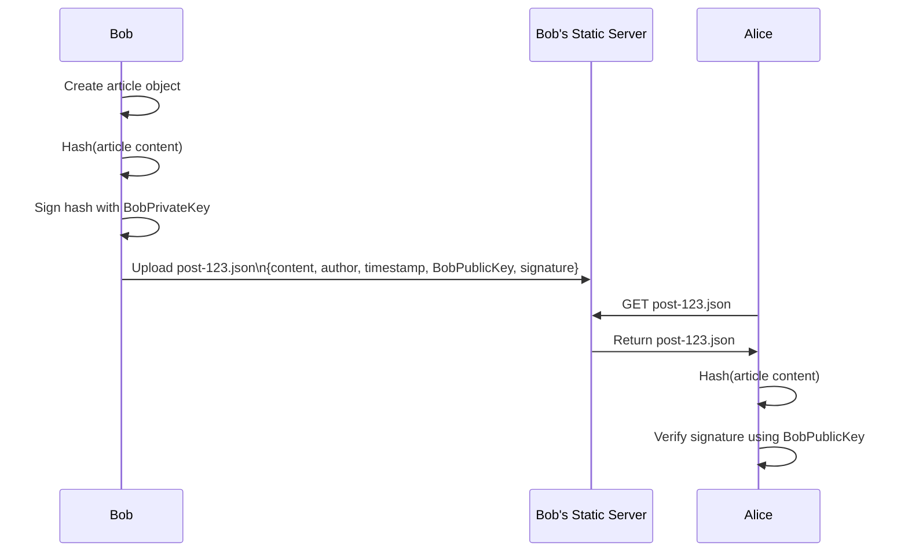
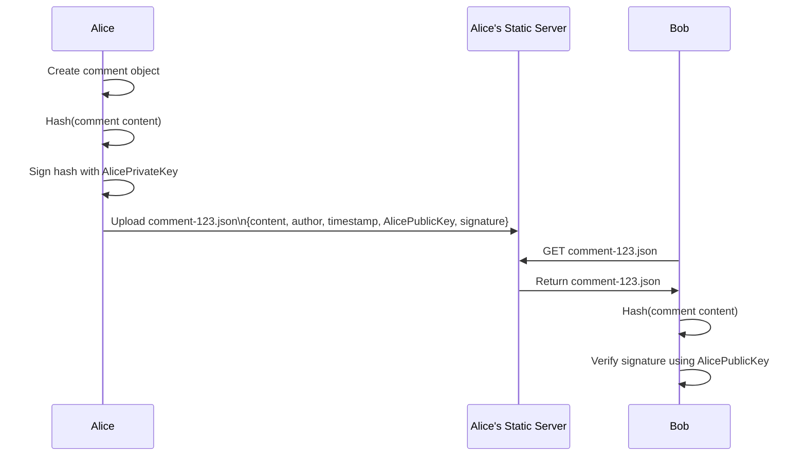
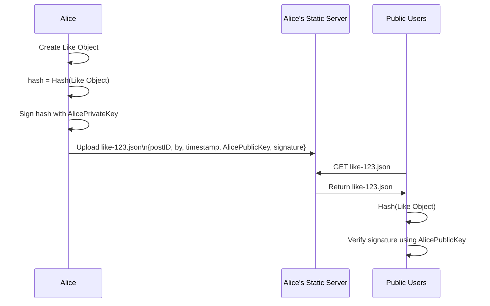
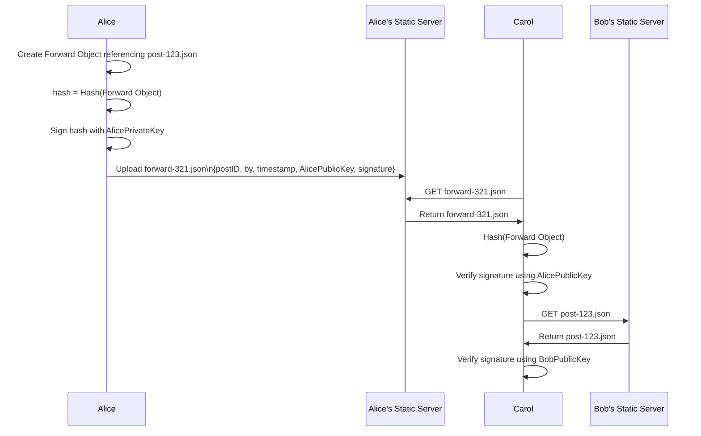

# ELEC4712_Decentralised_Blog
## Intended Workflow

## Follow Request

```mermaid
sequenceDiagram
    participant Alice
    participant Bob
    participant BobFollowerList as Bob Follower List

    Alice->>Alice: Hash(profileURL || publicKey || timestamp)
    Alice->>Alice: Sign hash with AlicePrivateKey

    Alice->>Bob: Email Follow Request\n(AliceProfileURL, AlicePublicKey, timestamp, signature)

    Bob->>Bob: Hash(profileURL || publicKey || timestamp)
    Bob->>Bob: Verify signature using AlicePublicKey

    Bob->>BobFollowerList: Store follower entry\n{AliceProfileURL, AlicePublicKey, timestamp}
```
## Post Article

```mermaid
sequenceDiagram
    participant Bob
    participant BobServer as Bob's Static Server
    participant Alice

    Bob->>Bob: Create article object
    Bob->>Bob: Hash(article content)
    Bob->>Bob: Sign hash with BobPrivateKey

    Bob->>BobServer: Upload post-123.json\n{content, author, timestamp, BobPublicKey, signature}

    Alice->>BobServer: GET post-123.json
    BobServer->>Alice: Return post-123.json

    Alice->>Alice: Hash(article content)
    Alice->>Alice: Verify signature using BobPublicKey
```
## Comment on Post

```mermaid
sequenceDiagram
    participant Alice
    participant AliceServer as Alice's Static Server
    participant Bob

    Alice->>Alice: Create comment object
    Alice->>Alice: Hash(comment content)
    Alice->>Alice: Sign hash with AlicePrivateKey

    Alice->>AliceServer: Upload comment-123.json\n{content, author, timestamp, AlicePublicKey, signature}

    Bob->>AliceServer: GET comment-123.json
    AliceServer->>Bob: Return comment-123.json

    Bob->>Bob: Hash(comment content)
    Bob->>Bob: Verify signature using AlicePublicKey
```
## Like Post

```mermaid
sequenceDiagram
    participant Alice
    participant AliceServer as Alice's Static Server
    participant PublicUsers as Public Users

    Alice->>Alice: Create Like Object
    Alice->>Alice: hash = Hash(Like Object)
    Alice->>Alice: Sign hash with AlicePrivateKey

    Alice->>AliceServer: Upload like-123.json\n{postID, by, timestamp, AlicePublicKey, signature}

    PublicUsers->>AliceServer: GET like-123.json
    AliceServer->>PublicUsers: Return like-123.json

    PublicUsers->>PublicUsers: Hash(Like Object)
    PublicUsers->>PublicUsers: Verify signature using AlicePublicKey
```
## Forward Post

```mermaid
sequenceDiagram
    participant Alice
    participant AliceServer as Alice's Static Server
    participant Carol
    participant BobServer as Bob's Static Server

    Alice->>Alice: Create Forward Object referencing post-123.json
    Alice->>Alice: hash = Hash(Forward Object)
    Alice->>Alice: Sign hash with AlicePrivateKey

    Alice->>AliceServer: Upload forward-321.json\n{postID, by, timestamp, AlicePublicKey, signature}

    Carol->>AliceServer: GET forward-321.json
    AliceServer->>Carol: Return forward-321.json

    Carol->>Carol: Hash(Forward Object)
    Carol->>Carol: Verify signature using AlicePublicKey

    Carol->>BobServer: GET post-123.json
    BobServer->>Carol: Return post-123.json

    Carol->>Carol: Verify signature using BobPublicKey
```

