# Alternative Decentralised Social Protocols
## ActivityPub
## Posting Workflow
### Brief Description:
The following sequence diagram shows how Alice's followers recieve the posts she makes. First of all, Alice creates a Post within here client (e.g. Mastodon app) which then constructs this as a Create activity. The client then sends this to Alice's server by making an HTTP POST to her outbox endpoint. The server validates this activity and stores it Alice's outbox. Following this, Alice's server iterates through all her followers and pushes this same Create activity to each follower's server by POSTing it to their inbox endpoints. The follower's server then all validate the messages and update their timeline. Last of all, the follower's clients get notfied or manually fetch the updated timelines from their server and Alice's post is rendered to their feeds.
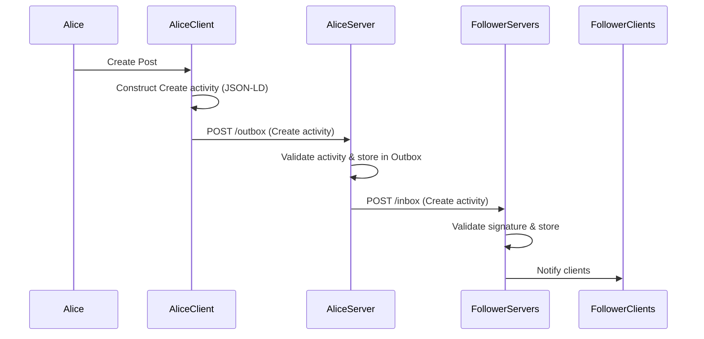
## Following Workflow
### Brief Description:
The sequence diagram shows how Alice starts following Bob. First, Alice specifies Bob's handle with key word Follow on her client. Alice's Client sends this as a Follow activity to her server by HTTP POSTing it to her outbox. This Follow activty is then forwarded to Bob's Server by POSTing to Bob's Inbox endpoint. Bob's server then validates the request, and if accepted adds Alice to his followers list. This server then sends a Accept activity to Alice's Server through POSTing to its inbox. The server then validates, stores the Accept activity and marks Bob as followed. Now, whenever Bob posts, Bob's server will push that post to ALice's server, which will then appear in her timeline.  

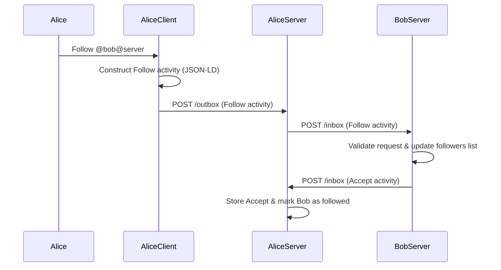
## Nostr
## Posting Workflow
### Brief Description:
The following sequence diagram shows Alice's followers receieve the posts which Alice posts. Firstly once Alice makes her post, Alice's Client Creates a signed event of kind 1 and publishes it to one or more relays. These relays validate the event and store it, then it forwards the event to all of Alice's 'followers' (clients that have subscribed to Alice's public key). The follower's client then build the follower's feed with Alice's post. 

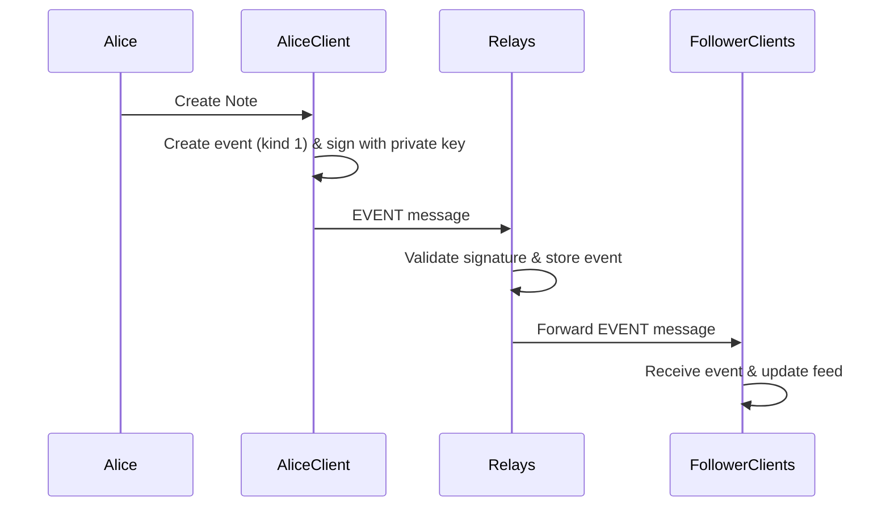
## Following Workflow
### Brief Description:
The following sequence diagram demonstrates how following works in Nostr, which is handled entirely on the client side. Once Bob decides to Follow Alice, Bob's client creates a signed contacts event (kind 3) which lists Alice's public key. This event is then forwarded to multiple relays, later Bob's client sends a REQ subscription message to the relays. This simply tells the relays to send events associated with a target public key. Finally, the relays send Alice's past events and streams her future events. 

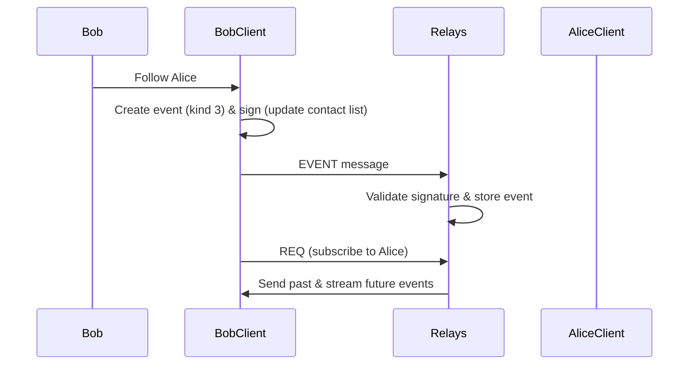
## Secure Scuttlebutt (SSB)
## Posting Workflow
### Brief Description:
The sequence diagram shows the posting workflow in SSB. Once Alice writes a new post, Alice's client creates a message object containing the post content. It asssigns the object the next identifying sequence number in her feed and computes the hash of the previous message, adehering to the feeds linked list data structure. The client then signs this entire message using Alice's private key and appendsit to Alice's local append-only feed. Since SSB is offline-first, when Alice posts, nothing is sent to anyone immediately and followers like Bob will only recieve this post later when the devices connect and gossip replication occurs. 

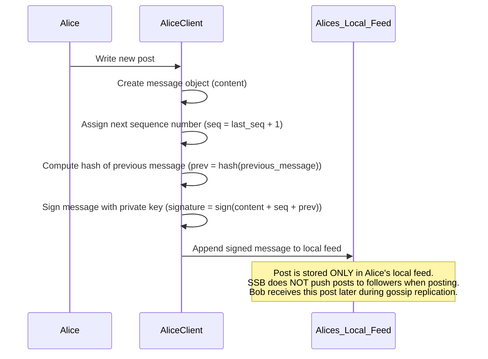
## Following + Replication Workflow
### Brief Description:
This sequence diagram shows how Bob follows Alice by adding her feed ID to his local follow list but does not notfy Alice. Later, when Bob's device connects with Alice's device (e.g. through wifi, pub server) gossip replication begins. This process involves Bob's client asking the Alice's client, what her latest sequence number is. Alice's client responds with the latest (highest) sequence number, so Bob's client then requests any missing messages from before. Once Alice's Client sends the missing signed messages, Bob verifies each signature using Alice's public key. These verfied messages are then appended to Bob's local copy of Alice's feed. Overall, this is a pull-based process and only happens when peers connect. 

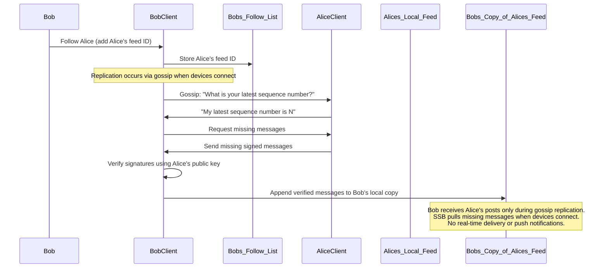
## sAT Protocol (s@)
## Posting Workflow
### Brief Description:
The following diagram shows how posting works in s@ which is entirely static site based and all encryption & processing happens on the browser, not on a server. Once Alice writes a new post on her browser, the browser constructs a plaintext JSON object of the post and it's meta data. A fresh symmetric key is newly generated for this post, and used to encrypt the whole JSON post. This encrypyted post is then named according to its id and uploaded to the posts subfolder within Alice's static site. Alice's browser then updates the index.json file (which is a file listing all post IDs in order) to include the new post's id. Finally, this updated index.json is uploaded to Alice's static site so that her followers can later discover the new post.

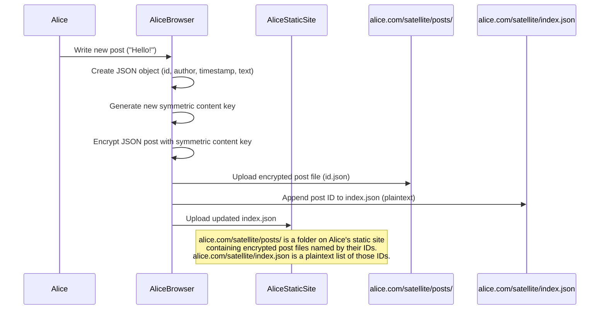
## Following + Replication Workflow
### Brief Description:
The following diagram shows how Bob follows Alice, and later syncronizes to recieve her posts. First of all, Bob intiates a follow action in his browser, specififying Alice's domain name which is then added to Bob's local json follow list by his browser. Bob's Browser then sends a follow request to Alice's static site which then forwards this request to Alice's Browser. Alice's browser then encrypts the symmetric content key (used to decrypt her posts) for Bob specifically using his public key. This encrypted package, known as the key envelope for Bob is then uploaded Alice's Static Site by Alice's Browser. Later, when Bob synchronises Bob's Browser fetches the key envelope and decrypts it with his private key, discovering the symmetric content key. Next, the index.json on Alice's Static Site is fetched by Bob's Browser which lists all Alice's post IDs in plaintext. Each of the IDs in the list corresponds to an encrypted post file within Alice's Static Site (under posts subdirectory). All of these posts are fetched and decrypted by Bob locally using the symmetric content key thus building Bob's feed.

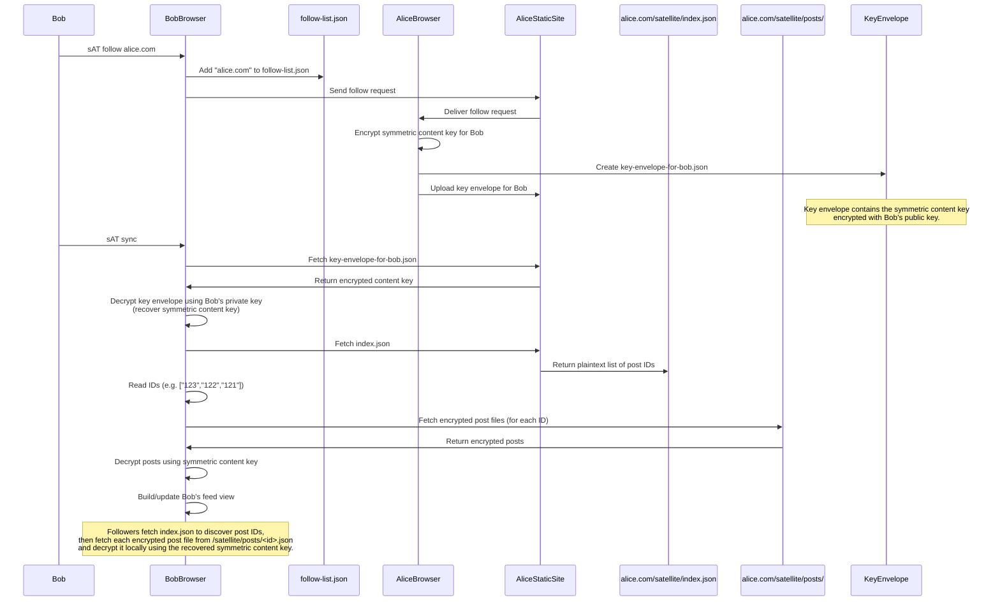
## AT Protocol
## Posting Workflow
### Brief Description:

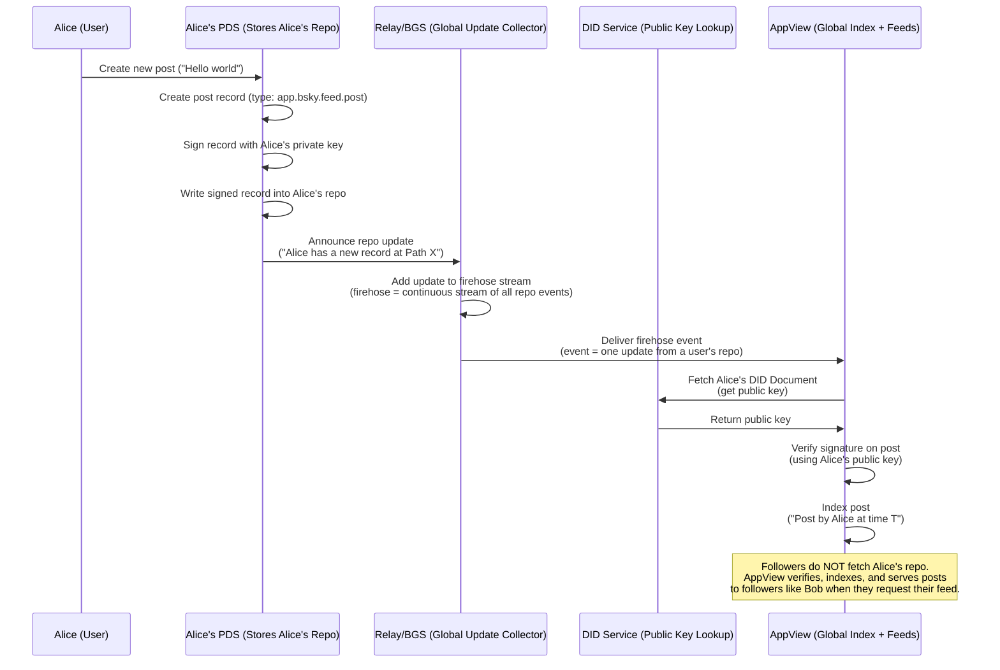
## Following + Replication Workflow
### Brief Description:

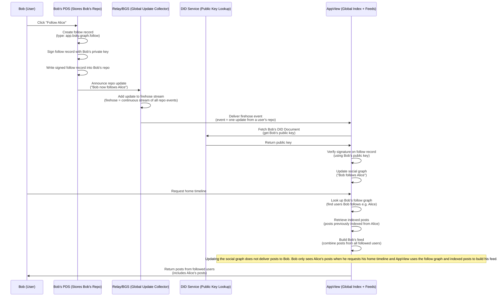

## Git Based Attempts
## social4git
## Posting Workflow
### Brief Description:
The following sequence diagrams shows how posting operates in social4Git, which is a Git-based pull-replication model. When Alice makes a post, her client creates the post file and metadata file which are both commited and pushed to her public repository. Followers recieve the posts only upon manually running social4git sync, which fetches updates from Alice's public repository and copies the new post into their own private repository. 

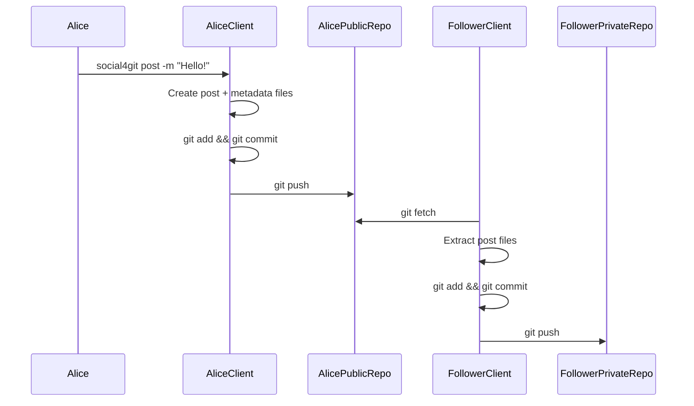
## Following Workflow
### Brief Description:
The following sequence diagram shows Bob attempts to follow Alice in social4git. Once Bob specifies Alice's Repository URL, Bob's client adds the URL to a local following list and uploads it to Bob's private repository which means the following action is completed on Bob's side without approval from Alice. After some time, when Bob wants to retrieve Alice's posts, he runs social4git sync, so his client then runs git fetch to extract any of Alice's new posts and copies them into Bob's private repository.

Following simply means adding a repository URL to a local following list stored in the follower's private repository as shown by the inte
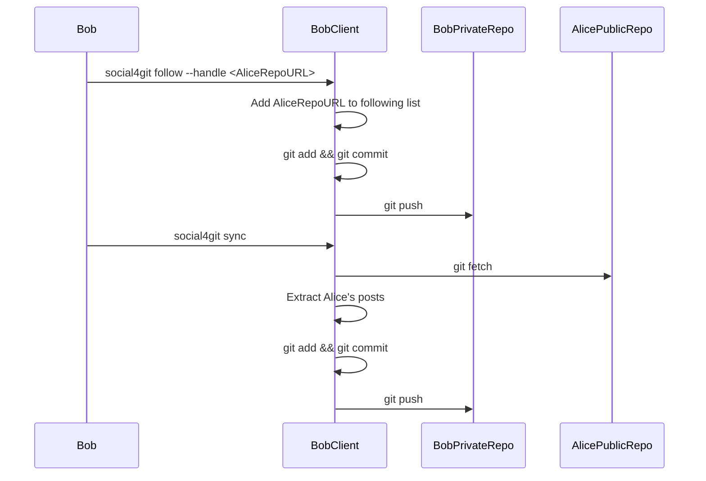
## gitsocial
## Posting Workflow
### Brief Description:
The following sequence diagram shows how posting works in GitSocial. As opposed to social4git, gitsocial has a single Git repository per user which has a dedicated branch called gitsocial for all social activity. When Alice makes a post, Alice's client represents the post as a Git commit on this gitsocial branch. This commit contains the post text along with the GitMsg metadata which indicates whether it is a post, comment, repost, or quote. In order to publish the post, this commit is pushed to Alice's repsoitory, making it available for followers. Since gitsocial is a pull-based replication model, her do not recieve these posts immediately, but the posts become visible when the follower later fetches the gitsocial branch during sync.

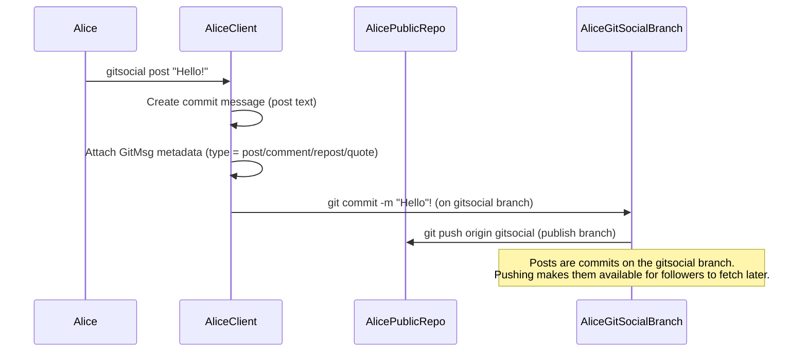
## Following + Replication Workflow
### Brief Description:
The following sequence diagram shows the following and replication workflow. For Bob to folllow Alice this means Bob needs to add Alice's repository URL to a follow-list JSON file stored inside Bob's repository. The steps required for updating this file are usual git steps involving modifying the file, git adding, commiting and then pushing to Bob's Repository. Compared to other conventional protocols, this follow action is local as Alice does not need to approve anything. Later when Bob runs sync, his client reads the follow list to determine which repositores to fetch from. For each of the followed users, the client fetches the gitsocial branch from their repository and the returned commits are stored in Bob's repository. Lastly, to build or update Bob's feed view with Alice's commits (or whoever he follows), Bob's Client interprets GitMsg metadata.

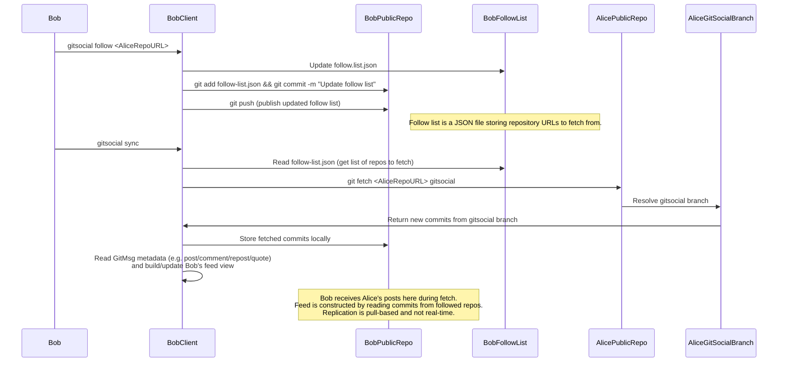
## Octotown
## Posting Workflow
### Brief Description:
The following sequence diagram shows how posting works in Octotown, which unlike other Git-based protocols, reuses GitHub's existing Issues system. Each user has a repository named .social which contains all posts represented as GitHub Issues. When Alice writes a post in the Octotown client, the client constructs a REST API request to the GitHubIssuesAPI, including the post content in the JSON body to the .social endpoint of Alice. Upon recieving the request, GitHub creates a new issue inside the .social repository, which now becomes the published post which followers can later fetch and interact with. 

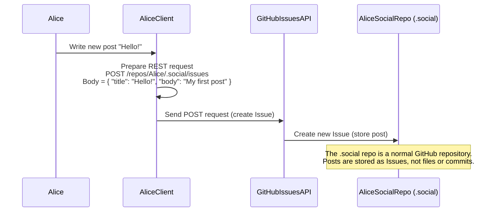
## Following + Replication Workflow
### Brief Description:
The following sequence diagram shows how following works in Octotown, which entirely functions on GitHub's in-built follow system. First of all, Bob has to follow Alice's GitHub profile which then updates GitHub's own follow list of Bob. Next, when Bob opens the Ocototown client to view his feed, his client begins replication by querying GitHub's Follow API to retrive the list of GitHub accounts Bob follows, which should include Alice. Since this list contains only user identities, the client has to determine which of these users participate in social actions through Octotown by checking whether they have a .social repository. For each of the followed users, the client checks if their repository has a .social repository, which would rturn true for Alice meaning she is a octotown user. After confriming this, Bob's client fetches posts, utilising GitHub's list issues for repository operation. Consequently this build's Bob's feed with all issues (posts) stored in the .social repository of the users he follows, including Alice.

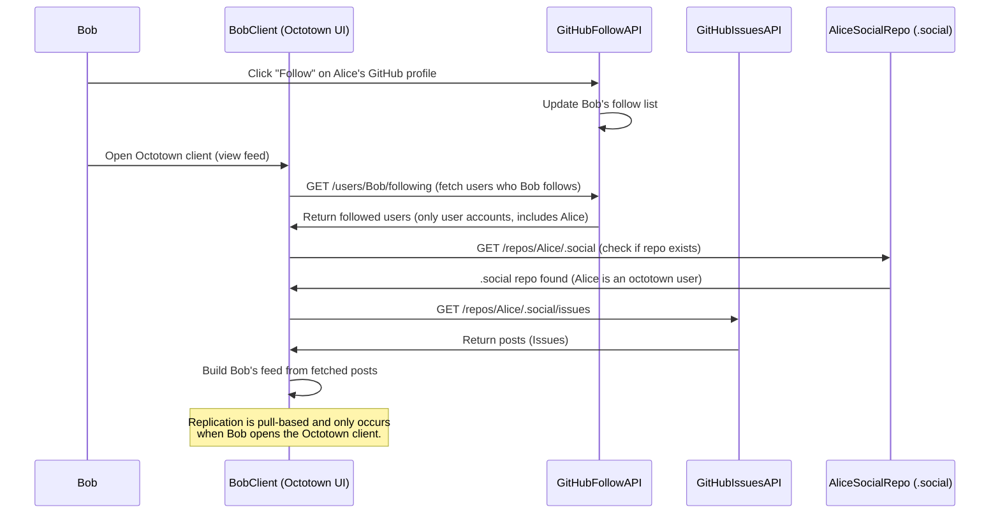
## Git as Federation Transport
## Posting Workflow
### Brief Description:
The following diagram shows the posting workflow for Git as Federation Transport which is a multiple-users per server based model. A single server (e.g. AliceServer) hosts a community of users, similar to Mastadon. Once a user on the server (Alice) creates a post, the server converts the post into a JSON file which is then commited and stored into the servers's Git Repository. After committing, the server pushes the commit (containing the post) to every other server AliceServer follows (here servers follow other servers as opposed to users following users). The push action does not mean that the other servers have actally receieved the post socially since it only transfer Git Objects. Only when the remote servers later run git fetch during their replication cycle, will they be able to built the feed with the posts.

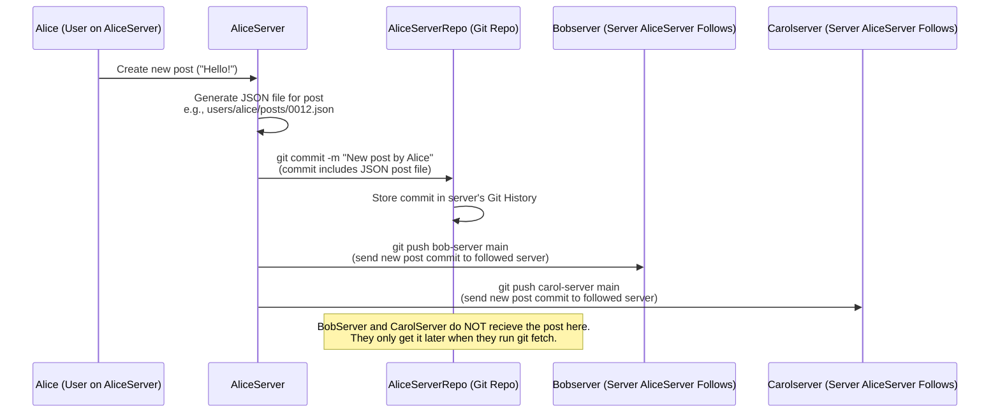
## Following + Replication Workflow
### Brief Description:
The following diagram shows how "following" works in this model, which is server-to-server and not user-to-user. For BobServer to follow AliceServer, BobServer's operator (e.g. admin) adds AliceServer as a Git remote. Once this is configured BobServer periodically runs git fetch to pull new commits from servers it follow which now includes AliceServer. AliceServer responds to BobServer by sending Git packfile which is a bundle of compressed Git objects containing the JSON post file which however is not in a readable form yet. Next, Git on BobServer writes these fetched objects into BobServer's Git repository, while updating its pointer to AliceServer's latest commit. In order to find the JSON post files, BobServer scans the new commits in the repository. The server parses these JSON files and imports them into its own timeline database, upon which the users on BobServer (e.g. Bob, Tom) can see Alice's posts. Overall this model is pull-based, meaning even if AliceServer had pushed to BobServer, BobServer would not show the post unless it later performs a fetch and imports it. This can be seen as a negative as AliceServer's push may effectively be wasted - the server it inteded to send post won't recieve the post until they choose to fetch it.

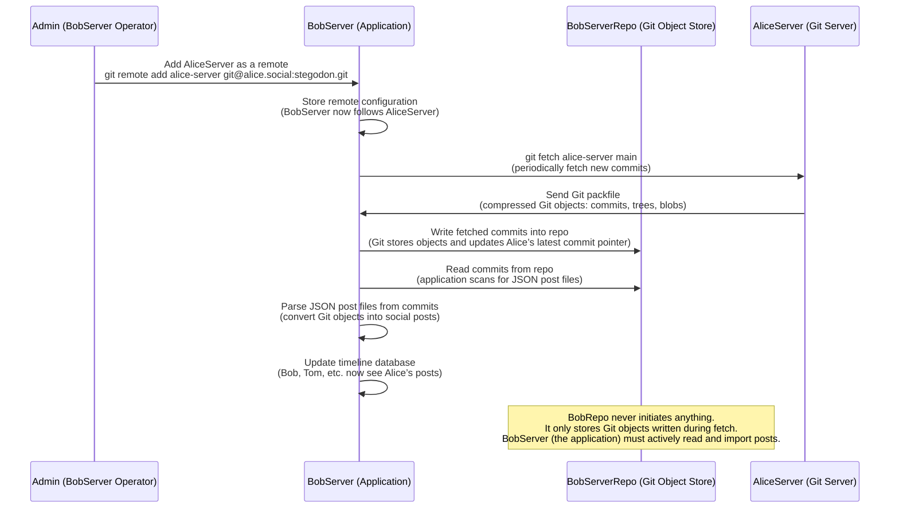

