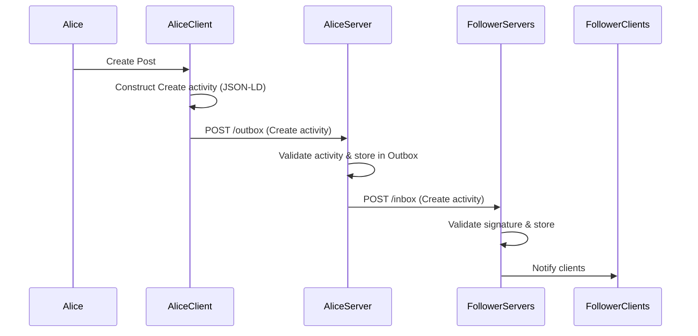
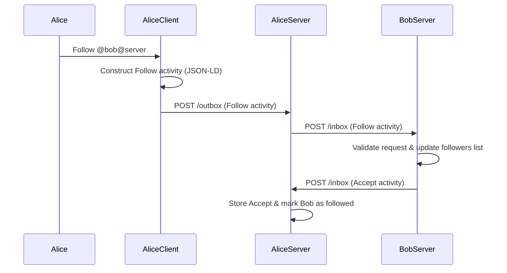
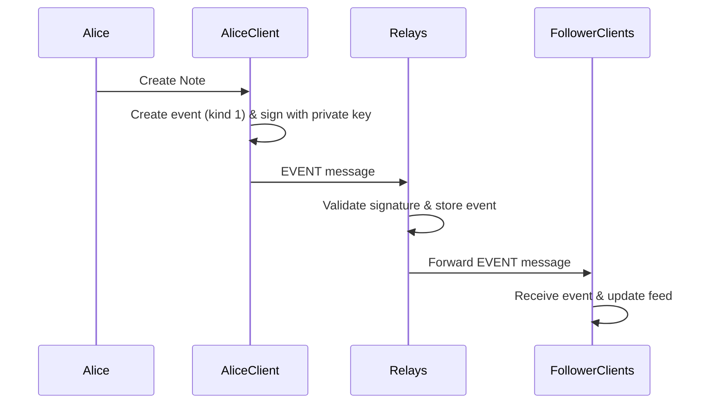
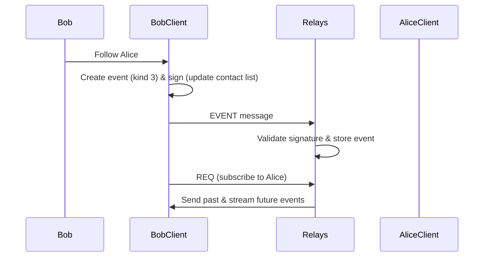
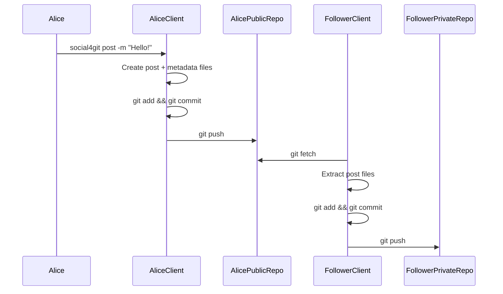
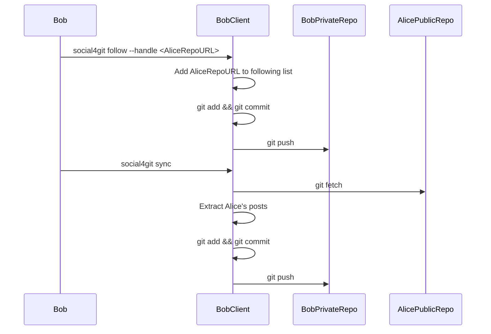

# Alternative Decentralised Social Protocols
## ActivityPub
## Posting Workflow

## Following Workflow

## Nostr
## Posting Workflow

## Following Workflow

## Git Based Attempts
## social4git
## Posting Workflow

## Following Workflow

