# Alternative Decentralised Social Protocols
## ActivityPub
## What it is
ActivityPub is a decentralised social networking protocol where users interact through servers that exchange structured social activities (e.g., Create, Like, Follow) using JSON‑LD over HTTP. It is widely used across the Fediverse and enables interoperability between platforms such as Mastodon and Peer‑Tube. This makes it one of the most established standards for federated social communication.

## How it works 
ActivityPub uses an inbox/outbox model where a user’s client constructs an activity (such as a Create or Follow), sends it to their server, and the server validates and stores it. The server then forwards this activity to the inboxes of follower servers, which also validate it and update their timelines accordingly. This results in a push‑based, server‑mediated delivery mechanism.

## Posting Workflow
### Brief Description:
The following sequence diagram shows how Alice's followers recieve the posts she makes. First of all, Alice creates a Post within here client (e.g. Mastodon app) which then constructs this as a Create activity. The client then sends this to Alice's server by making an HTTP POST to her outbox endpoint. The server validates this activity and stores it Alice's outbox. Following this, Alice's server iterates through all her followers and pushes this same Create activity to each follower's server by POSTing it to their inbox endpoints. The follower's server then all validate the messages and update their timeline. Last of all, the follower's clients get notfied or manually fetch the updated timelines from their server and Alice's post is rendered to their feeds.
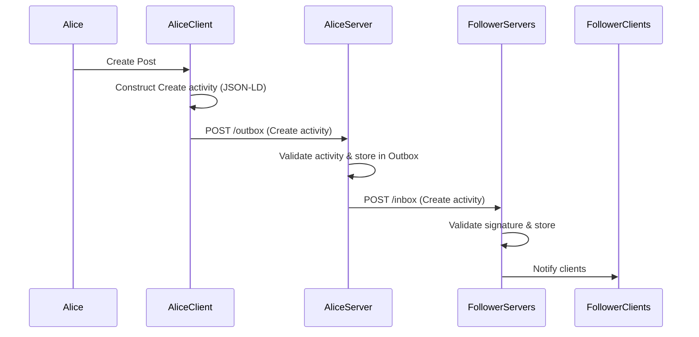
```mermaid
sequenceDiagram
    participant Alice
    participant AliceClient as AliceClient
    participant AliceServer as AliceServer
    participant FollowerServers as FollowerServers
    participant FollowerClients as FollowerClients

    Alice->>AliceClient: Create Post
    AliceClient->>AliceClient: Construct Create activity (JSON-LD)
    AliceClient->>AliceServer: POST /outbox (Create activity)
    AliceServer->>AliceServer: Validate activity & store in Outbox
    AliceServer->>FollowerServers: POST /inbox (Create activity)
    FollowerServers->>FollowerServers: Validate signature & store
    FollowerServers->>FollowerClients: Notify clients
```
## Following Workflow
### Brief Description:
The sequence diagram shows how Alice starts following Bob. First, Alice specifies Bob's handle with key word Follow on her client. Alice's Client sends this as a Follow activity to her server by HTTP POSTing it to her outbox. This Follow activty is then forwarded to Bob's Server by POSTing to Bob's Inbox endpoint. Bob's server then validates the request, and if accepted adds Alice to his followers list. This server then sends a Accept activity to Alice's Server through POSTing to its inbox. The server then validates, stores the Accept activity and marks Bob as followed. Now, whenever Bob posts, Bob's server will push that post to ALice's server, which will then appear in her timeline.  

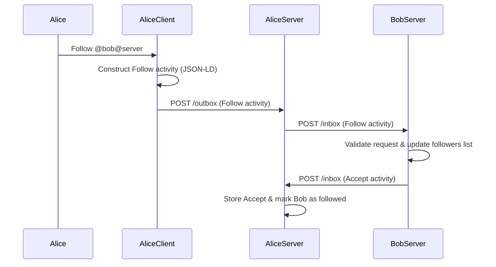
```mermaid
sequenceDiagram
    participant Alice
    participant AliceClient as AliceClient
    participant AliceServer as AliceServer
    participant BobServer as BobServer

    Alice->>AliceClient: Follow @bob@server
    AliceClient->>AliceClient: Construct Follow activity (JSON-LD)
    AliceClient->>AliceServer: POST /outbox (Follow activity)
    AliceServer->>BobServer: POST /inbox (Follow activity)
    BobServer->>BobServer: Validate request & update followers list
    BobServer->>AliceServer: POST /inbox (Accept activity)
    AliceServer->>AliceServer: Store Accept & mark Bob as followed
```
## Strengths
- Rich social vocabulary (Create, Like, Follow, Undo, Announce) which is good for social protocols and many others don’t have it.

- The servers provide security compared to most other protocols as they validate activities (including checking signatures and ensuring message integrity).

- This has been used and adapted across the Fediverse.

- Simple to understand server‑to‑server model.

- The person who attempts to follow you can be validated and accepted/declined, and they receive confirmation once completed.

- Clear HTTP‑based design makes it easy to implement and reason about, contributing to its widespread adoption and interoperability.

## Limitations
- Although the inbox/outbox provide clear responsibilities, it creates a significant infrastructure burden.

- Unlike Git, which is pull‑based and only replicates when users request updates, ActivityPub is push‑based. This is good for immediacy but becomes expensive at scale (as seen in Mastodon, where push fan‑out is a major bottleneck).

- Not Git‑based: no directed acyclic graph, versioning, reverting, or history benefits that Git provides.

- Moderation burden on each server → can resemble many smaller versions of centralised social media, where popular servers may still impose restrictive moderation.

- Server dependency means users rely on their server for identity, availability, and data storage.

- Push‑based fan‑out (server sends a post to every follower) becomes extremely expensive for large accounts, causing scalability issues and centralisation pressure.

## Relevance to my project
- This shows the initial idea of the project → an attempt at decentralised social media.

- It has much of the functionality I would want: a rich social vocabulary of activity types exchanged via HTTP into inboxes and outboxes and validated for integrity (rather than relying on implicit or ad‑hoc mechanisms). The posts themselves are converted to JSON‑LD objects, which may be promising.

- The fact that the followed person can accept the request and update followers is good and common across protocols.

- Compared to other protocols, this has more integrity and social‑media‑oriented functionality, but we need to adapt these ideas into a pull‑based model without servers.

- Static‑based systems would not have push‑based notifications; instead, followers would manually fetch posts, so an alternative lightweight notification mechanism may be required.

- Overall contrast:
  - Git = pull‑based, versioned, structured, static‑hostable  
  - ActivityPub = push‑based, server‑dependent, unversioned

- The concept of Activity types is a key takeaway (as it enables many social actions), and the integrity‑checking approach is also relevant.

- Highlights what our protocol should avoid (server dependency, push fan‑out (server sends to ever follower)) and what concepts we can reuse (structured activity types, validation steps), helping clarify the architectural direction for a Git‑based, pull‑oriented alternative.

## Nostr
## What it is
Nostr is a decentralised social protocol where users publish signed events to independent relays, which store and forward these events to subscribers. It uses public‑key cryptography for identity, allowing users to retain their identity across relays. Its design focuses on simplicity, censorship‑resistance, and minimal reliance on trusted infrastructure.

## How it works
Users create events (for example, kind‑1 events for posts and kind‑3 events for follows) from the notes or actions they perform in their client. The client signs each event with the user’s private key and forwards it to one or more relays. The relays validate the signature using the user’s public key and, if valid, store the event. Clients then subscribe to relays (using REQ messages) to receive past and future events and build the user’s feed. Overall, Nostr achieves a structured social workflow similar to ActivityPub, but using relays instead of servers.

## Posting Workflow
### Brief Description:
The following sequence diagram shows Alice's followers receieve the posts which Alice posts. Firstly once Alice makes her post, Alice's Client Creates a signed event of kind 1 and publishes it to one or more relays. These relays validate the event and store it, then it forwards the event to all of Alice's 'followers' (clients that have subscribed to Alice's public key). The follower's client then build the follower's feed with Alice's post. 

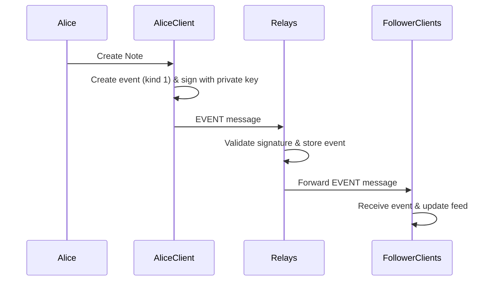
```mermaid
sequenceDiagram
    participant Alice
    participant AliceClient as AliceClient
    participant Relays as Relays
    participant FollowerClients as FollowerClients

    Alice->>AliceClient: Create Note
    AliceClient->>AliceClient: Create event (kind 1) & sign with private key
    AliceClient->>Relays: EVENT message
    Relays->>Relays: Validate signature & store event
    Relays->>FollowerClients: Forward EVENT message
    FollowerClients->>FollowerClients: Receive event & update feed
```
## Following Workflow
### Brief Description:
The following sequence diagram demonstrates how following works in Nostr, which is handled entirely on the client side. Once Bob decides to Follow Alice, Bob's client creates a signed contacts event (kind 3) which lists Alice's public key. This event is then forwarded to multiple relays, later Bob's client sends a REQ subscription message to the relays. This simply tells the relays to send events associated with a target public key. Finally, the relays send Alice's past events and streams her future events. 

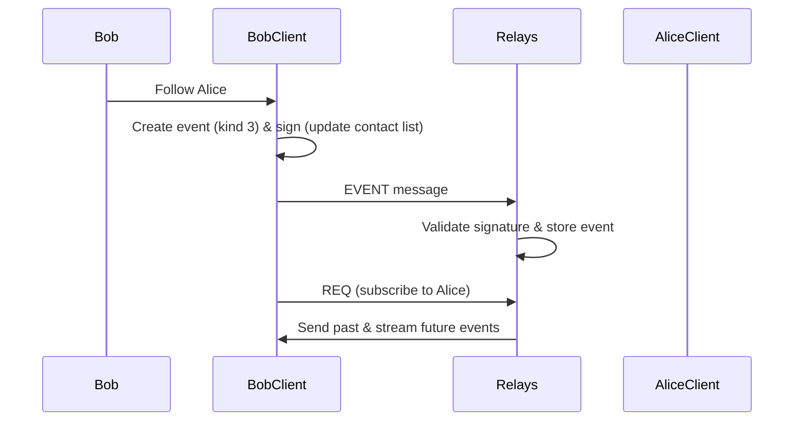
```mermaid
sequenceDiagram
    participant Bob
    participant BobClient as BobClient
    participant Relays as Relays
    participant AliceClient as AliceClient

    Bob->>BobClient: Follow Alice
    BobClient->>BobClient: Create event (kind 3) & sign (update contact list)
    BobClient->>Relays: EVENT message
    Relays->>Relays: Validate signature & store event
    BobClient->>Relays: REQ (subscribe to Alice)
    Relays->>BobClient: Send past & stream future events
```
## Strengths
- Compared to ActivityPub, where there is the issue of servers banning users and if a server is shut down the user loses their identity, in Nostr users maintain their identity and followers through their public key, even if banned on one relay.

- Nostr is built to be inherently censorship‑resistant. Users can freely publish their updates on multiple relays, creating a decentralised ecosystem that stands strong against censorship attempts.

- Identity is portable because it is tied to cryptographic keys rather than server accounts, which reduces dependence on any single operator.

- Relays are relatively simple components (store‑and‑forward nodes), which makes the protocol easy to deploy and contributes to resilience.

## Limitations
- As mentioned, the followed user does not get to accept or deny the request, and their past posts are fetched along with any future posts they make.

- According to analysis from Stacker News (https://stacker.news/items/241444), relays do not track what messages a client already has or what it still needs. As a result, clients often download entire message histories, which wastes bandwidth and computation.

- The same source notes that there is no structured way to relate messages other than timestamps. Because timestamps are the only ordering mechanism, they can be faked, allowing malicious users to create events that appear in the future or the past. This reflects weak ordering guarantees and introduces security risks.

- Furthermore, the reliability of relays is not sufficient: they can drop or lose messages, and there is no robust replication strategy to ensure consistent delivery across relays.

- These weaknesses of the relay model and the insufficient tracking and ordering of posts suggest that a more structured replication strategy, such as Git’s DAG‑based commit model, could be more suitable.

## Relevance to my project
- Shows a truly decentralised platform which has a similar workflow to ActivityPub but with relays instead of servers. It provides integrity with public‑key infrastructure, which is important for my own protocol.

- The use of different types of notes (event kinds) for different types of social actions suggests a common pattern (similar to ActivityPub) where different categories represent different actions while keeping the workflow consistent.

- The relays show how a decentralised protocol is meant to allow user identity to persist even if they are banned on one site, which has implications for the design of my protocol. However, the relays themselves have many limitations.

- The relays do not track client state, and the ordering of commits is not structured, leading to security risks (as with timestamp‑based ordering). Git’s commit‑based structured DAG model tries to address these issues appropriately.

- Nostr therefore illustrates both the benefits of decentralised, key‑based identity and the drawbacks of unstructured replication, reinforcing the motivation for a Git‑based, pull‑oriented, integrity‑preserving protocol design.

## Secure Scuttlebutt (SSB)
## What it is
Secure Scuttlebutt (SSB) is a decentralised social protocol where each user maintains an append‑only log (their feed) stored locally on their device. Each message in the feed is a signed JSON object linked to the previous message, forming a cryptographically verifiable chain. SSB is designed for offline‑first communication and peer‑to‑peer replication without servers.

## How it works
When a user creates a post, their client constructs a message object, assigns it the next sequence number, computes the hash of the previous message, and signs the new message with the user’s private key. The signed message is appended to the user’s local feed, forming a linked list of append‑only logs.
Following another user simply involves adding their feed ID to the local follow list. Replication occurs later through gossip: when two devices connect, they exchange sequence numbers and transfer any missing signed messages. Each received message is verified using the author’s public key before being appended to the local log.

## Posting Workflow
### Brief Description:
The sequence diagram shows the posting workflow in SSB. Once Alice writes a new post, Alice's client creates a message object containing the post content. It asssigns the object the next identifying sequence number in her feed and computes the hash of the previous message, adehering to the feeds linked list data structure. The client then signs this entire message using Alice's private key and appendsit to Alice's local append-only feed. Since SSB is offline-first, when Alice posts, nothing is sent to anyone immediately and followers like Bob will only recieve this post later when the devices connect and gossip replication occurs. 

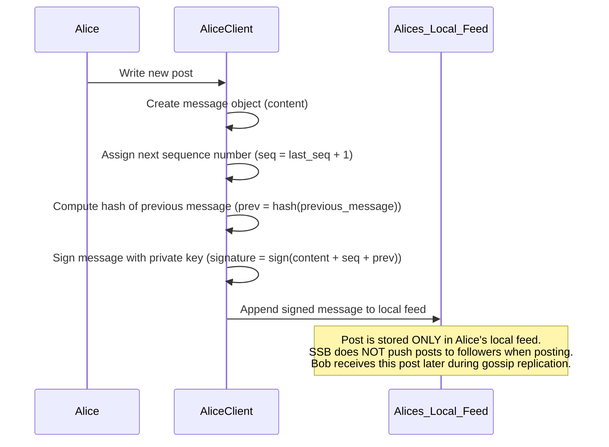
```mermaid
sequenceDiagram
    participant Alice
    participant AliceClient
    participant AliceFeed as Alices_Local_Feed

    Alice->>AliceClient: Write new post
    AliceClient->>AliceClient: Create message object (content)
    AliceClient->>AliceClient: Assign next sequence number (seq = last_seq + 1)
    AliceClient->>AliceClient: Compute hash of previous message (prev = hash(previous_message))
    AliceClient->>AliceClient: Sign message with private key (signature = sign(content + seq + prev))
    AliceClient->>AliceFeed: Append signed message to local feed

    Note over AliceFeed: Post is stored ONLY in Alice's local feed.<br>SSB does NOT push posts to followers when posting.<br>Bob receives this post later during gossip replication.
```
## Following + Replication Workflow
### Brief Description:
This sequence diagram shows how Bob follows Alice by adding her feed ID to his local follow list but does not notfy Alice. Later, when Bob's device connects with Alice's device (e.g. through wifi, pub server) gossip replication begins. This process involves Bob's client asking the Alice's client, what her latest sequence number is. Alice's client responds with the latest (highest) sequence number, so Bob's client then requests any missing messages from before. Once Alice's Client sends the missing signed messages, Bob verifies each signature using Alice's public key. These verfied messages are then appended to Bob's local copy of Alice's feed. Overall, this is a pull-based process and only happens when peers connect. 

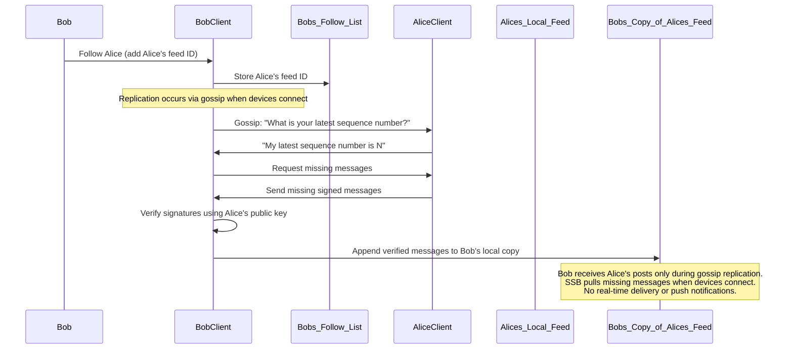
```mermaid
sequenceDiagram
    participant Bob
    participant BobClient
    participant BobFollowList as Bobs_Follow_List
    participant AliceClient
    participant AliceFeed as Alices_Local_Feed
    participant BobFeed as Bobs_Copy_of_Alices_Feed

    Bob->>BobClient: Follow Alice (add Alice's feed ID)
    BobClient->>BobFollowList: Store Alice's feed ID

    Note over BobClient: Replication occurs via gossip when devices connect

    BobClient->>AliceClient: Gossip: "What is your latest sequence number?"
    AliceClient->>BobClient: "My latest sequence number is N"

    BobClient->>AliceClient: Request missing messages
    AliceClient->>BobClient: Send missing signed messages

    BobClient->>BobClient: Verify signatures using Alice's public key
    BobClient->>BobFeed: Append verified messages to Bob's local copy

    Note over BobFeed: Bob receives Alice's posts only during gossip replication.<br>SSB pulls missing messages when devices connect.<br>No real-time delivery or push notifications.
```
## Strengths
- The feed is strongly protected as it is stored locally and cryptographically signed, and the protocol is largely spam‑resistant because you only receive messages from people you follow.

- The protocol is fully decentralised, with no central servers controlling visibility or access; replication occurs purely through peer‑to‑peer gossip.

- The linked‑list structure of messages resembles how commits are stored in Git, showing that a Git‑like model is conceptually compatible with decentralised social data.

- Gossip replication has been successfully deployed in real‑world contexts, such as European train networks (SBB free Wi‑Fi), demonstrating its offline‑first robustness.

- Users only download messages from peers they follow, which spreads data reliably and reduces exposure to harassment or unsolicited content.

## Limitations 
- Gossip replication is reliable but spreads data slowly, since users only download messages from peers they follow. This suggests that Git‑based replication could be more efficient, as it allows peers to synchronise without requiring local connectivity and leverages existing infrastructure.

- The append‑only log structure is similar to Git but far less flexible. Because logs cannot be rewritten or pruned, storage grows indefinitely and the timeline cannot be reorganised, unlike Git’s DAG which supports branching, merging, and history editing.

- According to external analysis (e.g., Medium’s “Definitive Guide to Secure Scuttlebutt”), SSB’s documentation is sparse and its user interfaces are not intuitive, which reduces accessibility for new users.

- Due to the append‑only nature of logs, storage usage becomes a serious limitation over time.

- As data grows, gossip replication becomes increasingly inefficient, since peers must exchange large amounts of data during synchronisation.

- The rigidity of the append‑only model and the slow, proximity‑based replication highlight the need for a more structured and scalable replication strategy, such as Git’s DAG‑based approach.

## Relevance to my project
- SSB shows a decentralised model without servers or relays forwarding posts; instead, replication occurs later through gossip when devices connect. This aligns closely with the static‑site‑based, pull‑oriented design of my protocol.

- The structure of feeds is similar to Git, demonstrating the viability of a linked‑list‑style data structure. However, the append‑only nature introduces rigidity and storage issues, suggesting that Git’s DAG is more suitable.

- The feed is strongly protected cryptographically, implying that my protocol should also sign posts (e.g., hashing content + referencing previous messages). However, SSB’s model—where only followed users can see your posts—does not scale well for large‑scale social interactions.

- Compared to Git’s DAG, SSB is less flexible because it cannot restructure history, merge changes, or rewrite data. This reinforces the need for a Git‑based replication model in my protocol.

## sAT Protocol (s@)
## What it is
The sAT Protocol (s@) is a decentralised, static‑site‑based social protocol where each user hosts their social data on their own domain under a dedicated directory named /satellite/. Posts and user metadata are stored as encrypted JSON files, and all interactions occur through browser‑side encryption and static‑site updates. It is designed for small, privacy‑preserving social groups without servers, relays, or backend infrastructure.

## How it works
When a user creates a post, their browser constructs a JSON object representing the post, generates a new symmetric content key, encrypts the post with this key, and uploads the encrypted file to /satellite/posts/. The post’s ID is appended to index.json, which acts as a plaintext list of post identifiers for replication.
Following another user involves adding their domain to a local follow list and exchanging encrypted “key envelopes,” where the symmetric content key is encrypted individually for each follower. Replication occurs when the follower’s browser fetches the index file, retrieves encrypted posts one by one, decrypts the content key using their private key, and then decrypts each post using the symmetric key.

## Posting Workflow
### Brief Description:
The following diagram shows how posting works in s@ which is entirely static site based and all encryption & processing happens on the browser, not on a server. Once Alice writes a new post on her browser, the browser constructs a plaintext JSON object of the post and it's meta data. A fresh symmetric key is newly generated for this post, and used to encrypt the whole JSON post. This encrypyted post is then named according to its id and uploaded to the posts subfolder within Alice's static site. Alice's browser then updates the index.json file (which is a file listing all post IDs in order) to include the new post's id. Finally, this updated index.json is uploaded to Alice's static site so that her followers can later discover the new post.

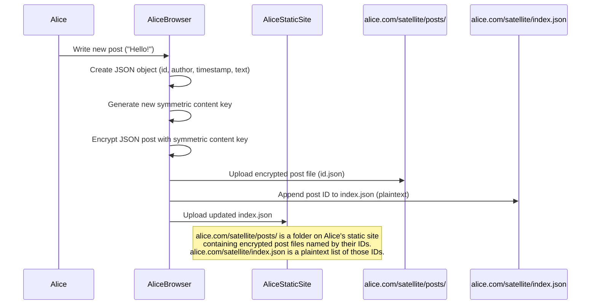
```mermaid
sequenceDiagram
    participant Alice
    participant AliceBrowser as AliceBrowser
    participant AliceSite as AliceStaticSite
    participant PostsDir as alice.com/satellite/posts/
    participant IndexFile as alice.com/satellite/index.json

    Alice->>AliceBrowser: Write new post ("Hello!")
    AliceBrowser->>AliceBrowser: Create JSON object (id, author, timestamp, text)
    AliceBrowser->>AliceBrowser: Generate new symmetric content key
    AliceBrowser->>AliceBrowser: Encrypt JSON post with symmetric content key
    AliceBrowser->>PostsDir: Upload encrypted post file (id.json)
    AliceBrowser->>IndexFile: Append post ID to index.json (plaintext)
    AliceBrowser->>AliceSite: Upload updated index.json

    Note over AliceSite: alice.com/satellite/posts/ is a folder on Alice's static site<br>containing encrypted post files named by their IDs.<br>alice.com/satellite/index.json is a plaintext list of those IDs.
```
## Following + Replication Workflow
### Brief Description:
The following diagram shows how Bob follows Alice, and later syncronizes to recieve her posts. First of all, Bob intiates a follow action in his browser, specififying Alice's domain name which is then added to Bob's local json follow list by his browser. Bob's Browser then sends a follow request to Alice's static site which then forwards this request to Alice's Browser. Alice's browser then encrypts the symmetric content key (used to decrypt her posts) for Bob specifically using his public key. This encrypted package, known as the key envelope for Bob is then uploaded Alice's Static Site by Alice's Browser. Later, when Bob synchronises Bob's Browser fetches the key envelope and decrypts it with his private key, discovering the symmetric content key. Next, the index.json on Alice's Static Site is fetched by Bob's Browser which lists all Alice's post IDs in plaintext. Each of the IDs in the list corresponds to an encrypted post file within Alice's Static Site (under posts subdirectory). All of these posts are fetched and decrypted by Bob locally using the symmetric content key thus building Bob's feed.

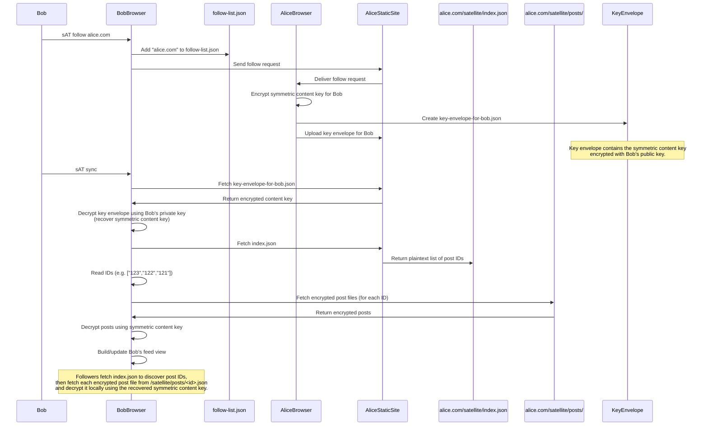
```mermaid
sequenceDiagram
    participant Bob
    participant BobBrowser as BobBrowser
    participant BobFollowList as follow-list.json
    participant AliceBrowser as AliceBrowser
    participant AliceSite as AliceStaticSite
    participant IndexFile as alice.com/satellite/index.json
    participant AlicePosts as alice.com/satellite/posts/

    Bob->>BobBrowser: sAT follow alice.com
    BobBrowser->>BobFollowList: Add "alice.com" to follow-list.json

    BobBrowser->>AliceSite: Send follow request
    AliceSite->>AliceBrowser: Deliver follow request

    AliceBrowser->>AliceBrowser: Encrypt symmetric content key for Bob
    AliceBrowser->>KeyEnvelope: Create key-envelope-for-bob.json
    AliceBrowser->>AliceSite: Upload key envelope for Bob

    Note over KeyEnvelope: Key envelope contains the symmetric content key<br>encrypted with Bob's public key.

    Bob->>BobBrowser: sAT sync
    BobBrowser->>AliceSite: Fetch key-envelope-for-bob.json
    AliceSite->>BobBrowser: Return encrypted content key
    BobBrowser->>BobBrowser: Decrypt key envelope using Bob's private key<br>(recover symmetric content key)

    BobBrowser->>AliceSite: Fetch index.json
    AliceSite->>IndexFile: Return plaintext list of post IDs
    BobBrowser->>BobBrowser: Read IDs (e.g. ["123","122","121"])

    BobBrowser->>AlicePosts: Fetch encrypted post files (for each ID)
    AlicePosts->>BobBrowser: Return encrypted posts
    BobBrowser->>BobBrowser: Decrypt posts using symmetric content key
    BobBrowser->>BobBrowser: Build/update Bob's feed view

    Note over BobBrowser: Followers fetch index.json to discover post IDs,<br>then fetch each encrypted post file from /satellite/posts/<id>.json<br>and decrypt it locally using the recovered symmetric content key.
```
## Strengths
- This protocol aligns strongly with the goal of a fully static‑hostable system: all social data is stored on static sites (e.g., GitHub Pages) with no servers, relays, or backend infrastructure.

- Provides integrity through HTTPS/TLS and confidentiality through strong symmetric encryption, where each follower receives their own encrypted content key. Importantly, sAT combines symmetric and asymmetric cryptography: posts are encrypted with a symmetric content key, and that key is then encrypted individually for each follower using asymmetric encryption. This hybrid model provides full confidentiality while avoiding the cost of encrypting large posts with public‑key cryptography.

- Unfollowing is handled securely: the user generates a new content key, re‑encrypts all posts, and issues new key envelopes only to remaining followers, ensuring the unfollowed user immediately loses access.

- Represents social actions using structured JSON objects (id, author, timestamp, text, reply metadata), similar to ActivityPub’s activity objects.

- The use of a dedicated `/satellite/` directory cleanly isolates social activity from the rest of the static site, similar to directory‑scoped Git‑based protocols like Octotown. 

## Limitations
- Feed aggregation is slow and does not scale well, as the browser must fetch each encrypted post file individually and decrypt them one by one.

- The protocol is suited mainly for small friend groups: there is no discoverability, and connections rely on personal relationships rather than public search or federation.

- There is no support for nested replies, limiting the expressiveness of social interactions.

- The browser must store the user’s private key, raising practical concerns about secure key storage and portability across devices.

- The replication workflow is computationally heavy: each follower must decrypt the content key and then decrypt every post, making the protocol inefficient for larger networks.

## Relevance to my project
- sAT demonstrates a purely decentralised, static‑hostable protocol with strong confidentiality and integrity guarantees, making it conceptually aligned with the goals of my project.

- Its symmetric‑key‑based security model shows how confidentiality can be preserved without servers or relays, but also highlights the computational cost of per‑post encryption and decryption. The hybrid use of symmetric encryption (for content) and asymmetric encryption (for distributing the content key) is an important design insight for balancing confidentiality and performance.

- Compared to ActivityPub and Nostr, which support richer social actions, sAT is more limited (e.g., no nested replies), suggesting that a more flexible object model (e.g., ActivityPub’s activity types or Nostr’s event kinds) may be preferable.

- The heavy encryption and slow replication suggest that a simpler, more efficient replication mechanism—such as Git’s DAG‑based model—may provide a better balance between security, scalability, and performance.

- The use of a dedicated directory (`/satellite/`) reinforces the design idea of isolating social data within a structured subdirectory, which is also seen in Git‑based protocols like Octotown.

## AT Protocol
## What it is
AT Protocol is a decentralised social networking protocol built around signed, per‑user repositories, Personal Data Servers (PDS), and a DID‑based portable identity system. It separates identity, data storage, indexing, and distribution into distinct services (PDS, AppView, BGS, DID Service). This architecture decentralises identity and data ownership, but still relies on servers for hosting and replication.

## How it works
Each user has a Personal Data Server (PDS) that stores a signed repository containing their social records (posts, likes, follows, media blobs). The repository is a custom DAG‑like structure defined by Lexicon schemas, not a Git repository, but it similarly isolates all social activity into a structured store.

When a user creates a post, the client constructs a record, signs it with the user’s private key, and writes it into the repository. AT Protocol uses public‑key cryptography for signing and identity verification, but does not encrypt posts, so all content is public.

The PDS announces repository updates to the Big Graph Service (BGS), which aggregates updates from all PDS instances into a global “firehose” stream. The AppView consumes this stream, verifies signatures using the user’s DID Document, indexes the post, and makes it available for feed generation.

Portable identity is enabled by the DID Service: a user’s handle (DNS name) resolves to a DID, and the DID Document contains the user’s public keys and PDS endpoint. Updating the DID Document allows the user to migrate to a new PDS without losing their identity or social graph.

## Posting Workflow
### Brief Description:
The following diagram shows the posting workflow in AT Protocol, where each user has their own Personal Data Server (PDS) to which users interact with to create posts. When Alice creates a post, her PDS creates a post record (app.bsky.feed.post) which contains the post content and metadata. The post record is then signed with Alice's private key and written into Alice's repo (Alice’s repo = her AT Protocol repository, a signed Merkle tree of records stored on her PDS — not a GitHub repository) by Alice's PDS. The PDS announces a repo update to the Relay/BGS service which collects updates from many PDS and appends them to the firehose (stream of all repo events across the network). The AppView then receieves the events, including Alice's post record who's signature is then verified using Alice's public key (which is fetched from Alice's DID Document). Once the post is verfied, AppView indexes the post into its global database so it can later be used for feeds, search and discovery. The post is not fetched from Alice's repository directly, instead followers later retrieve Alice's posts from AppView when requesting from timeline.

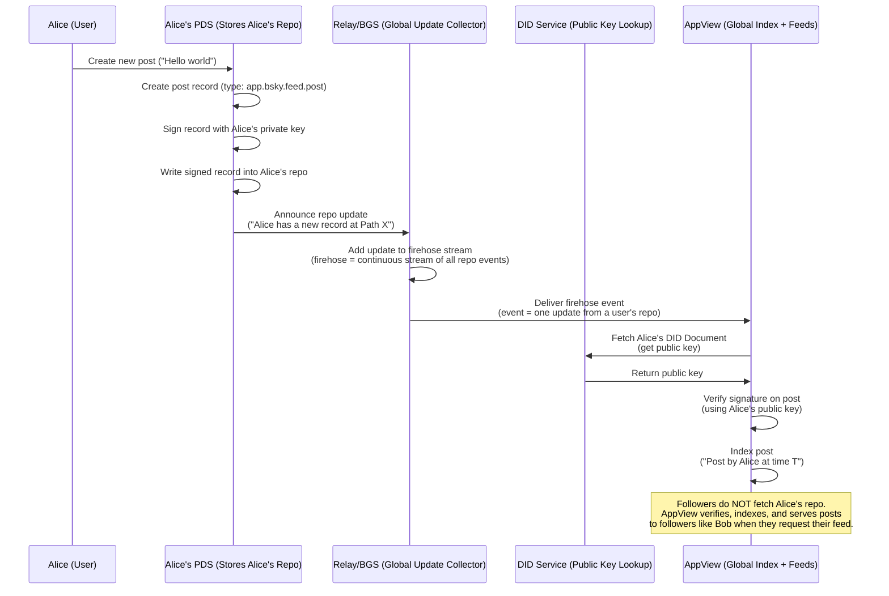
```mermaid
sequenceDiagram
    participant Alice as Alice (User)
    participant AlicePDS as Alice's PDS (Stores Alice's Repo)
    participant Relay as Relay/BGS (Global Update Collector)
    participant DID as DID Service (Public Key Lookup)
    participant AppView  as AppView (Global Index + Feeds)

    Alice->>AlicePDS: Create new post ("Hello world")

    AlicePDS->>AlicePDS: Create post record (type: app.bsky.feed.post)
    AlicePDS->>AlicePDS: Sign record with Alice's private key
    AlicePDS->>AlicePDS: Write signed record into Alice's repo

    AlicePDS->>Relay: Announce repo update<br>("Alice has a new record at Path X")

    Relay->>Relay: Add update to firehose stream<br>(firehose = continuous stream of all repo events)
    Relay->>AppView: Deliver firehose event<br>(event = one update from a user's repo)

    AppView->>DID: Fetch Alice's DID Document<br>(get public key)
    DID->>AppView: Return public key 

    AppView->>AppView: Verify signature on post<br>(using Alice's public key)
    AppView->>AppView: Index post<br>("Post by Alice at time T")

    Note over AppView: Followers do NOT fetch Alice's repo.<br>AppView verifies, indexes, and serves posts<br>to followers like Bob when they request their feed.
```
## Following + Replication Workflow
### Brief Description:
The diagram belows shows the following and replication workflow for AT Protocol, when Bob tries to follow Alice, Bob's BDS creates a follow record inside Bob's repository. This follow record is signed by Bob's private key and written into Bob's repo by the PDS which then announces this update to Relay/BGS, in turn which adds the event to the firehose stream of events. Next once, AppView receives the follow event from the firehose, it uses Bob's public key to verify the signature of the event and upon verification updates its social graph to record that Bob follows Alice. However this step does not deliver Alice's post to Bob, but only later when Bob opens his app and requests his feed/timeline, he can see Alice's post. Internally when Bob requests his timeline, AppView looks up Bob's follow graph to determine who he follows. Then indexed posts from users (including Alice) which were previously processing during the posting workflow are retrieved, lastly building Bob's feed by combining posts from all follwed users.

then retrieves indexed posts from users (including Alice) 

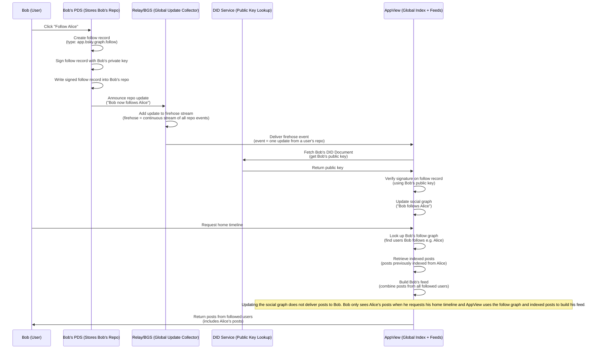
```mermaid
sequenceDiagram
    participant Bob as Bob (User)
    participant BobPDS as Bob's PDS (Stores Bob's Repo)
    participant Relay as Relay/BGS (Global Update Collector)
    participant DID as DID Service (Public Key Lookup)
    participant AppView as AppView (Global Index + Feeds)

    Bob->>BobPDS: Click "Follow Alice"
    BobPDS->>BobPDS: Create follow record<br>(type: app.bsky.graph.follow)
    BobPDS->>BobPDS: Sign follow record with Bob's private key
    BobPDS->>BobPDS: Write signed follow record into Bob's repo

    BobPDS->>Relay: Announce repo update<br>("Bob now follows Alice")
    Relay->>Relay: Add update to firehose stream<br>(firehose = continuous stream of all repo events)
    Relay->>AppView: Deliver firehose event<br>(event = one update from a user's repo)

    AppView->>DID: Fetch Bob's DID Document<br>(get Bob's public key)
    DID->>AppView: Return public key
    AppView->>AppView: Verify signature on follow record<br>(using Bob's public key)

    AppView->>AppView: Update social graph<br>("Bob follows Alice")
    Bob->>AppView: Request home timeline

    AppView->>AppView: Look up Bob's follow graph<br>(find users Bob follows e.g. Alice)
    AppView->>AppView: Retrieve indexed posts<br>(posts previously indexed from Alice)
    AppView->>AppView: Build Bob's feed<br>(combine posts from all followed users)

    
    Note over AppView: Updating the social graph does not deliver posts to Bob. Bob only sees Alice's posts when he requests his home timeline and AppView uses the follow graph and indexed posts to build his feed.
    

    AppView->>Bob: Return posts from followed users<br>(includes Alice's posts)

```
## Strengths
- The DID Service enables portable identity, allowing users to move between servers without losing their account, social graph, or data.

- Repositories are versioned, giving AT Protocol stronger ordering guarantees than timestamp‑based protocols like Nostr.

- The architecture supports advanced features: AppViews enable search, content discovery, ranking, and feed generation — capabilities missing in protocols like SSB.

- The BGS can handle large‑scale metrics (likes, reposts, follows), and the Lexicon schema system ensures interoperability across servers, making AT Protocol more flexible than ActivityPub’s extension model.

- The separation of PDS (write), BGS (distribution), and AppView (read) provides scalability and modularity, allowing different providers to specialise in different layers.

## Limitations
- The protocol does not solve the core problem of this project: it is still server‑dependent, requiring PDS servers and AppViews, so it is not fully decentralised or static‑hostable.

- The architecture is complex, involving multiple services (PDS, BGS, AppView, DID Service), and the repository format is custom, resulting in a steep learning curve.

- Follow actions are not negotiated (no accept/decline step); they are simply signed records, which may have UX implications.

- Security is limited to integrity: records are signed but not encrypted, so AT Protocol does not provide confidentiality like sAT.

- Users cannot replicate or view data independently, as the protocol relies on server‑side indexing rather than client‑side fetching.

## Relevance to my project
- AT Protocol demonstrates a sophisticated, large‑scale architecture that builds on ideas from ActivityPub and Nostr, while adding portable identity and advanced indexing features.

- It shows how a repository‑based identity system can work, with structured records, versioning, and a DAG‑like data model — conceptually similar to Git.

- However, the protocol remains server‑dependent, whereas this project aims for a fully static, serverless alternative, ideally leveraging Git’s simpler and more widely understood replication model.

- Despite signing records, AT Protocol does not encrypt them, so it lacks confidentiality, which is a key requirement for some use cases.

- The protocol’s complexity highlights the value of a simpler, Git‑based, static‑hostable design that avoids the heavy infrastructure of PDS/BGS/AppView.

## Summary of Non-Git based models:
| Protocol     | What it does well                                                                  | Key limitations                                                                                    | Useful ideas                                                            | Gaps / Missing                                       |
|--------------|---------------------------------------------------------------------------------------------|-------------------------------------------------------------------------------------------------------------|----------------------------------------------------------------------------------|---------------------------------------------------------------|
| ActivityPub  | Provides Rich Social activity types; Security using server-validated integrity; practically widely adopted | Inbox/outbox infrastructure create heavy server load; Push fan-out bottleneck (issues with push-based scaling); Server dependency | Clear and detailed structured activity model for social actions; validation check (integrity) | It is not static-hostable, push-based model is too heavy (need pull-based) |
| Nostr        | Portable identity: as it is tied to keys rather than servers; simple relay model replaces servers | Limitations around relays: weak-ordering of messages, no state tracking beyond timestamps | Use of various types of events is useful to represent social actions | No structured replication, Git’s DAG commit model may be more suitable |
| SSB          | Strong integrity of local feed; fully decentralised offline gossip replication              | Gossip synchronisation is slow; storage limitation of append-only feed                                      | Append-only logs (linked-list structure) resembles Git-like structure           | Need a more scalable replication approach like Git DAG        |
| sAT          | Full static hostable; integrity through HTTPs/TLS and confidentiality through hybrid encryption. | Slow feed replication + limited features                                                                     | Dedicated /satellite/ directory for social data                                  | Slow replication: may need Git DAG for efficiency             |
| AT Protocol  | Portable identity through DID + strong indexing/discovery                                   | Still server dependent; overly complex architecture                                                          | Shows repo-based identity + versioning -> similar to git                         | Not static-hostable; not Git-compatible                       |

## Transition into Git-based protocols 
As seen in the detailed analysis, each of the Non-Git based protocols have provided key insights into what a decentralised protocol should include. For example ActivityPub provides rich activity types for structured social actions, Nostr shows how portable identity is achieved via public keys with a simple relay mode. SSB provides strong append-only integrity while sAT is fully static-hostable with confidentiality and AT like Nostr achieves portable identity but through DIDs. However, none provide an efficient static hostable scalable pull-based replication model and lack Git’s structured ordering, efficient synchronisation. Thus this naturally leads to discovering existing Git-based protocols which can provide versioning, pull replication, static hosting and structured data model for a decentralised social media platform.  

## Git Based Attempts

## gitweets
## What it is
Gitweets is a very simple Git‑based social prototype where a user’s Git repository acts as their timeline, and each post is represented as a Git commit whose commit message contains the post text. The system relies entirely on standard Git operations (commit, push, fetch) and exposes posts through a static HTML viewer that reads commit history via the GitHub REST API. It is not a full social protocol, but rather a minimal demonstration of using Git as a transport layer for social content.

## How it works
When a user creates a post, they simply make a Git commit where the commit message is the post text. This commit is pushed to a remote repository (e.g., GitHub). The Gitweets Viewer — a static HTML page — fetches the repository’s commit history via the GitHub REST API and renders each commit as a post in the timeline.
Following another user involves adding their repository URL as a Git remote and running git fetch to download their commits. However, the actual timeline is only built when the follower visits the other user’s Gitweets Viewer page, which retrieves commit history from GitHub and displays it. Social actions are extremely limited: the only action beyond posting is a “retweet,” implemented by cherry‑picking another user’s commit into one’s own repository.

## Posting Workflow
### Brief Description:
The following diagram shows the posting worflow in gitweets, where a standard Git repository is treated as user's timeline. To create post, Alice simply creates a Git commit where the commit message is the post text. The commit is then pushed to Alice's public GitHub repository, updating her timeline. Later, people can view Alice's posts by opening the Gitweets static viewer, which fetches commit history from GitHub's REST API and displays each commit as a post. Their is no dedicated Gitweets client, instead the viewer is just a static HTML page that can be loaded in the browser by anyone.

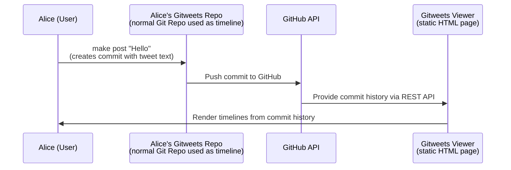
```mermaid
sequenceDiagram
    participant Alice as Alice (User)
    participant Repo as Alice's Gitweets Repo<br>(normal Git Repo used as timeline)
    participant GitHub as GitHub API
    participant Viewer as Gitweets Viewer<br>(static HTML page)

    Alice->>Repo: make post "Hello"<br>(creates commit with tweet text)
    Repo->>GitHub: Push commit to GitHub
    GitHub->>Viewer: Provide commit history via REST API
    Viewer->>Alice: Render timelines from commit history
```
## Viewing/Following Workflow
### Brief Description:
The following diagram shows the viewing workflow for Gitweets which has no built-in follow system, instead Bob manually adds Alice's Gitweets repository as a Git remote and fetches her commits. Fetching does not merge the commits into Bob's timeline but only downloads them locally. Thus to actually view Alice's posts Bob opens the Gitweets viewer pointed at Alice's repository which then retrieves Alice's commit history, rendering it as her timeline. If Bob wants to "retweet" he picks one of Alice's commits and commits and pushes it into his own repository, which makes it appear on his own timeline.
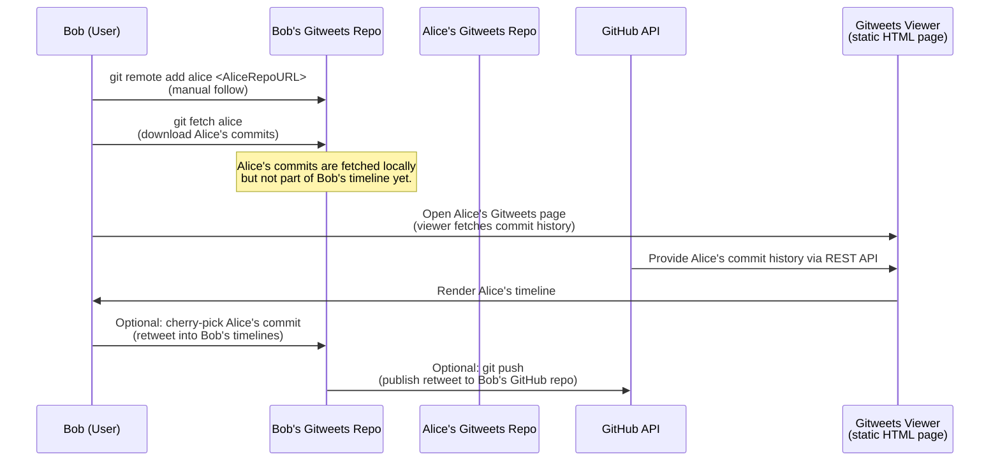
```mermaid
sequenceDiagram
    participant Bob as Bob (User)
    participant BobRepo as Bob's Gitweets Repo
    participant AliceRepo as Alice's Gitweets Repo
    participant GitHub as GitHub API
    participant Viewer as Gitweets Viewer<br>(static HTML page)

    Bob->>BobRepo: git remote add alice <AliceRepoURL><br>(manual follow)
    Bob->>BobRepo: git fetch alice<br>(download Alice's commits)

    Note over BobRepo: Alice's commits are fetched locally<br>but not part of Bob's timeline yet.
    
    Bob->>Viewer: Open Alice's Gitweets page<br>(viewer fetches commit history)    
    GitHub->>Viewer: Provide Alice's commit history via REST API
    Viewer->>Bob: Render Alice's timeline
    
    Bob->>BobRepo: Optional: cherry-pick Alice's commit<br>(retweet into Bob's timelines)
    BobRepo->>GitHub: Optional: git push<br>(publish retweet to Bob's GitHub repo)
```
## Strengths
- Very simple mental model: posting = pushing a commit, replication = fetching commits.

- Uses existing Git infrastructure, making it lightweight and easy to host on static platforms.

- The GitHub REST API + static HTML viewer provides a simple way to render timelines without servers.

- Although minimal, it demonstrates the core idea of using Git as a pull‑based replication mechanism for social content.

## Limitations
- Not a real social protocol: posts are just commit messages, which are not designed for long, structured, or media‑rich content.

- No discovery mechanism — users must manually know each other’s repository URLs, making it unsuitable for large‑scale social use.

- Very limited social actions (only posting and a crude form of reposting).

- Since everything is hosted on a Git platform (e.g., GitHub), deleting the Git account wipes the user’s entire social presence — so it is not truly decentralised.

- No structured data model for posts, replies, likes, or follows — everything is just Git commits.

- No privacy or access control; anyone with the repo URL can view posts.

## Relevance to my Project
- Gitweets shows the base concept of using Git for decentralised, pull‑based social media: pushing for posting and fetching for replication.

- Demonstrates that Git + static hosting + REST API can form a minimal social system without servers.

- However, it is far too limited for real social media, lacking structured social actions, discovery, and proper post formats.

- This suggests that a Git‑based protocol must incorporate ideas from non‑Git protocols (e.g., ActivityPub’s activity types) while keeping Git’s pull‑based, static‑hostable advantages.
## social4git
## Posting Workflow
### Brief Description:
The following sequence diagrams shows how posting operates in social4Git, which is a Git-based pull-replication model. When Alice makes a post, her client creates the post file and metadata file which are both commited and pushed to her public repository. Followers recieve the posts only upon manually running social4git sync, which fetches updates from Alice's public repository and copies the new post into their own private repository. 

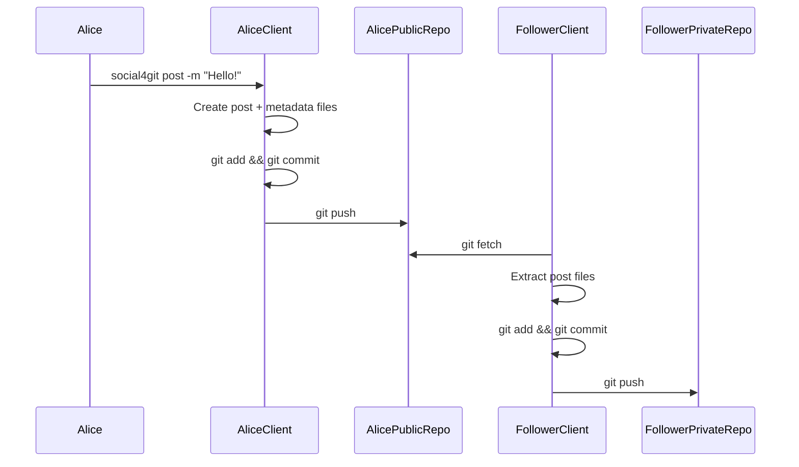
```mermaid
sequenceDiagram
    participant Alice
    participant AliceClient as AliceClient
    participant AlicePublicRepo as AlicePublicRepo
    participant FollowerClient as FollowerClient
    participant FollowerPrivateRepo as FollowerPrivateRepo

    Alice->>AliceClient: social4git post -m "Hello!"
    AliceClient->>AliceClient: Create post + metadata files
    AliceClient->>AliceClient: git add && git commit
    AliceClient->>AlicePublicRepo: git push

    FollowerClient->>AlicePublicRepo: git fetch
    FollowerClient->>FollowerClient: Extract post files
    FollowerClient->>FollowerClient: git add && git commit
    FollowerClient->>FollowerPrivateRepo: git push
```
## Following Workflow
### Brief Description:
The following sequence diagram shows Bob attempts to follow Alice in social4git. Once Bob specifies Alice's Repository URL, Bob's client adds the URL to a local following list and uploads it to Bob's private repository which means the following action is completed on Bob's side without approval from Alice. After some time, when Bob wants to retrieve Alice's posts, he runs social4git sync, so his client then runs git fetch to extract any of Alice's new posts and copies them into Bob's private repository.

Following simply means adding a repository URL to a local following list stored in the follower's private repository as shown by the inte
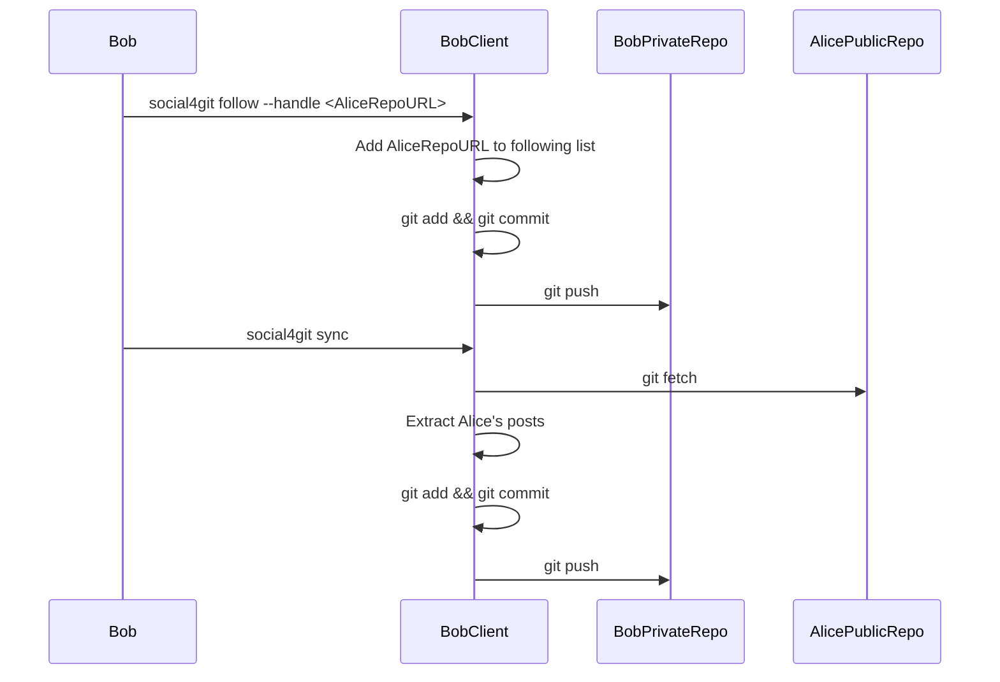
```mermaid
sequenceDiagram
    participant Bob
    participant BobClient as BobClient
    participant BobPrivateRepo as BobPrivateRepo
    participant AlicePublicRepo as AlicePublicRepo

    Bob->>BobClient: social4git follow --handle <AliceRepoURL>
    BobClient->>BobClient: Add AliceRepoURL to following list
    BobClient->>BobClient: git add && git commit
    BobClient->>BobPrivateRepo: git push

    Bob->>BobClient: social4git sync
    BobClient->>AlicePublicRepo: git fetch
    BobClient->>BobClient: Extract Alice's posts
    BobClient->>BobClient: git add && git commit
    BobClient->>BobPrivateRepo: git push
```
## gitsocial
## Posting Workflow
### Brief Description:
The following sequence diagram shows how posting works in GitSocial. As opposed to social4git, gitsocial has a single Git repository per user which has a dedicated branch called gitsocial for all social activity. When Alice makes a post, Alice's client represents the post as a Git commit on this gitsocial branch. This commit contains the post text along with the GitMsg metadata which indicates whether it is a post, comment, repost, or quote. In order to publish the post, this commit is pushed to Alice's repsoitory, making it available for followers. Since gitsocial is a pull-based replication model, her do not recieve these posts immediately, but the posts become visible when the follower later fetches the gitsocial branch during sync.

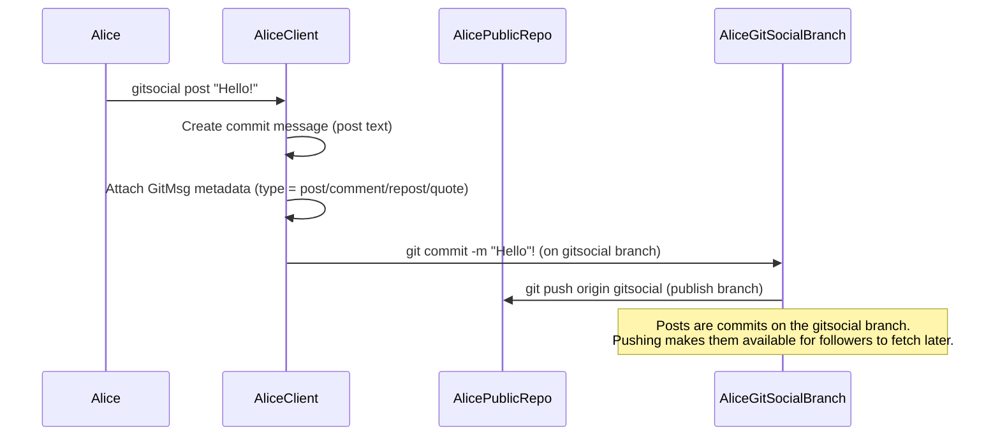
```mermaid
sequenceDiagram
    participant Alice
    participant AliceClient as AliceClient
    participant AlicePublicRepo as AlicePublicRepo
    participant AliceGitSocialBranch as AliceGitSocialBranch

    Alice->>AliceClient: gitsocial post "Hello!"
    AliceClient->>AliceClient: Create commit message (post text)
    AliceClient->>AliceClient: Attach GitMsg metadata (type = post/comment/repost/quote)
    AliceClient->>AliceGitSocialBranch: git commit -m "Hello"! (on gitsocial branch)
    AliceGitSocialBranch->>AlicePublicRepo: git push origin gitsocial (publish branch)

    Note over AliceGitSocialBranch: Posts are commits on the gitsocial branch.<br>Pushing makes them available for followers to fetch later.
```
## Following + Replication Workflow
### Brief Description:
The following sequence diagram shows the following and replication workflow. For Bob to folllow Alice this means Bob needs to add Alice's repository URL to a follow-list JSON file stored inside Bob's repository. The steps required for updating this file are usual git steps involving modifying the file, git adding, commiting and then pushing to Bob's Repository. Compared to other conventional protocols, this follow action is local as Alice does not need to approve anything. Later when Bob runs sync, his client reads the follow list to determine which repositores to fetch from. For each of the followed users, the client fetches the gitsocial branch from their repository and the returned commits are stored in Bob's repository. Lastly, to build or update Bob's feed view with Alice's commits (or whoever he follows), Bob's Client interprets GitMsg metadata.

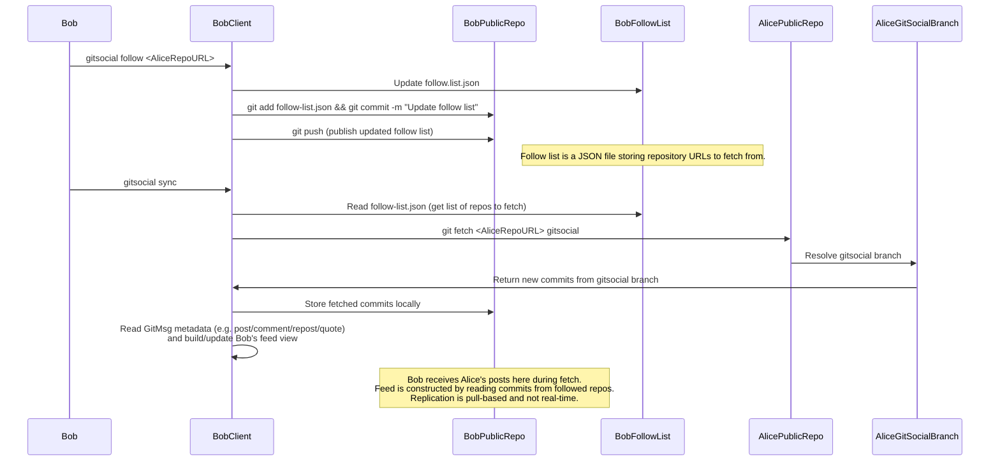
```mermaid
sequenceDiagram
    participant Bob
    participant BobClient as BobClient
    participant BobPublicRepo as BobPublicRepo
    participant BobFollowList as BobFollowList
    participant AlicePublicRepo as AlicePublicRepo
    participant AliceGitSocialBranch as AliceGitSocialBranch

    Bob->>BobClient: gitsocial follow <AliceRepoURL>
    BobClient->>BobFollowList: Update follow.list.json 
    BobClient->>BobPublicRepo: git add follow-list.json && git commit -m "Update follow list"
    BobClient->>BobPublicRepo: git push (publish updated follow list)

    Note over BobFollowList: Follow list is a JSON file storing repository URLs to fetch from.

    Bob->>BobClient: gitsocial sync
    BobClient->>BobFollowList: Read follow-list.json (get list of repos to fetch)

    BobClient->>AlicePublicRepo: git fetch <AliceRepoURL> gitsocial
    AlicePublicRepo->>AliceGitSocialBranch: Resolve gitsocial branch
    AliceGitSocialBranch->>BobClient: Return new commits from gitsocial branch

    BobClient->>BobPublicRepo: Store fetched commits locally
    BobClient->>BobClient: Read GitMsg metadata (e.g. post/comment/repost/quote)<br>and build/update Bob's feed view

    Note over BobPublicRepo: Bob receives Alice's posts here during fetch.<br>Feed is constructed by reading commits from followed repos.<br>Replication is pull-based and not real-time.
```
## Octotown
## Posting Workflow
### Brief Description:
The following sequence diagram shows how posting works in Octotown, which unlike other Git-based protocols, reuses GitHub's existing Issues system. Each user has a repository named .social which contains all posts represented as GitHub Issues. When Alice writes a post in the Octotown client, the client constructs a REST API request to the GitHubIssuesAPI, including the post content in the JSON body to the .social endpoint of Alice. Upon recieving the request, GitHub creates a new issue inside the .social repository, which now becomes the published post which followers can later fetch and interact with. 

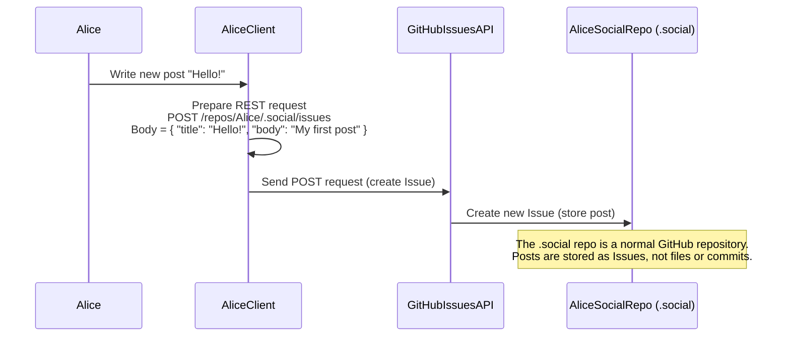
```mermaid
sequenceDiagram
    participant Alice
    participant AliceClient as AliceClient
    participant GitHubIssuesAPI as GitHubIssuesAPI
    participant AliceSocialRepo as AliceSocialRepo (.social)

    Alice->>AliceClient: Write new post "Hello!"
    AliceClient->>AliceClient: Prepare REST request<br>POST /repos/Alice/.social/issues<br>Body = { "title": "Hello!", "body": "My first post" }
    AliceClient->>GitHubIssuesAPI: Send POST request (create Issue)
    GitHubIssuesAPI->>AliceSocialRepo: Create new Issue (store post)
    Note over AliceSocialRepo: The .social repo is a normal GitHub repository.<br>Posts are stored as Issues, not files or commits.
```
## Following + Replication Workflow
### Brief Description:
The following sequence diagram shows how following works in Octotown, which entirely functions on GitHub's in-built follow system. First of all, Bob has to follow Alice's GitHub profile which then updates GitHub's own follow list of Bob. Next, when Bob opens the Ocototown client to view his feed, his client begins replication by querying GitHub's Follow API to retrive the list of GitHub accounts Bob follows, which should include Alice. Since this list contains only user identities, the client has to determine which of these users participate in social actions through Octotown by checking whether they have a .social repository. For each of the followed users, the client checks if their repository has a .social repository, which would rturn true for Alice meaning she is a octotown user. After confriming this, Bob's client fetches posts, utilising GitHub's list issues for repository operation. Consequently this build's Bob's feed with all issues (posts) stored in the .social repository of the users he follows, including Alice.

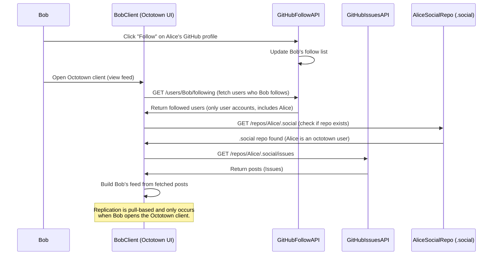
```mermaid
sequenceDiagram
    participant Bob
    participant BobClient as BobClient (Octotown UI)
    participant GitHubFollowAPI as GitHubFollowAPI
    participant GitHubIssuesAPI as GitHubIssuesAPI
    participant AliceSocialRepo as AliceSocialRepo (.social)

    Bob->>GitHubFollowAPI: Click "Follow" on Alice's GitHub profile
    GitHubFollowAPI->>GitHubFollowAPI: Update Bob's follow list

    Bob->>BobClient: Open Octotown client (view feed)
    BobClient->>GitHubFollowAPI: GET /users/Bob/following (fetch users who Bob follows)
    GitHubFollowAPI->>BobClient: Return followed users (only user accounts, includes Alice)

    BobClient->>AliceSocialRepo: GET /repos/Alice/.social (check if repo exists)
    AliceSocialRepo->>BobClient: .social repo found (Alice is an octotown user)

    BobClient->>GitHubIssuesAPI: GET /repos/Alice/.social/issues
    GitHubIssuesAPI->>BobClient: Return posts (Issues)

    BobClient->>BobClient: Build Bob's feed from fetched posts
    Note over BobClient: Replication is pull-based and only occurs<br>when Bob opens the Octotown client.
```
## Git as Federation Transport
## Posting Workflow
### Brief Description:
The following diagram shows the posting workflow for Git as Federation Transport which is a multiple-users per server based model. A single server (e.g. AliceServer) hosts a community of users, similar to Mastadon. Once a user on the server (Alice) creates a post, the server converts the post into a JSON file which is then commited and stored into the servers's Git Repository. After committing, the server pushes the commit (containing the post) to every other server AliceServer follows (here servers follow other servers as opposed to users following users). The push action does not mean that the other servers have actally receieved the post socially since it only transfer Git Objects. Only when the remote servers later run git fetch during their replication cycle, will they be able to built the feed with the posts.

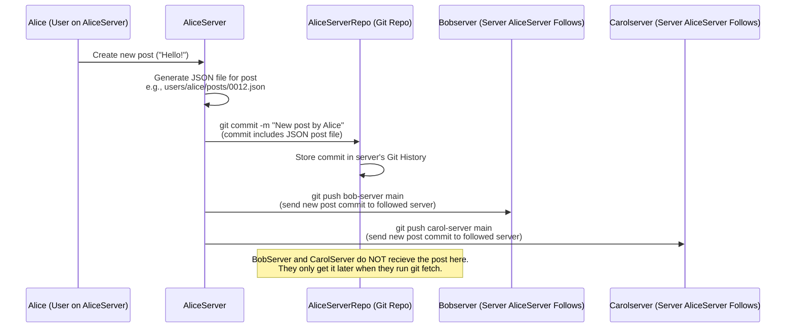
```mermaid
sequenceDiagram
    participant AliceUser as Alice (User on AliceServer)
    participant AliceServer as AliceServer
    participant AliceRepo as AliceServerRepo (Git Repo)
    participant BobServer as Bobserver (Server AliceServer Follows)
    participant CarolServer as Carolserver (Server AliceServer Follows)

    AliceUser->>AliceServer: Create new post ("Hello!")

    AliceServer->>AliceServer: Generate JSON file for post<br>e.g., users/alice/posts/0012.json

    AliceServer->>AliceRepo: git commit -m "New post by Alice"<br>(commit includes JSON post file)
    AliceRepo->>AliceRepo: Store commit in server's Git History

    AliceServer->>BobServer: git push bob-server main<br>(send new post commit to followed server)
    AliceServer->>CarolServer: git push carol-server main<br>(send new post commit to followed server)
    
    Note over AliceRepo: BobServer and CarolServer do NOT recieve the post here.<br>They only get it later when they run git fetch. 
```
## Following + Replication Workflow
### Brief Description:
The following diagram shows how "following" works in this model, which is server-to-server and not user-to-user. For BobServer to follow AliceServer, BobServer's operator (e.g. admin) adds AliceServer as a Git remote. Once this is configured BobServer periodically runs git fetch to pull new commits from servers it follow which now includes AliceServer. AliceServer responds to BobServer by sending Git packfile which is a bundle of compressed Git objects containing the JSON post file which however is not in a readable form yet. Next, Git on BobServer writes these fetched objects into BobServer's Git repository, while updating its pointer to AliceServer's latest commit. In order to find the JSON post files, BobServer scans the new commits in the repository. The server parses these JSON files and imports them into its own timeline database, upon which the users on BobServer (e.g. Bob, Tom) can see Alice's posts. Overall this model is pull-based, meaning even if AliceServer had pushed to BobServer, BobServer would not show the post unless it later performs a fetch and imports it. This can be seen as a negative as AliceServer's push may effectively be wasted - the server it inteded to send post won't recieve the post until they choose to fetch it.

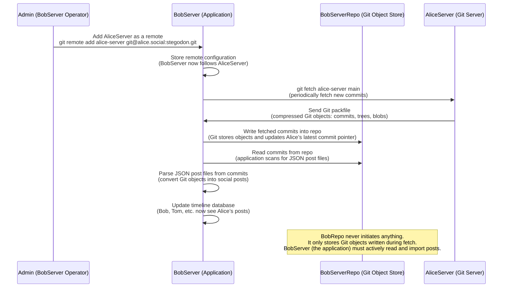
```mermaid
sequenceDiagram
    participant Admin as Admin (BobServer Operator)
    participant BobServer as BobServer (Application)
    participant BobRepo as BobServerRepo (Git Object Store)
    participant AliceServer as AliceServer (Git Server)

    Admin->>BobServer: Add AliceServer as a remote<br>git remote add alice-server git@alice.social:stegodon.git
    BobServer->>BobServer: Store remote configuration<br>(BobServer now follows AliceServer)

    BobServer->>AliceServer: git fetch alice-server main<br>(periodically fetch new commits)
    AliceServer->>BobServer: Send Git packfile<br>(compressed Git objects: commits, trees, blobs)

    BobServer->>BobRepo: Write fetched commits into repo<br>(Git stores objects and updates Alice’s latest commit pointer)
    BobServer->>BobRepo: Read commits from repo<br>(application scans for JSON post files)

    BobServer->>BobServer: Parse JSON post files from commits<br>(convert Git objects into social posts)
    BobServer->>BobServer: Update timeline database<br>(Bob, Tom, etc. now see Alice’s posts)

     Note over BobRepo: BobRepo never initiates anything.<br>It only stores Git objects written during fetch.<br>BobServer (the application) must actively read and import posts.
```

