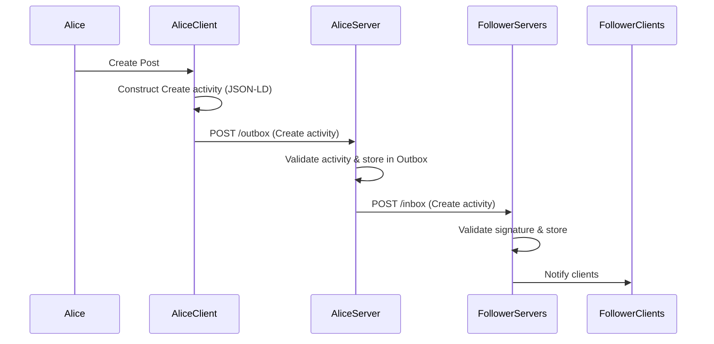
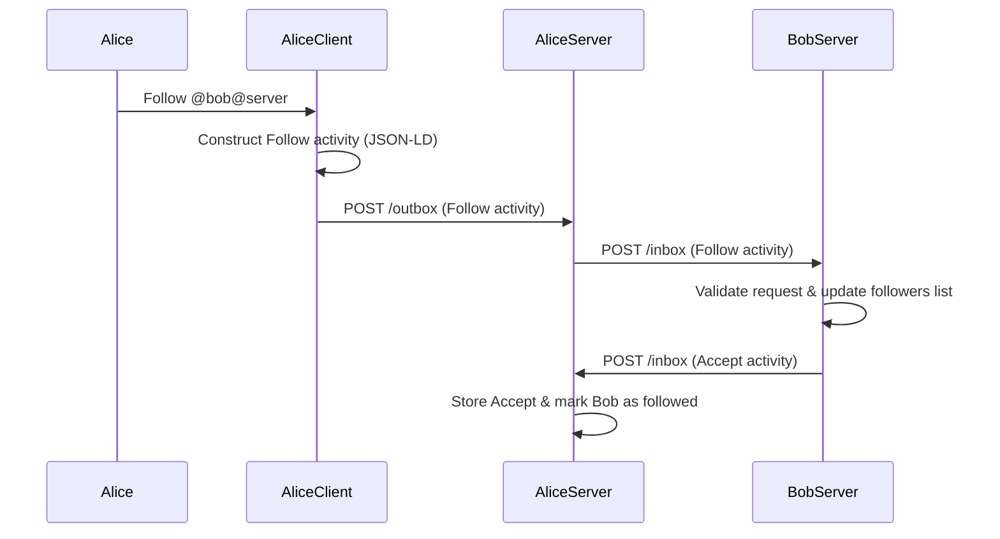
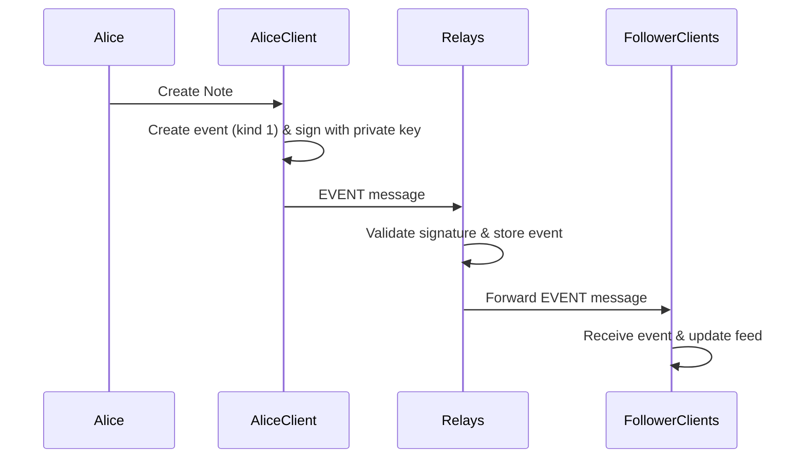
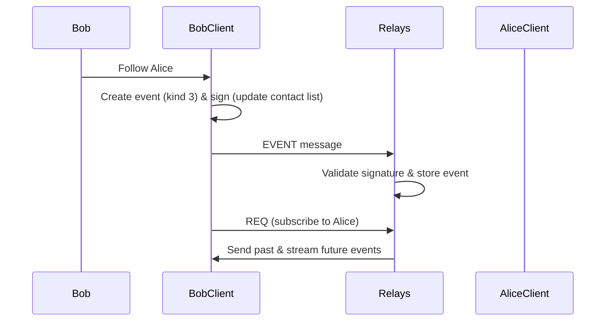
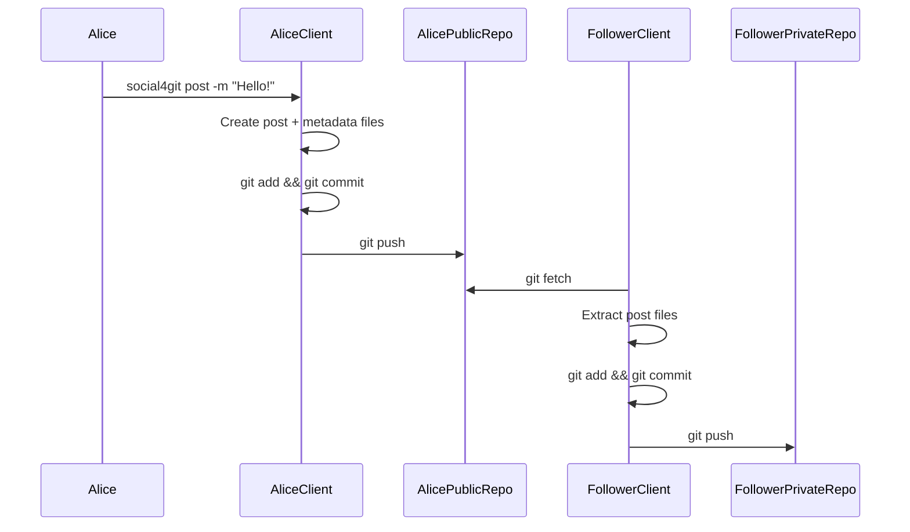
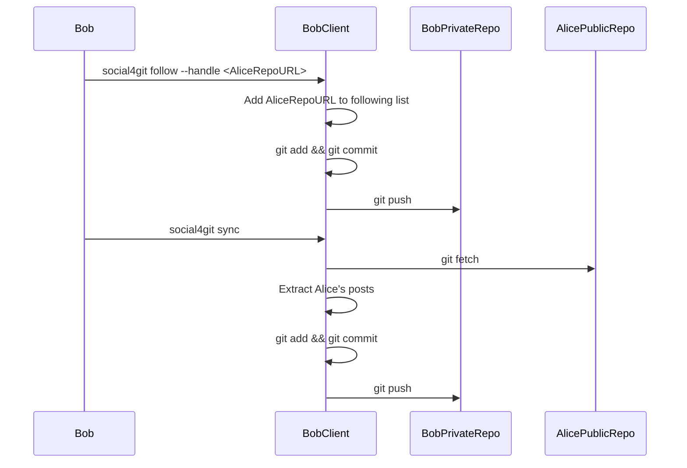

# Alternative Decentralised Social Protocols
## ActivityPub
## Posting Workflow
### Brief Description:
The following sequence diagram shows how Alice's followers recieve the posts she makes. First of all, Alice creates a Post within here client (e.g. Mastodon app) which then constructs this as a Create activity. The client then sends this to Alice's server by making an HTTP POST to her outbox endpoint. The server validates this activity and stores it Alice's outbox. Following this, Alice's server iterates through all her followers and pushes this same Create activity to each follower's server by POSTing it to their inbox endpoints. The follower's server then all validate the messages and update their timeline. Last of all, the follower's clients get notfied or manually fetch the updated timelines from their server and Alice's post is rendered to their feeds.

## Following Workflow
### Brief Description:
The sequence diagram shows how Alice starts following Bob. First, Alice specifies Bob's handle with key word Follow on her client. Alice's Client sends this as a Follow activity to her server by HTTP POSTing it to her outbox. This Follow activty is then forwarded to Bob's Server by POSTing to Bob's Inbox endpoint. Bob's server then validates the request, and if accepted adds Alice to his followers list. This server then sends a Accept activity to Alice's Server through POSTing to its inbox. The server then validates, stores the Accept activity and marks Bob as followed. Now, whenever Bob posts, Bob's server will push that post to ALice's server, which will then appear in her timeline.  


## Nostr
## Posting Workflow
### Brief Description:
The following sequence diagram shows Alice's followers receieve the posts which Alice posts. Firstly once Alice makes her post, Alice's Client Creates a signed event of kind 1 and publishes it to one or more relays. These relays validate the event and store it, then it forwards the event to all of Alice's 'followers' (clients that have subscribed to Alice's public key). The follower's client then build the follower's feed with Alice's post. 


## Following Workflow
### Brief Description:
The following sequence diagram demonstrates how following works in Nostr, which is handled entirely on the client side. Once Bob decides to Follow Alice, Bob's client creates a signed contacts event (kind 3) which lists Alice's public key. This event is then forwarded to multiple relays, later Bob's client sends a REQ subscription message to the relays. This simply tells the relays to send events associated with a target public key. Finally, the relays send Alice's past events and streams her future events. 


## Secure Scuttlebutt (SSB)
## Posting Workflow
### Brief Description:
```mermaid
sequenceDiagram
    participant Alice
    participant AliceClient as BobClient
    participant AliceFeed as Alice's Local Feed

    Alice->>AliceClient: Write new post
    AliceClient->>AliceClient: Create message object (content)
    AliceClient->>AliceClient: Assign next sequence number (seq = last_seq + 1)
    AliceClient->>AliceClient: Compute hash of previous message (prev = hash(previous_message))
    AliceClient->>AliceClient: Sign message with Aice's private key (signature = sign(content + seq + prev))
    AliceClient->>AliceFeed: Append signed message to local feed 

    Note over AliceFeed:
        Post is stored ONLY in Alice's local feed.
        SSB dont NOT push posts to followers when posting.
        Bob receieves this post later during gossip replication. 
```
## Following + Replication Workflow
### Brief Description:
```mermaid
sequenceDiagram
    participant Bob
    participant BobClient
    participant BobFollowList as Bob's Follow List
    participant AliceClient
    participant AliceFeed as Alice's Local Feed
    participant BobFeed as Bob's Local Copy of Alice's Feed

    Bob->>BobClient: Follow Alice (add Alice's feed ID)
    BobClient->>BobFollowList: Store Alice's feed ID

    Note over BobClient: Replication occurs via gossip when devices connect

    BobClient->>AliceClient: Gossip: "What is your latest sequence number?"
    AliceClient->>BobClient: "My latest sequence number is N"

    BobClient->>AliceClient: Request missing messages
    AliceClient->>BobClient: Send missing signed messages

    BobClient->>BobClient: Verify signatures using Alice's public key
    BobClient->>BobFeed: Append verified messages to Bob's local copy

    Note over BobFeed:
        Bob receives Alice's posts only during gossip replication.
        SSB pulls missing messages when devices connect.
        No real-time delivery or push notifications.
```


## Git Based Attempts
## social4git
## Posting Workflow
### Brief Description:
The following sequence diagrams shows how posting operates in social4Git, which is a Git-based pull-replication model. When Alice makes a post, her client creates the post file and metadata file which are both commited and pushed to her public repository. Followers recieve the posts only upon manually running social4git sync, which fetches updates from Alice's public repository and copies the new post into their own private repository. 


## Following Workflow
### Brief Description:
The following sequence diagram shows Bob attempts to follow Alice in social4git. Once Bob specifies Alice's Repository URL, Bob's client adds the URL to a local following list and uploads it to Bob's private repository which means the following action is completed on Bob's side without approval from Alice. After some time, when Bob wants to retrieve Alice's posts, he runs social4git sync, so his client then runs git fetch to extract any of Alice's new posts and copies them into Bob's private repository.

Following simply means adding a repository URL to a local following list stored in the follower's private repository as shown by the inte

