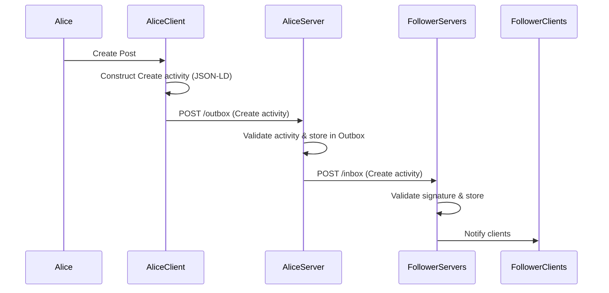

# Alternative Decentralised Social Protocols
## ActivityPub
## Posting Workflow

```mermaid
sequenceDiagram
    participant Alice
    participant AliceClient as AliceClient
    participant AliceServer as AliceServer
    participant FollowerServers as FollowerServers
    participant FollowerClients as FollowerClients

    Alice->>AliceClient: Create Post
    AliceClient->>AliceClient: Construct Create activity (JSON-LD)
    AliceClient->>AliceServer: POST /outbox (Create activity)
    AliceServer->>AliceServer: Validate activity & store in Outbox
    AliceServer->>FollowerServers: POST /inbox (Create activity)
    FollowerServers->>FollowerServers: Validate signature & store
    FollowerServers->>FollowerClients: Notify clients
```
