# Design Document
The following document specifies the architecture and workflows of the proposed Git-based static-hostable social protocol. It builds ontop of the design_principles.md by translating principles into concrete components, data structures and processes. This ensures that the design is grounded in insights from surveyed protocols and has notes on implementation feasilibility and areas of code reuse.

## Layered Architecture
These are the layers of the design arranged in concise bullet points which indicate the natural implementation sequence, with must haves down to advanced features.
- Core Layer (must-have): Identity, Social Actions, Replication, Storage Format
- Extension Layer (optional improvements): Discovery, Feed Indexing, Media Handling
- Redesigned Layer (advanced features): Moderation, Confidentialiy, Threading

## Core Components
### Identity
Design Principle:
Each user has a permanent cryptographic identity that is portable across hosts.
Why portable?
- The identity is defined by a public key
- This key does not depend on any server or provider
- As long as the public key stays the same, the user's idenity remains valid regardless if they move their repository to GitHub, GitLab or static host.
Human-readable handles:
- To make identity easier to use, a hanle (like bharat.social) is mapped to the public key
- This mapping is stored in /social/profile.json.
Client Responsibilities (step-by-step):
1. When a new account is created, the client generates an Ed25519 key pair (public/private)
2. The public key is written into /social/profile.json
3. The private key is stored securely by the client 
4. Whenever a post, reply, follow, or moderation list is created, the client signs the JSON object using the private key.
5. Followers verify signatures using the public key in profile.json
Survey Source:
Inspired by Nostr (portable key identity) and AT Protocol (DNS-mapped handles)
Data Structure (profile.json schema):
{
  "publicKey": "ed25519:abc123...",
  "handle": "bharat.social",
  "displayName": "Bharat",
  "bio": "Student at USYD",
  "created": "2026-06-28T19:57:00Z"
}
When signing is needed:
- Every time the client creates a new JSON object (post, reply, like, follow, blocklist)
- The client automatically attaches a signature field to prove authencity.

### Identity Workflow
#### What it is:
Shows a new account's identity is created and how followers fetch and verify the author's profile.json before trusting any future actions. 
Note:
In practice, followers reach this step after performing a Follow action, which is shown in the full Following Workflow section. Here, only the identity verification step is shown.

#### How it works:
The client generates an Ed25519 key pair, writes the public key, handle, and metadata into /social/profile.json, signs it, and publishes it. When another user follows this account, their client fetches the author's profile.json, verifies its signatures using the author's publicKey inside the file, and stores that publicKey for verifying all future posts and actions.

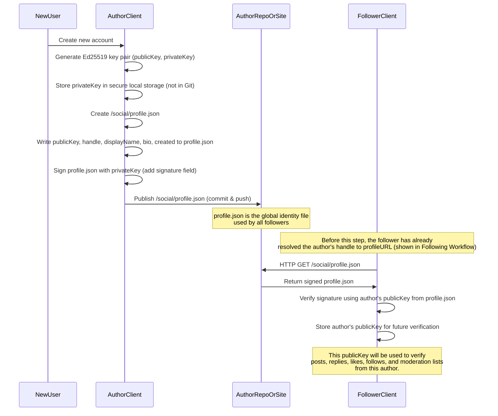
```mermaid
sequenceDiagram
  participant User as NewUser
  participant Client as AuthorClient
  participant Repo as AuthorRepoOrSite
  participant FollowerClient as FollowerClient

  User ->> Client: Create new account
  Client ->> Client: Generate Ed25519 key pair (publicKey, privateKey)
  Client ->> Client: Store privateKey in secure local storage (not in Git)

  Client ->> Client: Create /social/profile.json
  Client ->> Client: Write publicKey, handle, displayName, bio, created to profile.json
  Client ->> Client: Sign profile.json with privateKey (add signature field)
  Client ->> Repo: Publish /social/profile.json (commit & push)

  Note over Repo: profile.json is the global identity file<br>used by all followers

  Note over FollowerClient: Before this step, the follower has already<br>resolved the author's handle to profileURL (shown in Following Workflow)

  FollowerClient ->> Repo: HTTP GET /social/profile.json
  Repo ->> FollowerClient: Return signed profile.json 

  FollowerClient ->> FollowerClient: Verify signature using author's publicKey from profile.json
  FollowerClient ->> FollowerClient: Store author's publicKey for future verification

  Note over FollowerClient: This publicKey will be used to verify<br>posts, replies, likes, follows, and moderation lists<br>from this author. 
```

### Social Actions
Design Principle:
All user activities (Social actions) are represented as typed JSON objects. This makes them predictable, portable, and easy for clients to process.
Action Types (what they represent)
1. Post -> a new message or article authored by the user
2. Reply -> a response to an existing post, linked via inReplyTo
3. Like -> an edorsement of an existing post, linked via target
4. Follow -> a request to subscribe to another user's feed, linked via target
Why structured actions matter:
- ActivityPub showed that a fixed vocabulary (Create, Like, Follow) makes feeds interoperable.
- Nostr used event kinds to simplify client logic
- sAT stored acions as JSON objects, proving that they are easy to replicate and extend
- This ensures that every action has a clear schema and can be cryptographically verified.
Client Responsibilities (step-by-step):
1. When a user performs an action, the client creates a JSON object with the required fields
2. The client signs the JSON using the private key -> adds a signature field
3. The client saves the file in /social/actions/<id>.json
4. The client commits and pushes the file to the Git repository
5. Follower's client fetch new commits and verify signatures using the author's public key.
Survey Source:
Inspired by ActivtiyPub (typed activities), Nostr (event kinds), and sAT (JSON objects)
JSON Schemas for Each Action:
Post
{
  "id": "post-001",
  "type": "post",
  "author": "ed25519:abc123...",
  "content": "Hello world!",
  "created": "2026-06-28T20:05:00Z",
  "signature": "base64sig..."
}
Reply
{
  "id": "post-002",
  "type": "reply",
  "author": "ed25519:abc123...",
  "content": "Replying to post-001",
  "inReplyTo": "post-001",
  "created": "2026-06-28T20:06:00Z",
  "signature": "base64sig..."
}
Like
{
  "id": "like-001",
  "type": "like",
  "author": "ed25519:abc123...",
  "target": "post-001",
  "created": "2026-06-28T20:07:00Z",
  "signature": "base64sig..."
}
Follow
{
  "id": "follow-001",
  "type": "follow",
  "author": "ed25519:abc123...",
  "target": "ed25519:def456...",
  "created": "2026-06-28T20:08:00Z",
  "signature": "base64sig..."
}
When signing is needed:
- Every time a new action (post, reply, like, follow) is created
- The client automatically signs the JSON before saving
- Followers verify the signature using the public key in profile.json
Implementation Note:
Crypto libraries (e.g libsodium, tweetnacl) provide ready-made functions:
- sign(message, privateKey) -> client produces signature
- verify(message, signature, publickey) -> follower's client check authencity
- Thus ensuring only the true author can create valid actions and anyone can verify them.

### Posting Workflow
What it is
Shows how an author creates a signed post action, publishes it to /social/actions, and how followers later fetch and verify it as part of replication.

How it works
When the user writes a new post, the client constructs a types JSON object (type: "post"), fills in the required fields (id, author, content, created), signs it with the author's private key, and saves it as /social/actions/post-XXX.json. The client then commits and pushes this file to the Git repository. Later, follower's clients fetch new commits, read the new action file, verify its signature using the author's publicKey from the author's profile.json, and insert the post into their own local feed database.

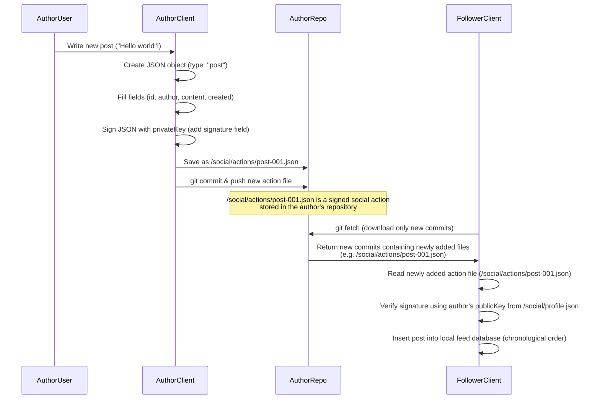
```mermaid
sequenceDiagram
  participant Author as AuthorUser
  participant AuthorClient as AuthorClient
  participant Repo as AuthorRepo
  participant FollowerClient as FollowerClient

  Author ->> AuthorClient: Write new post ("Hello world"!)
  AuthorClient ->> AuthorClient: Create JSON object (type: "post")
  AuthorClient ->> AuthorClient: Fill fields (id, author, content, created)
  AuthorClient ->> AuthorClient: Sign JSON with privateKey (add signature field)

  AuthorClient ->> Repo: Save as /social/actions/post-001.json
  AuthorClient ->> Repo: git commit & push new action file

  Note over Repo: /social/actions/post-001.json is a signed social action<br>stored in the author's repository 

  FollowerClient ->> Repo: git fetch (download only new commits)
  Repo ->> FollowerClient: Return new commits containing newly added files<br>(e.g. /social/actions/post-001.json)

  FollowerClient ->> FollowerClient: Read newly added action file (/social/actions/post-001.json)
  FollowerClient ->> FollowerClient: Verify signature using author's publicKey from /social/profile.json
  FollowerClient ->> FollowerClient: Insert post into local feed database (chronological order)
```
### Reply Action Workflow
What it is
Shows how an author creates a signed reply action linked to an existing post via inReplyTo, publishes it to /social/actions/, and how followers later fetch, verify, and attach it ot the correct parent post in their local feed.

How it works
When the user writes a reply to an existing post, the client constructs a typed JSON object (type: "reply"), fills in the required fields (id, author, content, inReplyTo, created), signs it with the author's private key, and saves it as /social/actions/reply-XXX.json. The client then commits and pushes this file to the Git repository. Later, follower's client run git fetch, which downloads only new commits. They read the newly added reply file, verify its signature using the author's publicKey from profile.json, insert the reply into their local feed database, and link it to the parent post using inReplyTo.

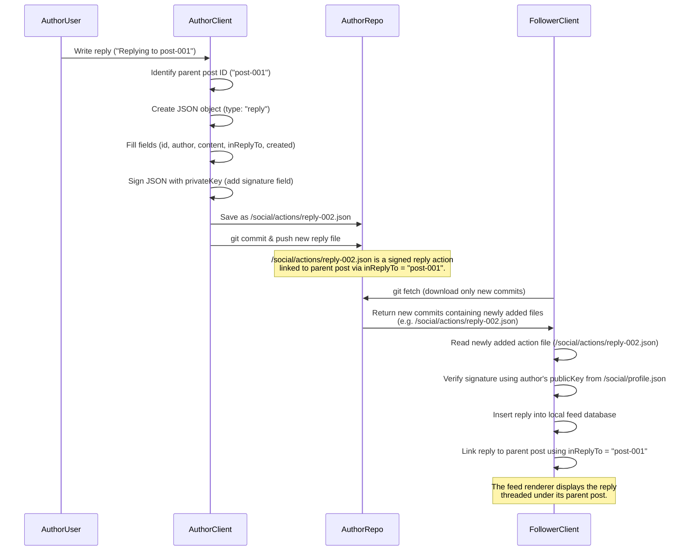
```mermaid
sequenceDiagram
  participant Author as AuthorUser
  participant AuthorClient as AuthorClient
  participant Repo as AuthorRepo
  participant FollowerClient as FollowerClient

  Author ->> AuthorClient: Write reply ("Replying to post-001")
  AuthorClient ->> AuthorClient: Identify parent post ID ("post-001")
  AuthorClient ->> AuthorClient: Create JSON object (type: "reply")
  AuthorClient ->> AuthorClient: Fill fields (id, author, content, inReplyTo, created)
  AuthorClient ->> AuthorClient: Sign JSON with privateKey (add signature field)

  AuthorClient ->> Repo: Save as /social/actions/reply-002.json
  AuthorClient ->> Repo: git commit & push new reply file

  Note over Repo: /social/actions/reply-002.json is a signed reply action<br>linked to parent post via inReplyTo = "post-001".

  FollowerClient ->> Repo: git fetch (download only new commits)
  Repo ->> FollowerClient: Return new commits containing newly added files<br>(e.g. /social/actions/reply-002.json)

  FollowerClient ->> FollowerClient: Read newly added action file (/social/actions/reply-002.json)
  FollowerClient ->> FollowerClient: Verify signature using author's publicKey from /social/profile.json

  FollowerClient ->> FollowerClient: Insert reply into local feed database 
  FollowerClient ->> FollowerClient: Link reply to parent post using inReplyTo = "post-001"
  Note over FollowerClient: The feed renderer displays the reply<br>threaded under its parent post.
```
### Like Action Workflow
What it is
Shows how an author creates a signed like action referencing and existing post via target, publishes it to /social/actions/, and how followers later fetch, verify, and attach the like as metadata to the correct post in their local feed.

How it works
When the user likes a post, the client constructurs a typed JSON object (type: "like"), fills in the required fields (id, author, target, created), signs it with the author's private key, and saves it as /social/actions/like-XXX.json. The client then commits and pushes this file to the Git repository, Later, follower's clients run git fetch,, which downloads only new commits. They read the newly added like file, verify its signature using the author's publicKey from profile.json, insert the like into their feed database, and attach it as metadata to the target post.

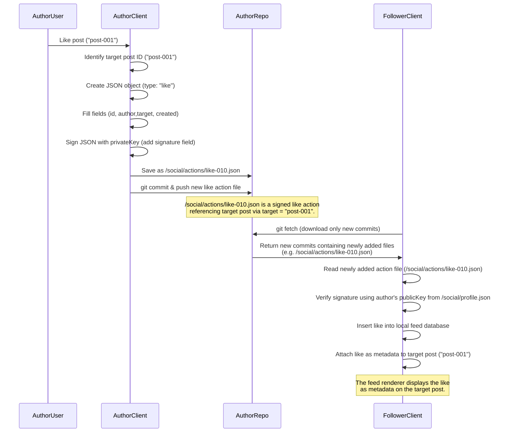
```mermaid
sequenceDiagram
  participant Author as AuthorUser
  participant AuthorClient as AuthorClient
  participant Repo as AuthorRepo
  participant FollowerClient as FollowerClient

  Author ->> AuthorClient: Like post ("post-001")
  AuthorClient ->> AuthorClient: Identify target post ID ("post-001")
  AuthorClient ->> AuthorClient: Create JSON object (type: "like")
  AuthorClient ->> AuthorClient: Fill fields (id, author,target, created)
  AuthorClient ->> AuthorClient: Sign JSON with privateKey (add signature field)

  AuthorClient ->> Repo: Save as /social/actions/like-010.json
  AuthorClient ->> Repo: git commit & push new like action file

  Note over Repo: /social/actions/like-010.json is a signed like action<br>referencing target post via target = "post-001".

  FollowerClient ->> Repo: git fetch (download only new commits)
  Repo ->> FollowerClient: Return new commits containing newly added files<br>(e.g. /social/actions/like-010.json)

  FollowerClient ->> FollowerClient: Read newly added action file (/social/actions/like-010.json)
  FollowerClient ->> FollowerClient: Verify signature using author's publicKey from /social/profile.json

  FollowerClient ->> FollowerClient: Insert like into local feed database 
  FollowerClient ->> FollowerClient: Attach like as metadata to target post ("post-001")
  Note over FollowerClient: The feed renderer displays the like<br>as metadata on the target post.
```
### Follow Action Workflow
What it is
Shows how an author creates a signed follow action referencing another user's public key via target, publishes it to /social/actions/, and how followers (i.e. clients who replicate this repositroy) later fetch, verify, and display the follow action as metadata on the target profile.

How it works
When the user decides to follow another account, the client constructs a typed JSON object (type: "follow"), fills in the required fields (id, author, target, created), signs it with the author's private key, and saves it as /social/actions/follow-XXX.json. The client then commits and pushes this file to the Git repository. Later, follower's clients run git fetch, which downloads only new commits. They read the newly added follow file, verify its signature using the authro's publicKey from profile.json, insert the follow action into their feed database, and attach it as metadat to the target profile. 

Note:
This workflow does not update follow.json - that is handled in the Following Workflow section

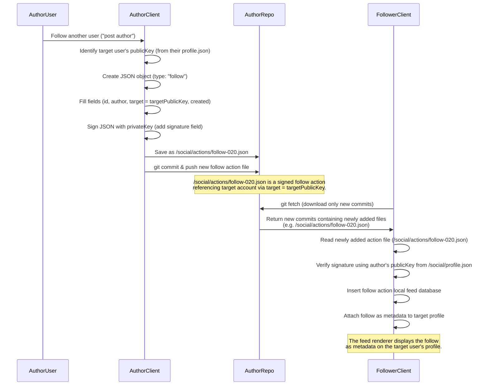
```mermaid
sequenceDiagram
  participant Author as AuthorUser
  participant AuthorClient as AuthorClient
  participant Repo as AuthorRepo
  participant FollowerClient as FollowerClient

  Author ->> AuthorClient: Follow another user ("post author")
  AuthorClient ->> AuthorClient: Identify target user's publicKey (from their profile.json)
  AuthorClient ->> AuthorClient: Create JSON object (type: "follow")
  AuthorClient ->> AuthorClient: Fill fields (id, author, target = targetPublicKey, created)
  AuthorClient ->> AuthorClient: Sign JSON with privateKey (add signature field)

  AuthorClient ->> Repo: Save as /social/actions/follow-020.json
  AuthorClient ->> Repo: git commit & push new follow action file

  Note over Repo: /social/actions/follow-020.json is a signed follow action<br>referencing target account via target = targetPublicKey.

  FollowerClient ->> Repo: git fetch (download only new commits)
  Repo ->> FollowerClient: Return new commits containing newly added files<br>(e.g. /social/actions/follow-020.json)

  FollowerClient ->> FollowerClient: Read newly added action file (/social/actions/follow-020.json)
  FollowerClient ->> FollowerClient: Verify signature using author's publicKey from /social/profile.json

  FollowerClient ->> FollowerClient: Insert follow action local feed database 
  FollowerClient ->> FollowerClient: Attach follow as metadata to target profile
  Note over FollowerClient: The feed renderer displays the follow<br>as metadata on the target user's profile.
```

### Replication
Design Principle:
Replication is pull-based and incremental. Followers fetch only new commits since their last synchronisation, instead of dowloading eveything again.

Why pull-based replication matters:
- Push models (like ActivityPub) overload servers because they must deliver every post to every follower
- Git's pull model (used in GitSocial, Social4Git, Gittweets) is efficient: authors push once, followers fetch when they want.
- Thus the identity is portable and hosting is flexible as anyone can host their repo, and followers can synchronise at their own pace.

Client Responsibilities (step-by-step)
1. Author's client:
- Commits new JSON files (posts, replies, likes, follows) into /social/actions/
- Pushes repo to Git host (GitHub, GitLab, or static host)
2. Follower's client (periodic fetch):
- Reads /social/discovery/following.json to determine which repos to replicate 
- Runs git fetch at a chosen interval (e.g. every few minutes, or when the user opens the app).
- The interval can be configured - some clients may fetch every 5 minutes, others only when the user refreshes
3. Incremental sync:
- Git automatically compares the local commit group graph with the remote 
- Only new commits (those not already in the local repo) are downloaded
- This avoids re-downloading old posts
4. Parsing new commits:
- For each new commit, the client checks which files were added in /social/actions/
- It opens each new JSON file and reads the actio object
5. Signature verification:
- The client verifies each action's signature using the author's public key from /social/profile.json
- If valid, the action is accepts; if invalid, it is ignored
6. Feed update:
- The client inserts the new action into the local feed database (could be a simple JSON file, SQLite, or just cached in memory)
- Posts are displayed in chronological order
- Replies are linked to their parent via inReplyTo
- Likes and follows are shown as metadata on the target post or profile

Data Structures in Replication
Commit graph (Git DAG):
commit abc123
  /social/actions/post-001.json
commit def456
  /social/actions/post-002.json
commit ghi789
  /social/actions/reply-001.json
Action JSON (example post):
{
  "id": "post-001",
  "type": "post",
  "author": "ed25519:abc123...",
  "content": "Hello world!",
  "created": "2026-06-28T20:05:00Z",
  "signature": "base64sig..."
}
When signing is needed
- Signing happens at the action level: every JSON file is signed by the author's client before commit
- Replications itself doesn't require signing - Git ensures commit integrity
- Followers verify signatures inside each JSON file after replication

Implementation Note
- Use GitPython (Python) or isomorphic-git (JavaScript) to automate fetch and parse.
- Use cryptography libaries for signature verification 
Typical workflow:
- git fetch origin -> get new commits
- Parse /social/actions/*.json
- Run verify(message, signature, publicKey) for each action
- Update feed database with verified actions

### Replication Workflow
What it is
Shows how authors publish new signed social actions (posts, replies, like, follows) into /social/actions/, and how follower's clients periodically pull only new commits, parse newly added action files, verify signatures, and updated their local feed database - linking replies and attaching likes/follows as metadata.

How it works
When an author creates new actions, their client saves each one as a signed JSON file under /social/actions/, then commits and pushes to the Git host. Follower's clients, guided by following.json, periodically run git fetch against each followed repository. Git transfers only commits that are not yet present locally. For each new commit, the follower's client inspects which files were added under /social/actions/, opens each JSON action, verifies its signature using the author's publicKey from /social/profile.json, and, if valid, inserts it into the local feed database, Posts are stored chronologically; replies are linked to their parent via inReplyTo; likes and follows are attached as metadata to the target post or profile.

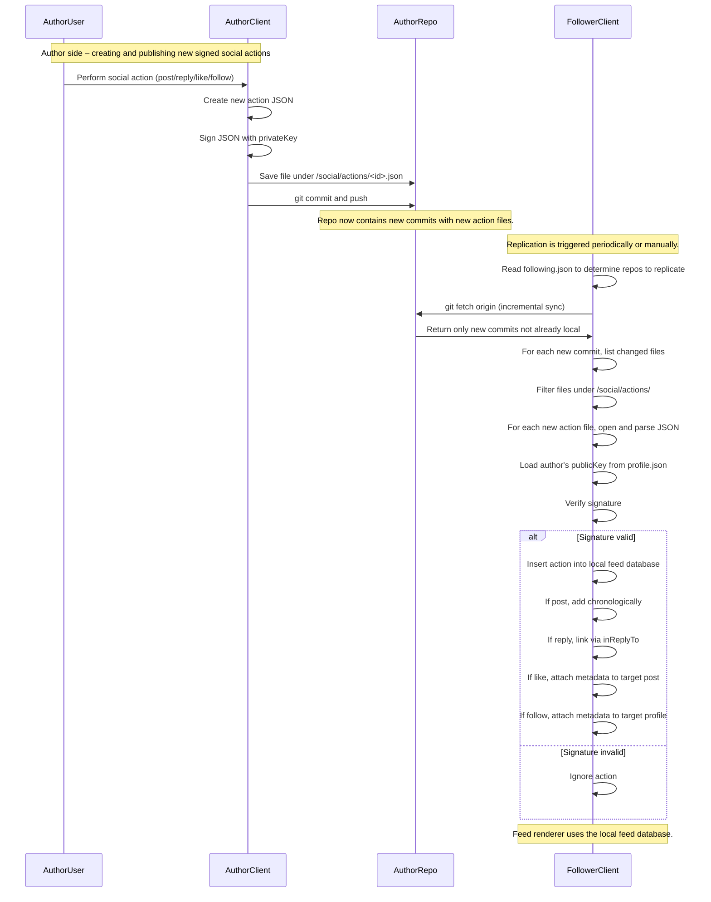
```mermaid
sequenceDiagram
  participant Author as AuthorUser
  participant AuthorClient as AuthorClient
  participant Repo as AuthorRepo
  participant FollowerClient as FollowerClient

  Note over Author,AuthorClient: Author side – creating and publishing new signed social actions

  Author ->> AuthorClient: Perform social action (post/reply/like/follow)
  AuthorClient ->> AuthorClient: Create new action JSON
  AuthorClient ->> AuthorClient: Sign JSON with privateKey
  AuthorClient ->> Repo: Save file under /social/actions/<id>.json
  AuthorClient ->> Repo: git commit and push

  Note over Repo: Repo now contains new commits with new action files.

  Note over FollowerClient: Replication is triggered periodically or manually.

  FollowerClient ->> FollowerClient: Read following.json to determine repos to replicate
  FollowerClient ->> Repo: git fetch origin (incremental sync)
  Repo ->> FollowerClient: Return only new commits not already local

  FollowerClient ->> FollowerClient: For each new commit, list changed files
  FollowerClient ->> FollowerClient: Filter files under /social/actions/

  FollowerClient ->> FollowerClient: For each new action file, open and parse JSON
  FollowerClient ->> FollowerClient: Load author's publicKey from profile.json
  FollowerClient ->> FollowerClient: Verify signature

  alt Signature valid
    FollowerClient ->> FollowerClient: Insert action into local feed database
    FollowerClient ->> FollowerClient: If post, add chronologically
    FollowerClient ->> FollowerClient: If reply, link via inReplyTo
    FollowerClient ->> FollowerClient: If like, attach metadata to target post
    FollowerClient ->> FollowerClient: If follow, attach metadata to target profile
  else Signature invalid
    FollowerClient ->> FollowerClient: Ignore action
  end

  Note over FollowerClient: Feed renderer uses the local feed database.
```
### Follow List 
Design Principle:
Each user mantains a local list of account they follow. This defines the scope of replication and feed construction.
Why it matters:
- Nostr only tracks "who you follow" (no server-side follower list)
- GitSocial introduced follow lists to make feed generation scalable
- Without a follow list, replication would mean fetching everyone's repos - impossible at scale
Client Responsibilities (step-by-step)
1. User decides to follow someone
- Provides a handle (e.g. alice.social)
2. Client fetches target's profile.json
- Reads publicKey and repoURL
- Verifies signature to ensure authencity 
3. Client updates local following.json
- Adds entry with handle, public key, repo URL, and timestamp
4. Client starts replication
- Uses repo URL from following.json
- Runs git fetch periodically to sync new actions 
Data Structure (following.json schema)
{
  "following": [
    {
      "handle": "alice.social",
      "publicKey": "ed25519:def456...",
      "repoURL": "https://gitlab.com/alice/social.git",
      "added": "2026-06-30T17:46:00Z"
    },
    {
      "handle": "bharat.social",
      "publicKey": "ed25519:abc123...",
      "repoURL": "https://github.com/bharat/social.git",
      "added": "2026-06-30T17:45:00Z"
    }
  ]
}
When signing is needed
- profile.json -> signed by the author when published
- following.json -> local config, not signed (as it is private to the client)

Implementation Notes
- Storage: following.json is kept in the client's local repor or app data
- Verification: profile.json signatues checked with crypto libraries
- Replication: GitPython/isomorphic git fetch repos listed in following.json

### Following Workflow (Follow List / following.json)
What it is 
A workflow that shows how a user decides to follow an account using its handle, how the client resolves that handle to the correct signd profile.json, verifies the identity, updates the local following.json, and performs an intial replication of the target's repository. The workflow defines the replication scope - it determines which repositories the client will pull posts from. It is not a social action.

How it works
When the user enters a handle (e.g. alice.social), the client resolves it to a profile URL using the Discovery layer. It fetches the signed profile.json, verifies the signature, and extracts the publicKey and repoURL. The client then appends a new entry to following.json with: the handle, publicKey, repoURL and timestamp.

Immediately after updating following.json, the client performs an intial replication which is a git fetch to pull all existing posts, replies, like and follows from the target repository. All future replication is handled by the Replication workflow, which reads following.json to know which repos to sync.

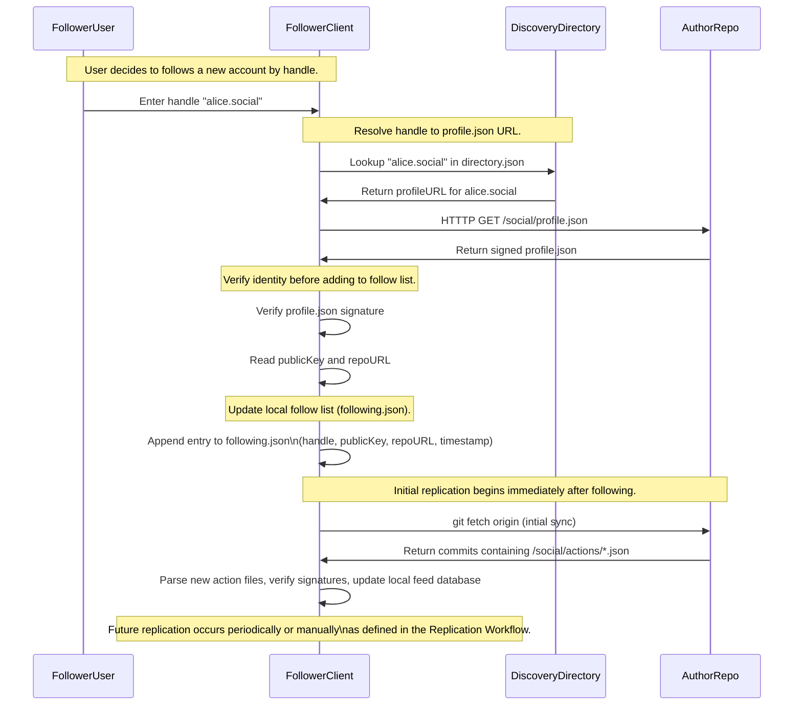
```mermaid
sequenceDiagram
  participant User as FollowerUser
  participant FollowerClient as FollowerClient
  participant Directory as DiscoveryDirectory
  participant AuthorRepo as AuthorRepo

  Note over User,FollowerClient: User decides to follows a new account by handle.

  User ->> FollowerClient: Enter handle "alice.social"

  Note over FollowerClient,Directory: Resolve handle to profile.json URL.

  FollowerClient ->> Directory: Lookup "alice.social" in directory.json
  Directory ->> FollowerClient: Return profileURL for alice.social

  FollowerClient ->> AuthorRepo: HTTTP GET /social/profile.json
  AuthorRepo ->> FollowerClient: Return signed profile.json

  Note over FollowerClient: Verify identity before adding to follow list.

  FollowerClient ->> FollowerClient: Verify profile.json signature
  FollowerClient ->> FollowerClient: Read publicKey and repoURL

  Note over FollowerClient: Update local follow list (following.json).

  FollowerClient ->> FollowerClient: Append entry to following.json\n(handle, publicKey, repoURL, timestamp)

  Note over FollowerClient,AuthorRepo: Initial replication begins immediately after following.

  FollowerClient ->> AuthorRepo: git fetch origin (intial sync)
  AuthorRepo ->> FollowerClient: Return commits containing /social/actions/*.json

  FollowerClient ->> FollowerClient: Parse new action files, verify signatures, update local feed database

  Note over FollowerClient: Future replication occurs periodically or manually\nas defined in the Replication Workflow.
```

## Extension 
### Discovery 
Design Principle:
Discovery maps a human-readable handle (like bharat.social) to the actual Git repository URL and public key. It works at two levels:
- Per-user: each account publishes its own /social/profile.json
- Global directory: a static /social/discovery/directory.json that is automatically updated when new accounts are created.

Why it matters:
- Public keys are portable but not user-friendly
- Handles make identity easier to share
- Discovery acts as the bridge: handle -> profile.json -> repo URL + public key
Exisisting protocols showed gaps:
- ActivityPub -> WebFinger (server-based)
- AT Protocol -> DIDs + DNS mapping (infrastructure-heavy)
- Nostr -> no built-in discovery (relays only)
- Git prototypes -> no discovery, you had to know repo URLs
The surveryed protocols flagged the gap of: no decentralised static-hostable discovery layer.
Automatic directory publishing fills that gap without servers: every client contributes its handle to a shared static file.

Client Responsibilties (Step-by-step)
1. Account creation (author's client)
- When a new account is created, the client automatically generates /social/profile.json
- This file contains: public key, handle, repo URL, display name, bio
- The client signs profile.json with the private key
- The user uploads profile.json to a well-known location:
  - Example: https://bharat.social/profile.json
  - If hosted on GitHub Pages: https://bharat.github.io/social/profile.json
2. Automatic directory update:
- At account creation, the client also appends the new handle + profile URL to /social/discovery/directory.json
- This directory is hosted on a static site (e.g. GitHub Pages)
- Example: https://social.example.org/directory.json
3. Follower browsing:
- User opens the directory (acting as a "yellow pages" of accounts)
- Finds a handle they want to follow (e.g. alice.social)
4. Client fetches profile.json:
- Requests https://alice.social/profile.json
- Reads repoURL + publicKey
- Verifies signature
5. Client updates local following.json:
- Adds entry with handle, repo URL, public key, and timestamp
6. Replication begins:
- Client uses repoURL from following.json
- Runs git fetch to sync posts from that repo

Data Structures
/social/discovery/profile.json (per user, authoritative)
{
  "publicKey": "ed25519:abc123...",
  "handle": "bharat.social",
  "repoURL": "https://github.com/bharat/social.git",
  "displayName": "Bharat",
  "bio": "Student at USYD",
  "created": "2026-06-28T19:57:00Z",
  "signature": "base64sig..."
}
/social/discovery/directory.json (auto-updated global index)
{
  "directory": [
    {
      "handle": "bharat.social",
      "profileURL": "https://bharat.social/social/profile.json"

    },
    {
      "handle": "alice.social",
      "profileURL": "https://bharat.social/social/profile.json"

    }
  ]
}
following.json (local file mantained by the client)
{
  "following": [
    {
      "handle": "alice.social",
      "publicKey": "ed25519:def456...",
      "repoURL": "https://gitlab.com/alice/social.git",
      "added": "2026-06-30T17:46:00Z"
    }
  ]
}
When signing is needed
- profile.json -> signed by the author when published
- directory.json -> auto-updated, unsigned (just an index)
- following.json -> local config, not signed (private to the client)
Implementation Note
- Publishing: Client generates and uploads profile.json automatically during account creation 
- Directory: Clients automatically append their handle + profile URL to a shared directory.json
- Fetching: Clients use HTTP GET to retrieve either directory.json (to browse) or profile.json (to follow)
- Verification: Use crypto libraries to verify profile.json signature
- Storage: Append entry to following.json
- Replication: GitPython/isomorphic git fetch repos listed in following.json

### Discovery Workflow
What it is 
A workflow that shows how the protocol resolves a human-readable handle (e.g. alice.social) into the profile.json containing the user's publicKey and repoURL.
Discovery is the bridge between:
- human-friendly identity (handle)
- cryptographic identity (publicKey)
- storage location (repoURL)
Discovery operates at two levels:
1. Per-user discvoery: each user publishes their own /social/profile.json
2. Global directory discovery: a shared /social/discovery/directory.json which lists all known handles 
This workflow is used before the Following workflow and is required for verifying identity and locating the correct Git repository.

How it works
When a new account is created, the client generates a signed a profile.json containing the user's publicKey, handle, repoURL, and metadata, and publishes it at a well-known URL. The client also appends the handle + profileURL to a shared directory.json hosted on a static site.

When another user wants to follow this account, their client resolves the handle by fetching directory.json, locating the profileURL, fetching the signed profile.json, verifying its signature, and extracting the publicKey and repoURL.
This verified information is then passed to the Following workflow, which updates following.json and begins replication.

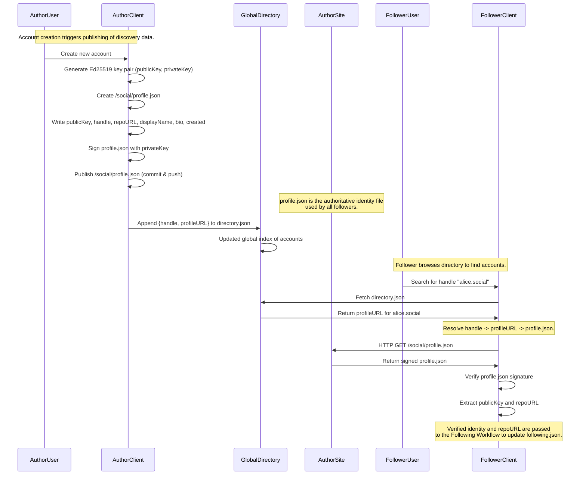
```mermaid
sequenceDiagram
  participant Author as AuthorUser
  participant AuthorClient as AuthorClient
  participant Directory as GlobalDirectory
  participant AuthorSite as AuthorSite
  participant Follower as FollowerUser
  participant FollowerClient as FollowerClient

  Note over Author,AuthorClient: Account creation triggers publishing of discovery data.

  Author ->> AuthorClient: Create new account
  AuthorClient ->> AuthorClient: Generate Ed25519 key pair (publicKey, privateKey)

  AuthorClient ->> AuthorClient: Create /social/profile.json
  AuthorClient ->> AuthorClient: Write publicKey, handle, repoURL, displayName, bio, created
  AuthorClient ->> AuthorClient: Sign profile.json with privateKey

  AuthorClient ->> AuthorClient: Publish /social/profile.json (commit & push)

  Note over AuthorSite: profile.json is the authoritative identity file<br>used by all followers.

  AuthorClient ->> Directory: Append {handle, profileURL} to directory.json
  Directory ->> Directory: Updated global index of accounts

  Note over Follower,FollowerClient: Follower browses directory to find accounts.

  Follower ->> FollowerClient: Search for handle "alice.social"
  FollowerClient ->> Directory: Fetch directory.json
  Directory ->> FollowerClient: Return profileURL for alice.social

  Note over FollowerClient: Resolve handle -> profileURL -> profile.json.

  FollowerClient ->> AuthorSite: HTTP GET /social/profile.json
  AuthorSite ->> FollowerClient: Return signed profile.json

  FollowerClient ->> FollowerClient: Verify profile.json signature
  FollowerClient ->> FollowerClient: Extract publicKey and repoURL

  Note over FollowerClient: Verified identity and repoURL are passed<br>to the Following Workflow to update following.json.
```

### Feed Indexing
Design Principle:
Efficient feed rendering requires an index of recent posts. Instead of scanning all files in /social/actions/, clients can read a lightweight index.json to quickly locate the latest posts.
Why it matters:
- As repositories grow, scanning every file in /social/actions/ becomes slow 
- An index speeds up synchronisation by pointing directly to recent posts
- Keeps replication efficient while mantaining portability
Inspiration from surveyed protocols:
- Git-as-Transport -> proposed indexes to avoiding scanning the entire repo history. This influenced the use of index.json as lightweight pointer to recent actions
- ActivityPub -> uses inbox/outbox collections to quickly access recent posts without crawling all objects, we mirror this efficieny in Git-native way
Git prototype lacked a feed index, forcing clients to scan whole repository. Feed Indexing fills this gap.

Client Responsibilities (step-by-step)
Author's client (posting):
1. Create new action file:
- Generates a JSON file (post, reply, like, follow) inside /social/actions/
- Each file is signed with the author's private key
2. Update index.json:
- Adds the new post ID to the latestPosts array
- Refreshes the updated timestamp
- Keeps only a limited window of recent posts (e.g. last 50 IDs) for efficiency
3. 
Commit and push:
- Commits bot the new action file and the updated index.json
- Pushes to the Git host
Follower's client (fetching):
1. Runs git fetch:
- Synchronises new commits from each followed repo listed in following.json
- This updates the local copy of /social/actions/ and retrieves the latest index.json
2. Read index.json:
- Opens the fetched index.json from each followed repo
- Quickly identifies the latest post IDs without scanning all files
3. Compare with local feed database:
- Checks which post IDs in the remote index.json are missing from the local feed database
- Note: comparison is against the local feed database, not against your own index.json (which only tracks your own posts)
4. Fetch missing posts:
- Retrieves only the missing JSON files from /social/actions/
- Avoids re-scanning or re-downloading old posts
5. Verify signatures:
- Uses the author's public key (from their profile.json) to verify each new action file
- Accepts valid posts and ignores invalid ones
6. Insert into feed database:
- Adds verified posts to the local feed database (JSON file, SQLite, or memory cache)
- Updates chronological ordering
- Links replies to parent posts via inReplyTo
- Displays likes/follows as metadata
How /social/actions/ fits in
- /social/action is the folder in each repo where all signed social actions are stored
- After replication, your local copy of /social/actions contains all posts from followers accumulated since your last sync
- Git ensures incremental sync: only new commits are fetched
- Feed Indexing (index.json) avoids rescanning the entire /social/actions/ directory by pointing directly to the latest posts.

Data Structure 
index.json (per repo, lightweight index)
{
  "latestPosts": ["post-001", "post-002", "post-003"],
  "updated": "2026-06-28T15:24:00Z"
}
Example worflow with index.json:
- Repo has 10,000 posts in /social/actions/
- index.json lists only the last 50 post IDs
- Follower's client fetches those 50, verfies signatures, and updates feed
- No need to rescan all 10,000 files
Why signing is needed
- Actions files -> signed by the author
- index.json -> not signed (convenience file)
- Followers always verify signatures inside the actual action JSON files
Implementation Note
- Publishing: Author's client updates index.json automatically whenever a new post is created
- Fetching: Follower's client reads index.json first, then fetches missing posts
- Verification: Signatures are checked on the post JSON files, not index.json
- Storage: Feed database (local JSON, SQLite, or memory cache) is updated with verified posts
- Efficiency: Index avoids scanning thousands of files, making sync faster

### Feed indexing workflow
What it is
Shows how an author mantains a lightweight index.json pointing to recet post, and how follower clients use that index after replication to quickly discover which posts are new to their local feed database without rescnning all of /social/actions/. This workflow is an optimisation layer on top of Replication: it does not replace the standard signature verfication or action parsing, but narrows the search space.

How it works
When the author publishes a new post, their client creates the signed action file under /social/actions/, then updates index.json in the same repository. The index keeps a sliding window of recent post IDs (e.g. last 50) and an updated timestamp. The client commits bothe the new action file and the updated index.json and pushes them to the Git host.

Follower clients, after running git fetch as part of the Replication workflow, read the latest index.json from each followed repo. They compare the latestPosts IDs in that remote index against their local feed database to determine which posts are missing. For each missing ID, the client opens the corresponding JSON file in /social/actions/, verifies its signature using the author's publicKey from profile.json, and if valid, inserts the post into the local feed database - linking replies via inReplyTo and showing likes/followes as metadata as usual.

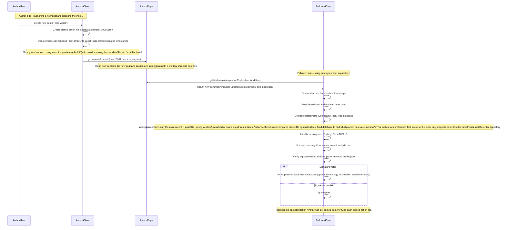
```mermaid
sequenceDiagram
  participant Author as AuthorUser
  participant AuthorClient as AuthorClient
  participant Repo as AuthorRepo
  participant FollowerClient as FollowerClient

  Note over Author,AuthorClient: Author side - publishing a new post and updating the index.

  Author ->> AuthorClient: Create new post ("Hello world")
  AuthorClient ->> AuthorClient: Create signed action file /social/actions/post-10001.json
  AuthorClient ->> AuthorClient: Update index.josn (append "post-10001" to latestPosts, refresh updated timestamp)
  Note over AuthorClient: Sliding window keeps only recent N posts (e.g. last 50)\nto avoid scanning thousands of files in /social/actions/.

  AuthorClient ->> Repo: git commit & push\n(post10001.json + index.json)

  Note over Repo: Repo now contains the new post and an updated index.json\nwith a window of recent post IDs.

  Note over FollowerClient: Follower side – using index.json after replication.

  FollowerClient ->> Repo: git fetch orgin (as part of Replication Workflow)
  Repo ->> FollowerClient: Return new commits\nincludng updated /social/actions/ and index.json

  FollowerClient ->> FollowerClient: Open index.json from each followed repo
  FollowerClient ->> FollowerClient: Read latestPosts and updated timestamp

  FollowerClient ->> FollowerClient: Compare latestPosts IDs\nagainst local feed database

  Note over FollowerClient: index.json contains only the most recent N post IDs (sliding window).\nInstead of scanning all files in /social/actions/, the follower compares these IDs against its local feed database to find which recent posts are missing.\nThis makes synchrohisation fast because the client only inspects posts listed in latestPosts, not the entire repostory history.

  FollowerClient ->> FollowerClient: Identify missing post IDs (e.g. "post-10001")

  FollowerClient ->> FollowerClient: For each missing ID, open /social/actions/<id>.json
  FollowerClient ->> FollowerClient: Verify signature using author's publicKey from profile.json 

  alt Signature valid
    FollowerClient ->> FollowerClient: Insert post into local feed database\n(update chronology, link replies, attach metadata)
  else Signature invalid
    FollowerClient ->> FollowerClient: Ignore post
  end

  Note over FollowerClient: Index.json is an optimization hint.\nTrust still comes from verifying each signed action file.
```
Intuitive example workflow:
Step 1: One session key for the whole group
- sessionKey = ABC123
- All recipients share this same symmetric key.

Step 2: Encrypt the post ONCE
- ciphertext = Encrypt(plaintext, sessionKey, freshNonce)
- This ciphertext is:
  - unique to this post
  - identical for all recipients

Step 3: Encrypt the session key separately for each recipient
- encryptedKeyForAlice = Encrypt(ABC123, Alice_publicKey)
- encryptedKeyForBob   = Encrypt(ABC123, Bob_publicKey)
- encryptedKeyForCara  = Encrypt(ABC123, Cara_publicKey)

These encryptedKey values are:
- different per recipient
but they all decrypt to the same session key ABC123

### Media Handling 
Design Principle:
Posts can reference media files (images, audio, video). Large binary files are handled differently than JSON actions by handling via Git LFS or external storage to keep repositories efficient.

Why it matters:
- Social feeds often include rich media
- Git alone doesn't handle large binary files well - repos can bloat quickly
- Media must be referenced cleanly in posts and stored efficiently
Inspired by:
- ActivityPub -> servers host media alongside posts
- Git prototypes -> limited or no media support
- AT Protocol -> supports blob storage references
Gap identified: Git-based social prototypes lacked robust media handling. Adding Git LFS or external storage fills this gap

What is Git LFS?
- Git LFS (Large File Storage) is an extension to Git for handling large binary files 
- Instead of storing the full binary in the repository history, Git LFS stores a small pointer file in the repo
The pointer file contains:
- version -> the LFS spec version (e.g. https://git-lfs.github.com/spec/v1)
- oid sha256 -> a cryptographic hash of the actual binary file
- size -> the size of the binary file in bytes
- The actual binary file (image, video, audio) is stored separately in LFS storage
- When followers fetch, Git LFS automatically downloads the real binary behind the pointer

Example Pointer File (Git LFS)
When the client commits a large media file, Git LFS generates a pointer file like this:

version https://git-lfs.github.com/spec/v1
oid sha256:3b2f1c9d4a7e8f0a9c8e2d6f1234567890abcdef1234567890abcdef12345678
size 2456789
version -> fixed string from the Git LFS specification
oid sha256 -> hash of the actual binary media file (ensures integrity)
size -> exact size of the binary file file in bytes
This pointer file is what gets committed to the repo. The binary itself is stored in LFS storage

Client Responsibilities (step-by-step)
Author's client (posting with media)
1. Create media file:
- User selects an image, audio, or video
- Client saves it in /social/media/
- If the file is large, Git LFS automatically generates a pointer file with version, hash, and size
2. Reference in post JSON:
- Post JSON includes a media field listing file paths
- Example: "media": ["media/photo1.jpg"]
- If Git LFS is used, the path points to the pointer file, but Git LFS resolves it to the actual binary 
3. Commit and push:
- Commits both the post JSON in /social/actions/ and the media file (or LFS pointer)
- Pushes to Git host 
4. Update index.json:
- Adds the new post ID to index.json
- Ensures followers can quickly discover the post and its media reference
Follower's client (fetching media)
1. Run git fetch:
- Synchronises new commits from each followed repository
- Retrieves new post JSON files and any referenced media files (or LFS pointers)
2. Read post JSON:
- Identifies media field entries
- Determines which media files need to be downloaded
3. Dowload media:
- If small files: fetched directly from /social/media/
- If large files: Git LFS automatically downloads the actual binary where the pointer file is encountered
4. Verify post JSON:
- Checks signature of the post JSON
- Ensures media references are valid 
5. Insert into feed database:
- Adds post content and media references
- Displays media inline with the post in the feed

Data Structures 
Post JSON with media references
{
  "id": "post-003",
  "type": "post",
  "author": "ed25519:abc123...",
  "content": "Photo from trip",
  "media": ["media/photo1.jpg"],
  "created": "2026-06-28T20:15:00Z",
  "signature": "base64sig..."
}
Repo layout example
/social/actions/post-003.json
/social/media/photo1.jpg   (small file)
/social/media/photo2.lfs   (pointer file for large file)
/social/index.json

When signing is needed
- Post JSON -> signed by the author
- Media files -> not individually signed (integrity comes from Git commit or LFS pointer)
- Follower verify the post JSON signature; media integrity is ensures by Git/LFS.

### Media Handling Workflow (Posts with media + Git LFS/external storage)
What it is
Shows how an author attaches media (images/audio/video) to a post, how the client stores media files (directly or via Git LFS pointer files), references them from the post JSON, and how followers fetch, resolve, and display those media assets alongside the post. This workflow focuses on media storage and referencing, not on social action semantics (as already covered in the Posting Workflow).

How it works
When the user creates a post with media, the client saves the media file under /social/media/, optionally using Git LFS so that only a small pointer file is committed to the repository while the actual binary is stored in LFS storage. The post JSON includes a media field listing the paths to these media files. The client then commits and pushes both the post JSON and the media (or pointer) files. Followers, during replication, fetch new commits, read the post JSON, inspect the media field, and let Git/Git LFS retrieve the actual binaries. The follower verifies the post JSON signature using the author's publicKey from profile.json, then stores the post and its media references in the local feed database and renders the media inline.

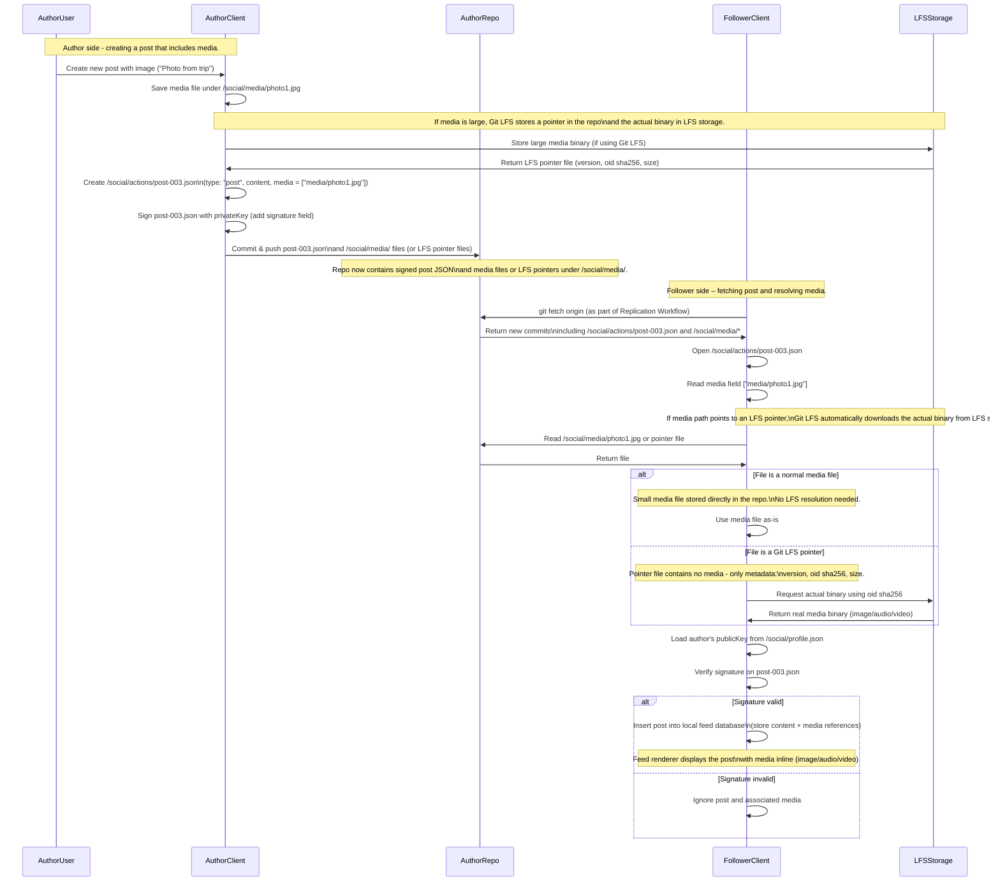
```mermaid
sequenceDiagram
  participant Author as AuthorUser
  participant AuthorClient as AuthorClient
  participant Repo as AuthorRepo
  participant FollowerClient as FollowerClient
  participant LFS as LFSStorage

  Note over Author,AuthorClient: Author side - creating a post that includes media.

  Author ->> AuthorClient: Create new post with image ("Photo from trip")
  AuthorClient ->> AuthorClient: Save media file under /social/media/photo1.jpg

  Note over AuthorClient,LFS: If media is large, Git LFS stores a pointer in the repo\nand the actual binary in LFS storage.

  AuthorClient ->> LFS: Store large media binary (if using Git LFS)
  LFS ->> AuthorClient: Return LFS pointer file (version, oid sha256, size)

  AuthorClient ->> AuthorClient: Create /social/actions/post-003.json\n(type: "post", content, media = ["media/photo1.jpg"])
  AuthorClient ->> AuthorClient: Sign post-003.json with privateKey (add signature field)

  AuthorClient ->> Repo: Commit & push post-003.json\nand /social/media/ files (or LFS pointer files)

  Note over Repo: Repo now contains signed post JSON\nand media files or LFS pointers under /social/media/.

  Note over FollowerClient: Follower side – fetching post and resolving media.

  FollowerClient ->> Repo: git fetch origin (as part of Replication Workflow)
  Repo ->> FollowerClient: Return new commits\nincluding /social/actions/post-003.json and /social/media/*

  FollowerClient ->> FollowerClient: Open /social/actions/post-003.json
  FollowerClient ->> FollowerClient: Read media field ["media/photo1.jpg"]

  Note over FollowerClient,LFS: If media path points to an LFS pointer,\nGit LFS automatically downloads the actual binary from LFS storage.

  FollowerClient ->> Repo: Read /social/media/photo1.jpg or pointer file
  Repo ->> FollowerClient: Return file

  alt File is a normal media file
    Note over FollowerClient: Small media file stored directly in the repo.\nNo LFS resolution needed.
    FollowerClient ->> FollowerClient: Use media file as-is
  else File is a Git LFS pointer
    Note over FollowerClient: Pointer file contains no media - only metadata:\nversion, oid sha256, size.
    FollowerClient ->> LFS: Request actual binary using oid sha256
    LFS ->> FollowerClient: Return real media binary (image/audio/video)
  end

  FollowerClient ->> FollowerClient: Load author's publicKey from /social/profile.json
  FollowerClient ->> FollowerClient: Verify signature on post-003.json

  alt Signature valid
    FollowerClient ->> FollowerClient: Insert post into local feed database\n(store content + media references)
    Note over FollowerClient: Feed renderer displays the post\nwith media inline (image/audio/video).
  else Signature invalid
    FollowerClient ->> FollowerClient: Ignore post and associated media
  end

```

## Redesigned Components
### Moderation
Design Principle:
Moderation is decentralised and portable. Each user can publish signed blocklists and trust lists that define who they block or trust. These lists are crytographically verifiable and can be shared across repositories

Why it matters:
- Moderation is essential for safety and trust in social systems
- Surveyed protocols showed gaps:
  - ActivityPub -> moderation is server-based (admins enforce rules)
  - Nostr -> no built-in moderation; users rely on relays or external tools
- My design principle flagged this gap: no surveyed protocol offered portable, signed moreation lists
- Adding signed blocklists/trust lists make moderation user-controlled, verifiable, and shareable

Client Responsibilties (step-by-step)
Author's client (publishing moderation lists):
1. User decides who to block/trust
- This is a manual decision: the user chooses accounts they don't want to see (blocklist) or accounts they want to prioritse (trustlist)
- They identify these accounts by their public key (e.g. ed25519:def456...) or by their handle (e.g. alice.social)
2. Create moderation list:
- Client generates a JSON file in /social/moderation/ (e.g. blocklist.json or trustlist.json)
3. Add entries:
- Each entry is a public key or handle of the account being blocked/trusted
- Example: "blockedKeys": ["ed25519:def456..."]
4. Sign the list:
- Client signs the JSON file with the author's private key
- Ensures authencity and prevents tampering
5. Commit and push:
- Commits the moderation file to the repository 
- Pushes to Git host

Follower's client (enforcing moderation):
1. Run git fetch:
- Synchronsises new commits from followed repositories
- Retrieves updated moderation files (blocklist.json, trustlist.json)
2. Verify signature:
- Uses the author's public key (from their profile.json) to verify the moderation list
- Accepts valid lists; ignores invalid ones
3. Apply moderation rules:
- Blocklist -> hides posts from those accounts in the feed
- Trustlist -> highlights or prioritises posts from these accounts
4. Update local moderation state:
- Stores verified moderation lists locally
- Applies them during feed rendering

Data Structures
Blocklist JSON
{
  "blockedKeys": ["ed25519:def456..."],
  "signature": "base64sig..."
}
Trustlist JSON
{
  "trustedKeys": ["ed25519:abc123..."],
  "signature": "base64sig..."
}
Repo layout example
/social/actions/post-001.json
/social/moderation/blocklist.json
/social/moderation/trustlist.json
/social/index.json

When signing is needed
- Moderation lists -> always signed by the author
- Followers verify signatures before applying rules
- Ensures moderation is authentic and portable

Implementation Note
- Publishing: Clients generate and sign moderation lists automatically when users block/trust accounts
- Verification: Followers use crypto libraries to verify signatures
- Storage: Moderation lists are stored in /social/moderation/
- Application: Clients enforce block/trust rules during feed rendering

### Moderation Workflow (Signed Blocklists & Trustlists)
What it is 
A workflow showing how users publish signed moderation lists - blocklist.json and trustlist.json - under /social/moderation/, and how followers client fetch, verify, and enforce these lists during feed rendering. 
Moderation in this protocol is:
- Decentralised - no servers or admins decide what you see
- Portable - moderation lists travel with your identity
- Cryptographically verifiable - followers only apply lists that are signed by the author
- User-controlled - each user decides who to block or trust
- Feed-level - moderation affects rendering, not replication
This fills the gap identified in your designm.md where surveyed protocols lacked portable, signed moderation lists.

How it works
When a user decides to block or trust accounts, their client creates a JSON moderation file under /social/moderation/. Moderation entries are publicKeys, which is suitable because the they are the user's true identity in the protocol. Clients already obtain these publicKey earlier through the Discovery Workflowm so moderation does not perform any handle resolution.

The client creates either blocklist.json or trustlist.json, inserts the chosen publicKeys signs the JSON with the author's private key, and commits/pushes it ot the repository. Follower clients fetch these moderation files during replication, verify their signatures using the author's publicKey from profile.hson, and update their local moderation state.

During feed rendering:
- Blocklist: hide posts, replies, likes, and follows from blocked publicKeys
- Trustlist: highlight or prioritise posts from trusted publicKeys
Moderation does not affect replication - followers still fetch all posts - but it affects visibility, ranking, and filtering in the local feed. This means blocked content is still downloaded and verified, but not shown. 

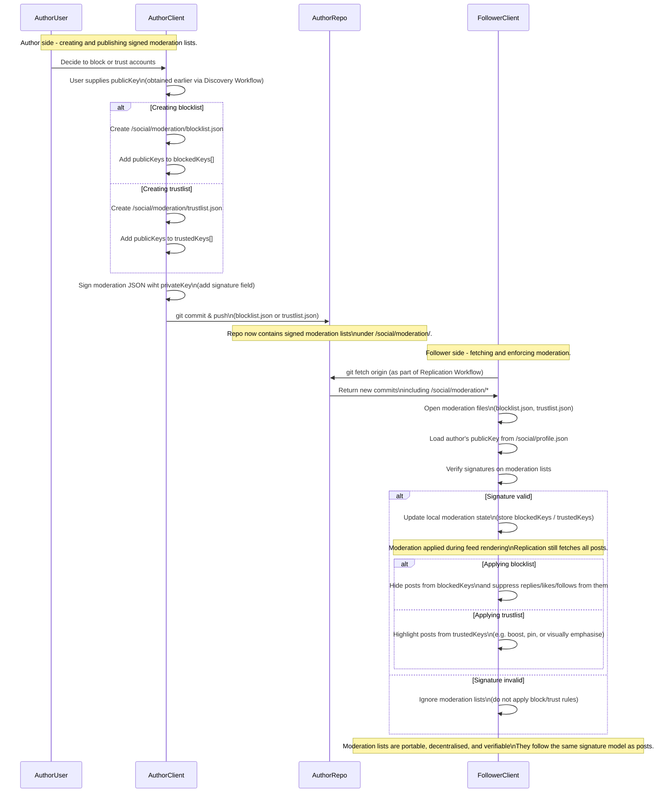
```mermaid
sequenceDiagram
  participant Author as AuthorUser
  participant AuthorClient as AuthorClient
  participant Repo as AuthorRepo
  participant FollowerClient as FollowerClient

  Note over Author,AuthorClient: Author side - creating and publishing signed moderation lists.

  Author ->> AuthorClient: Decide to block or trust accounts
  AuthorClient ->> AuthorClient: User supplies publicKey\n(obtained earlier via Discovery Workflow)

  alt Creating blocklist
    AuthorClient ->> AuthorClient: Create /social/moderation/blocklist.json
    AuthorClient ->> AuthorClient: Add publicKeys to blockedKeys[]
  else Creating trustlist
    AuthorClient ->> AuthorClient: Create /social/moderation/trustlist.json
    AuthorClient ->> AuthorClient: Add publicKeys to trustedKeys[]
  end

  AuthorClient ->> AuthorClient: Sign moderation JSON wiht privateKey\n(add signature field)
  
  AuthorClient ->> Repo: git commit & push\n(blocklist.json or trustlist.json)

  Note over Repo: Repo now contains signed moderation lists\nunder /social/moderation/.

  Note over FollowerClient: Follower side - fetching and enforcing moderation.

  FollowerClient ->> Repo: git fetch origin (as part of Replication Workflow)
  Repo ->> FollowerClient: Return new commits\nincluding /social/moderation/*

  FollowerClient ->> FollowerClient: Open moderation files\n(blocklist.json, trustlist.json)
  FollowerClient ->> FollowerClient: Load author's publicKey from /social/profile.json
  FollowerClient ->> FollowerClient: Verify signatures on moderation lists

  alt Signature valid
    FollowerClient ->> FollowerClient: Update local moderation state\n(store blockedKeys / trustedKeys)

    Note over FollowerClient: Moderation applied during feed rendering\nReplication still fetches all posts.

    alt Applying blocklist
      FollowerClient ->> FollowerClient: Hide posts from blockedKeys\nand suppress replies/likes/follows from them
    else Applying trustlist
      FollowerClient ->> FollowerClient: Highlight posts from trustedKeys\n(e.g. boost, pin, or visually emphasise)
    end
  else Signature invalid
    FollowerClient ->> FollowerClient: Ignore moderation lists\n(do not apply block/trust rules)
  end

  Note over FollowerClient: Moderation lists are portable, decentralised, and verifiable\nThey follow the same signature model as posts.
```

### Confidenentiality 
Design Principle:
Confedentiality allows users to publish private posts that are only readable by selected receipients. This is achieved using group/session keys for encryption.

Why it matters:
- Social feeds often need private or semi-private communication
- Surveyed protocols showed gaps:
  - sAT -> supports per-post encryptions but heavy at scale
  - ActivityPub -> relies on server-side access control, not end-to-end encryption
  - Nostr -> messages are public unless encrypted separately 
- Adding group/session key encryption makes private posts end-to-end secure, verifiable, and decentralised while balancing efficiency

How Session Keys Work
- A session key is a randomly generated symmetric key (e.g.AES-256)
- Per-post model (sAT style):
  - Each post gets its own fresh session key 
  - Strong isolation, but heavy at scale
- Session/group model (chosen default)
  - One session key is generated for a coversation or time window
  - Multiple posts in that session are encrypted with the same key
  - The session key is distributed once to recipients, then reused until rotated
- Balanced approach (optional):
  - Use per-post keys for highly sensitive content
  - Use session keys for conversational threads or bursts of posts
  - Rotate session keys regularly (e.g. daily, per thread, or manual trigger) to limit exposure
Clarification: In this design we adopt the session/group model as the default, because it scales better. Per-post encryption may still be available for sensitive cases, but session keys are the standard.

Client Responsibilities (step-by-step)
Author's client (publishing private posts):
1. Compose private post:
- User writes a post intended for specific recipients
2. Generate or reuse session key:
- If new session -> generate fresh symmetric key (randomBytes(32))
- If ongoing session -> reuse existing session key 
3. Encrypt post content:
- Uses session key to encrypt the post text
- Stores ciphertext in the JSON
4. Encrypt session key for recipents:
- For each recipient's public key, encrypts the session key once
- These encrypted keys are written into a session key distribution file (/social/actions/session-001.json)
5. Create post JSON:
- Post JSON references the sessionId (e.g. "sessionId": "sess-001") 
- Includes ciphertext and metadata
- Signs the JSON with the author's private key
6. Commit and push:
- Commits both the session key distribution JSON (if new) and the post JSON
- Pushes to Git host

Follower's client (reading private posts):
1. Run git fetch:
- Syncs new commits from followed repos
- Retrieves both session key distribution files and post JSONs
2. Verify signatures:
- Uses author's public key to verify authencity of both files
3. Check recipient list (session file):
- Looks at encryptedFor in the session JSON
- If follower's public key is included, they are an intended recipient
4. Decrypt session key:
- Uses their private key to decrypt the session key once from the session file
5. Decrypt post content:
- Uses the session key to decrypt ciphertext for all posts referencing that sessionId
6. Insert into feed database:
- Adds decrypted posts to local feed
- Displays them only to authorised recipients

Data Structures
Session key distribution JSON
{
  "sessionId": "sess-001",
  "encryptedFor": [
    {
      "recipient": "ed25519:abc123...",
      "encryptedKey": "base64encKey1..."
    },
    {
      "recipient": "ed25519:def456...",
      "encryptedKey": "base64encKey2..."
    }
  ],
  "signature": "base64sig..."
}
Post JSON using session key 
{
  "id": "post-010",
  "type": "post",
  "author": "ed25519:xyz789...",
  "sessionId": "sess-001",
  "ciphertext": "base64encCiphertext...",
  "created": "2026-07-02T18:40:00Z",
  "signature": "base64sig..."
}
Purpose: Contains encrypted post content tied to a session
Reviewed by: Follower's clients after they have decrypted the session key 
Usage: Decrypts ciphertext using the session key from the distribution file

Implementation Note:
- Default: Session/group model for scalability
- Distribution: Session key is published once in a signed JSON file
- Posts: Each post references the sessionId and stores ciphertext
- Verification: Followers verify both session and post JSON signatures
- Decryption: Followers decrypt session key once, then reuse it for all posts in that session
- Rotation: Session keys rotated regularly to limit expose

Summary 
Confidentiality relies on two linked files:
- Session key distribution JSON -> defines who can decrypt the session key
- Post JSON -> references that sessionId and stores ciphertext
- Authors generate and distribute session keys once per session.
- Followers fetch both files, verify signatures, decrypt the session key, then use it for all posts in that session.
- This makes private posts scalable, secure, and verifiable.

### Confidentiality Workflow (Private Posts via Session/Group Keys)
What it is 
Shows how an author creates private posts encrypted with a sesssion key, and how the client distributes that session key to authorised recipients using their publicKeys, and how followers fetch, verify, decrypt, and display those private posts. 

Confidentiality provides end-to-end encrypted private posts without servers, using Git as the transport layer and symmetric session keys for scalable encryption. This fill that gap identified in desing.md of portable, decentralised and verifiable private posts.

How it works
When a user writes a private post, the client either generates a new session key or reuses an existing one for that conversation. The post content is encrypted using this symmetric session key.
The client then creates a session key distribution JSON containing:
- a sessionId
- one symmetric session key shared by all recipients
- multiple encryptedKey entries, one per recipient publicKey (each encryptedKey contains the same session key encrypted wiht a different recipient publicKey)
The post JSON stores:
- the session ID 
- the ciphertext (same for all recipients, different per post due to fresh nonce/IV)
- metadata
- a signature
Both the session distribution file and the encrypted post file are committed and pushed. Follower clients fetch these files during replication, verify signatures, check whether their publicKey appears in the session distribution JSON, decrypt the session key using their private key, and then decrypt all posts referencing that sessionId. 

Private posts are inserted into the feed database and displayed only to authorised recipients. Confidentiality does not affect replication - followers still fetch all encrypted posts - but only authorised recipients can decrypt and view them. 

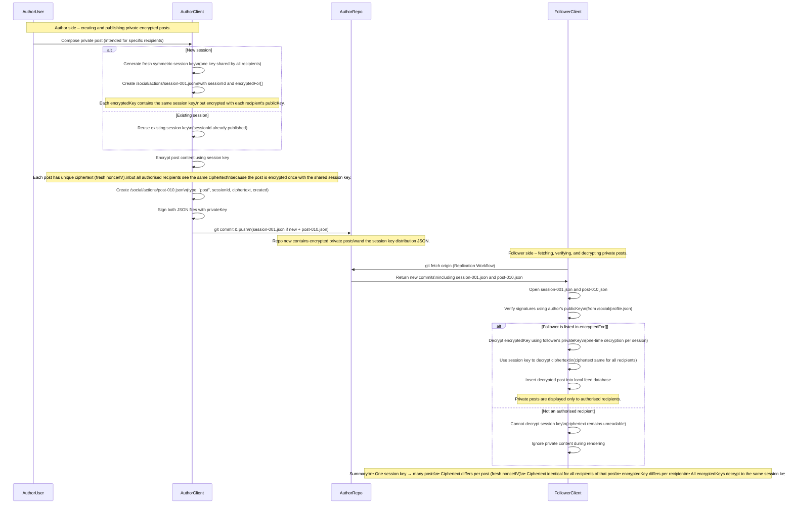
```mermaid
sequenceDiagram
  participant Author as AuthorUser
  participant AuthorClient as AuthorClient
  participant Repo as AuthorRepo
  participant FollowerClient as FollowerClient

  Note over Author,AuthorClient: Author side – creating and publishing private encrypted posts.

  Author ->> AuthorClient: Compose private post (intended for specific recipients)

  alt New session
    AuthorClient ->> AuthorClient: Generate fresh symmetric session key\n(one key shared by all recipients)
    AuthorClient ->> AuthorClient: Create /social/actions/session-001.json\nwith sessionId and encryptedFor[]
    Note over AuthorClient: Each encryptedKey contains the same session key,\nbut encrypted with each recipient's publicKey.
  else Existing session
    AuthorClient ->> AuthorClient: Reuse existing session key\n(sessionId already published)
  end

  AuthorClient ->> AuthorClient: Encrypt post content using session key
  Note over AuthorClient: Each post has unique ciphertext (fresh nonce/IV),\nbut all authorised recipients see the same ciphertext\nbecause the post is encrypted once with the shared session key.

  AuthorClient ->> AuthorClient: Create /social/actions/post-010.json\n(type: "post", sessionId, ciphertext, created)
  AuthorClient ->> AuthorClient: Sign both JSON files with privateKey

  AuthorClient ->> Repo: git commit & push\n(session-001.json if new + post-010.json)

  Note over Repo: Repo now contains encrypted private posts\nand the session key distribution JSON.

  Note over FollowerClient: Follower side – fetching, verifying, and decrypting private posts.

  FollowerClient ->> Repo: git fetch origin (Replication Workflow)
  Repo ->> FollowerClient: Return new commits\nincluding session-001.json and post-010.json

  FollowerClient ->> FollowerClient: Open session-001.json and post-010.json
  FollowerClient ->> FollowerClient: Verify signatures using author's publicKey\n(from /social/profile.json)

  alt Follower is listed in encryptedFor[]
    FollowerClient ->> FollowerClient: Decrypt encryptedKey using follower's privateKey\n(one-time decryption per session)
    FollowerClient ->> FollowerClient: Use session key to decrypt ciphertext\n(ciphertext same for all recipients)
    FollowerClient ->> FollowerClient: Insert decrypted post into local feed database
    Note over FollowerClient: Private posts are displayed only to authorised recipients.
  else Not an authorised recipient
    FollowerClient ->> FollowerClient: Cannot decrypt session key\n(ciphertext remains unreadable)
    FollowerClient ->> FollowerClient: Ignore private content during rendering
  end

  Note over FollowerClient: Summary:\n• One session key → many posts\n• Ciphertext differs per post (fresh nonce/IV)\n• Ciphertext identical for all recipients of that post\n• encryptedKey differs per recipient\n• All encryptedKeys decrypt to the same session key
```

### Threading
Design Principle:
Replies reference parent commits. Threads are reconstructed by traversing the Git DAG (Directed Acylic Graph)

Why it matters:
- Social feeds aren't just flat lists - conversations form through replies
- Surveyed protocols:
  - ActivityPub -> replies reference parent posts via IDs, but threading depends on servers to mantain context
  - Nostr -> replies reference event IDs, but threading is weak; clients often fail to reconstruct full conversation trees
  - Git DAG -> naturally models parent/child relationship between commits, but Git-based prototypes didn't define explicit reply structures
- Gap: Git-based prototypes lacked clear threading logic and inReplyTo fields
- Fix: Adding explicit inReplyTo plus DAG traversal makes threads verifiable, decentralised, and easy to reconstruct.

Client Responsibilities (step-by-step)
Author's client (publishing a reply):
1. Compose reply:
- User writes a reply to an existing post (e.g. post-001)
2. Create reply JSON:
- Same workflow as a post JSON, but with:
  - type: "reply"
  - inReplyTo: "post-001"
- Example file: /social/actions/post-005.json
3. Sign and commit:
- Signs with author's private key 
- Commits the reply JSON
4. Push to Git host:
- Pushes the commit so followers can fetch it 

Follower's client (reading replies):
1. Run git fetch:
- Syncs new commits from followed repos
- Retrieves reply JSON files
2. Verify signature:
- Uses author's public key to verify authencity 
3. Check inReplyTo:
- Reads the parent post ID from the reply JSON
- Links reply to its parent in local feed database
4. Traverse DAG:
- Builds conversation threads by following parent/child links
- Example: post-001 -> post-005 -> post-008
5. Render thread:
- Displays parent post with nested replies
- Mantains chronological order

Data Structures
Reply JSON Example: /social/actions/post-005.json
{
  "id": "post-005",
  "type": "reply",
  "author": "ed25519:xyz789...",
  "content": "Replying to post-001",
  "inReplyTo": "post-001",
  "created": "2026-06-27T22:34:00Z",
  "signature": "base64sig..."
}
- inReplyTo -> references parent post ID
- type: "reply" -> distinguishes from normal posts
- Signed for authencity

Repo Layout Example
/social/actions/post-001.json   (original post)
/social/actions/post-005.json   (reply)
/social/actions/post-007.json   (reply to reply)

Implementation Note
- Publishing: Replies are authored as JSON with inReplyTo
- Verification: Followers verify signatures before linking 
- Thread reconstruction: Clients traverse DAG edges (inReplyTo) to build conversation trees
- Rendering: Threads displayed with parent + nested replies

Example Workflow
1. Alice posts:
- post-001.json -> "Hello world"
2. Bob replies:
- post-005.json -> inReplyTo: "post-001"
- Content: "Hi Alice!"
3. Carol replies to Bob:
- post-007.json -> inReplyTo: "post-005"
- Content: "Agree with Bob"
4. Followers fetch:
- Clients pull all three JSONs
- Verify signatures
- Traverse DAG:
  - Root: post-001
  - Child: post-005
  - Grandchild: post-007
5. Render thread:
Alice: Hello world.
  Bob: Hi Alice!
    Carol: Agree with Bob.

Summary:
- A reply is a specialised post JSON (type: "reply") with an extra inReplyTo pointer
- Workflow is identical to posts: authored, signed, committed, pushed, fetched, verified
- The difference is that replies link into threads, reconstructured by DAG traversal
- This fixes the gap in Git-based prototypes and makes threading decentralised, verifiable, and consistent

### Threading Workflow
What it is 
Threading shows how clients reconstruct coversation trees by following inReplyTo pointers and traversing the Git DAG. It explains how replies for nested structures (post -> reply -> reply -> ...) and how clients render these threads in the feed. This addresses the gaps in earlier Git-based prototypes, which lacked explicit reply structures and threading logic.

How it works
When an author publishes a reply, the reply JSON includes an inReplyTo field pointing to the parent post. Followers fetch replies during replication, verify signatures, and store them in the local feed database.

Threading begins after all posts and replies are stored locally. At this point, the client perfomrs the following steps:
1. Read all posts and replies
The client loads every JSON file in /social/actions and extracts: id, type, inReplyTo (if present), giving the client full list of post and replies
2. Build a mapping: postId -> children[]
The client creates a mapping that groups replies under the post they reference. This is done by scanning each reply's inReplyTo field and adding that reply to the parent post's children[] list.
3. Traverse the DAG using inReplyTo
Git already provides a Directed Acyclic Graph of commits, so threading uses the reply edges inside that DAG to reconstruct the reply chain.
4. Construct a conversation tree (client builds tree by mapping edges)
5. Render nested replies

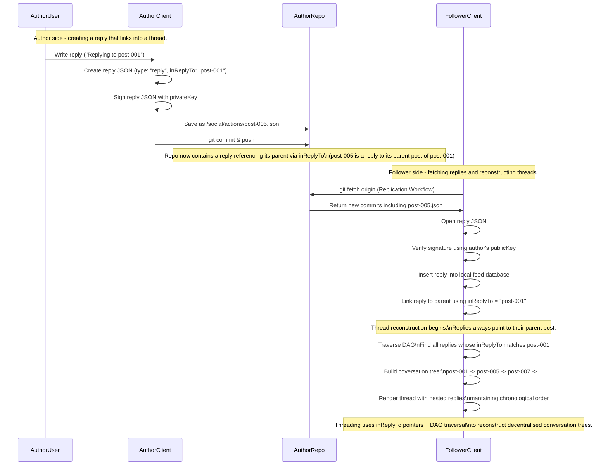
```mermaid
sequenceDiagram
  participant Author as AuthorUser
  participant AuthorClient as AuthorClient
  participant Repo as AuthorRepo
  participant FollowerClient as FollowerClient
  
  Note over Author,AuthorClient: Author side - creating a reply that links into a thread.

  Author ->> AuthorClient: Write reply ("Replying to post-001")
  AuthorClient ->> AuthorClient: Create reply JSON (type: "reply", inReplyTo: "post-001")
  AuthorClient ->> AuthorClient: Sign reply JSON with privateKey
  AuthorClient ->> Repo: Save as /social/actions/post-005.json
  AuthorClient ->> Repo: git commit & push

  Note over Repo: Repo now contains a reply referencing its parent via inReplyTo\n(post-005 is a reply to its parent post of post-001)

  Note over FollowerClient: Follower side - fetching replies and reconstructing threads.

  FollowerClient ->> Repo: git fetch origin (Replication Workflow)
  Repo ->> FollowerClient: Return new commits including post-005.json

  FollowerClient ->> FollowerClient: Open reply JSON
  FollowerClient ->> FollowerClient: Verify signature using author's publicKey

  FollowerClient ->> FollowerClient: Insert reply into local feed database
  FollowerClient ->> FollowerClient: Link reply to parent using inReplyTo = "post-001"

  Note over FollowerClient: Thread reconstruction begins.\nReplies always point to their parent post.

  FollowerClient ->> FollowerClient: Traverse DAG\nFind all replies whose inReplyTo matches post-001
  FollowerClient ->> FollowerClient: Build coversation tree:\npost-001 -> post-005 -> post-007 -> ...

  FollowerClient ->> FollowerClient: Render thread with nested replies\nmantaining chronological order

  Note over FollowerClient: Threading uses inReplyTo pointers + DAG traversal\nto reconstruct decentralised conversation trees.
```
### Summary Workflows (End-to-end Alice & Bob Scenario example)
Note:
This section provides a simplified, high-level walkthrough of how the protocol behaves in practice. Each step corresponds to a full workflow described earlier in the document:
- Handle lookup → Discovery Workflow
- Following → Following Workflow
- Publishing posts/replies → Posting / Reply Action Workflows
- Fetching commits → Replication Workflow
- Threading → Threading Workflow
- Private posts → Confidentiality Workflow
Feed indexing, moderation, and media handling are ommitted from the diagrams for simplicity, with their complete descriptions in their respective sections

The diagrams only show the simplified summary flow, with full details available in the corresponding workflow sections.

1. Alice discovers and follows Bob
(Simplified version of Discovery + Following Workflows)
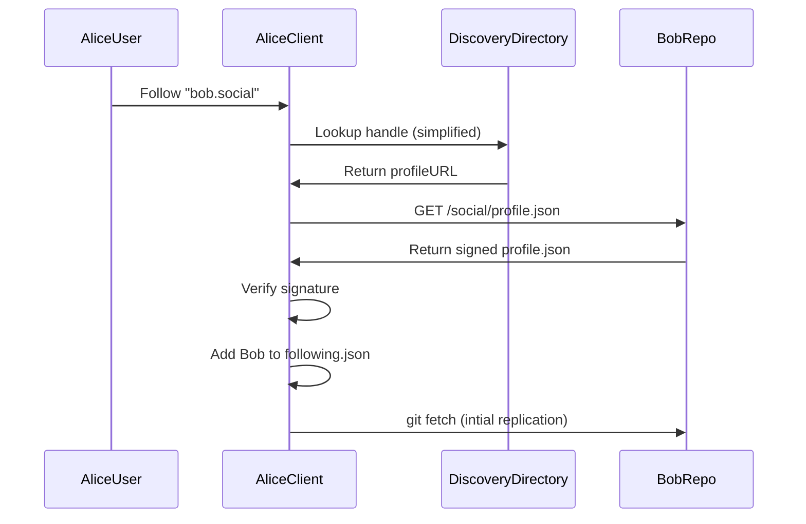
```mermaid
sequenceDiagram
  participant Alice as AliceUser
  participant AliceClient as AliceClient
  participant Directory as DiscoveryDirectory
  participant BobRepo as BobRepo

  Alice ->> AliceClient: Follow "bob.social"
  AliceClient ->> Directory: Lookup handle (simplified)
  Directory ->> AliceClient: Return profileURL

  AliceClient ->> BobRepo: GET /social/profile.json
  BobRepo ->> AliceClient: Return signed profile.json

  AliceClient ->> AliceClient: Verify signature
  AliceClient ->> AliceClient: Add Bob to following.json

  AliceClient ->> BobRepo: git fetch (intial replication)  
```
2. Bob publishes a post
(Simplified version of Posting Workflow)
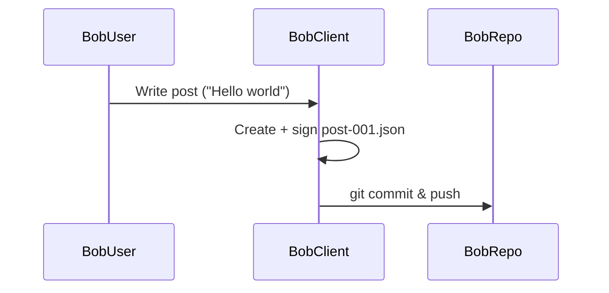
```mermaid
sequenceDiagram
  participant Bob as BobUser
  participant BobClient as BobClient
  participant BobRepo as BobRepo

  Bob ->> BobClient: Write post ("Hello world")
  BobClient ->> BobClient: Create + sign post-001.json
  BobClient ->> BobRepo: git commit & push
```
3. Alice fetches Bob's new post
(Simplified version of Replication Workflow)
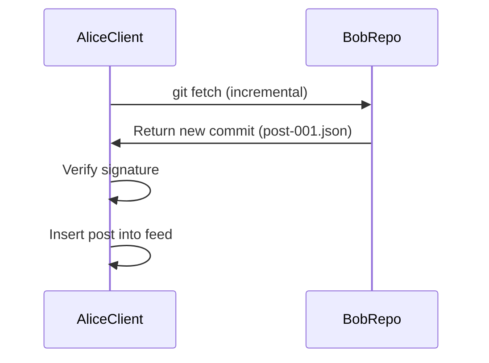
```mermaid
sequenceDiagram
  participant AliceClient as AliceClient
  participant BobRepo as BobRepo

  AliceClient ->> BobRepo: git fetch (incremental)
  BobRepo ->> AliceClient: Return new commit (post-001.json)

  AliceClient ->> AliceClient: Verify signature
  AliceClient ->> AliceClient: Insert post into feed
```
4. Bob replies to his own post (threading begins)
(Simplified version of Reply Action + Threading Workflows)
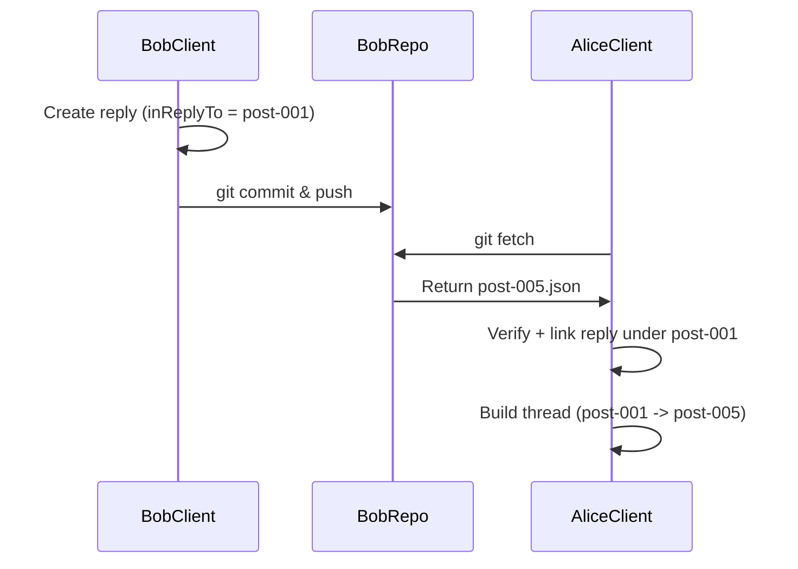
```mermaid
sequenceDiagram
  participant BobClient as BobClient
  participant BobRepo as BobRepo
  participant AliceClient as AliceClient
  
  BobClient ->> BobClient: Create reply (inReplyTo = post-001)
  BobClient ->> BobRepo: git commit & push

  AliceClient ->> BobRepo: git fetch
  BobRepo ->> AliceClient: Return post-005.json

  AliceClient ->> AliceClient: Verify + link reply under post-001
  AliceClient ->> AliceClient: Build thread (post-001 -> post-005)
```
5. Bob publishes a private post (Confidentiality)
(Simplified version of Confidentiality Workflow)
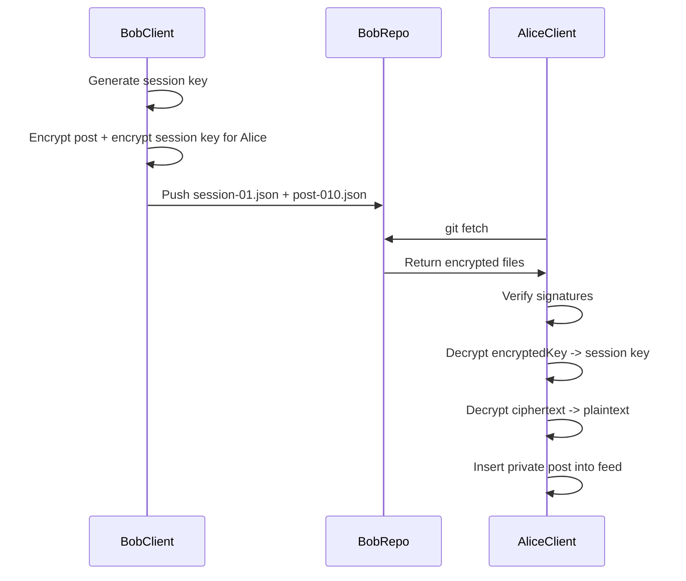
```mermaid
sequenceDiagram
  participant BobClient as BobClient
  participant BobRepo as BobRepo
  participant AliceClient as AliceClient
  
  BobClient ->> BobClient: Generate session key 
  BobClient ->> BobClient: Encrypt post + encrypt session key for Alice
  BobClient ->> BobRepo: Push session-01.json + post-010.json

  AliceClient ->> BobRepo: git fetch
  BobRepo ->> AliceClient: Return encrypted files 

  AliceClient ->> AliceClient: Verify signatures
  AliceClient ->> AliceClient: Decrypt encryptedKey -> session key 
  AliceClient ->> AliceClient: Decrypt ciphertext -> plaintext
  AliceClient ->> AliceClient: Insert private post into feed
```
Alice's feed now contains:
- Bob's public posts
- Bob's replies (threaded)
- Bob's private posts (only visible to her)
Addition simplified workflows not included as diagrams:
Feed Indexing:
- Each repository mantains a lightweight inde.json listing recent post IDs
- After replication, followers read this index to quickly identify new posts without scanning all of /social/actions
- Signatures are still verified on the actual action files. 
Moderation:
- Each user mantains two signed moderation lists under /social/moderation/:
  - blocklist.json: hide posts, replies, likes, and follows from blocked publicKeys
  - trustlist.json: highlight or prioritise posts from trusted publicKeys
During feed construction, the client applies these lists to filter or emphasise actions.
Media Handling 
- Posts may include media stored under /social/media/
- Small files are committed directly; large files use Git LFS pointers
- During feed rendering, the client resolves each media path (normal file or LFS pointer) and dsiplays the media inline.

### Directory Layout (Summary)
Purpose:
Defines a predictable repository tree so clients know exactly where to find identity, actions, moderation lists, indexes, and media. This layout makes replication portable and parsing efficient.

/social/
  profile.json              → per-user identity (signed, global core file)
  following.json            → follow list (defines replication scope, core for feeds)
/social/actions/            → signed social actions
    post-001.json
    reply-005.json
    like-010.json
    follow-020.json
/social/moderation/         → signed blocklists/trustlists
    blocklist.json
    trustlist.json
/social/index.json          → optional feed index for efficiency
/social/media/              → optional folder for binary files (Git LFS or small files)
    photo1.jpg
    video1.lfs
/social/discovery/          → static discovery helpers
    directory.json          → global directory index (auto‑updated, unsigned)

- profile.json -> signed identity file with public key + handle, storedd globally 
- following.json ->  global follow list, core for replication and feed building.
- actions/ -> every social action (post, reply, like, follow), signed individually 
- moderation/ -> blocklist/trustlist JSONs, signed by author
- index.json -> convenience file pointing to recent posts (not signed)
- media/ -> optional folder for bianry files, handled via Git LFS
- discovery/ -> modular folder for all discovery files:
  - directory.json (global index, auto-updated, unsigned)
### Workflows (Summary)
Posting:
- Create JSON object (type: "post")
- Sign with private key
- Save in /social/actions/
- Commit + push
- Followers fetch new commit, verify signature using public key from /social/profile.json, insert into feed

Replying (Threading):
- Create JSON (type: "reply", inReplyTo: parentId)
- Sign with private key
- Save in /social/actions/
- Commit + push
- Followers fetch new commit, /social/profile.json, link reply to parent, traverse DAG, render thread

Following:
- Fetch target's /social/profile.json
- Read public key + repo URL
- Add entry to global /social/following.json
- Start replication via git fetch
- Optionally browse /social/discovery/directory.json for global handles

Replication:
- Client checks repos listed in /social/following.json
- Fetches new commits incrementally 
- Parses new JSON files in /social/actions/
- Verifies signatures using public keys from /social/profile.json
- Updates feed database

Moderation:
- Fetch blocklist/trust lisdt from /social/moderation/
- Verify signature using public keys from /social/profile.json
- Apply rules when rendering feed

Private Posting (Confidentiality):
- For private posts, the author creates one shared session key.
- They encrypt the post with that key.
- They then create a single “session file” that contains the session key encrypted separately for each recipient.
- The post points to that session file using sessionId.
- Followers decrypt the session key once, then use it to decrypt all posts in that session.

Private Posting (Confidentiality)
- For private posts, the author creates one shared session  key.
- They then encrypt the post content with that session key.
- They then create a single “session file” that contains the session key encrypted separately for each recipient.
- The post points to that session file using sessionId.
- Commit + push both files.
- Followers fetch, verify via /social/profile.json, decrypt session key once, then decrypt posts.

