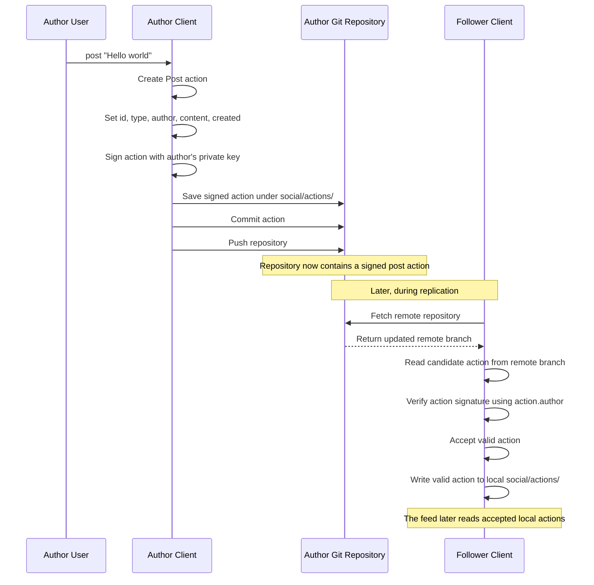
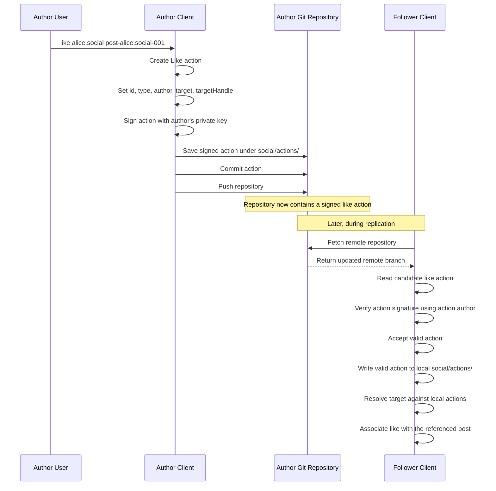
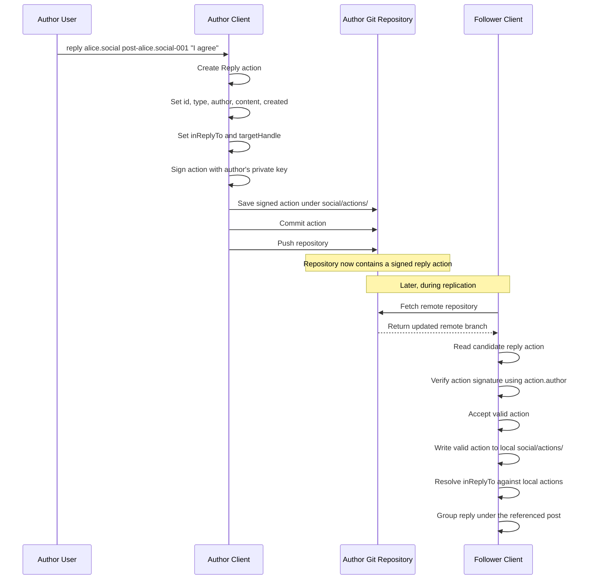
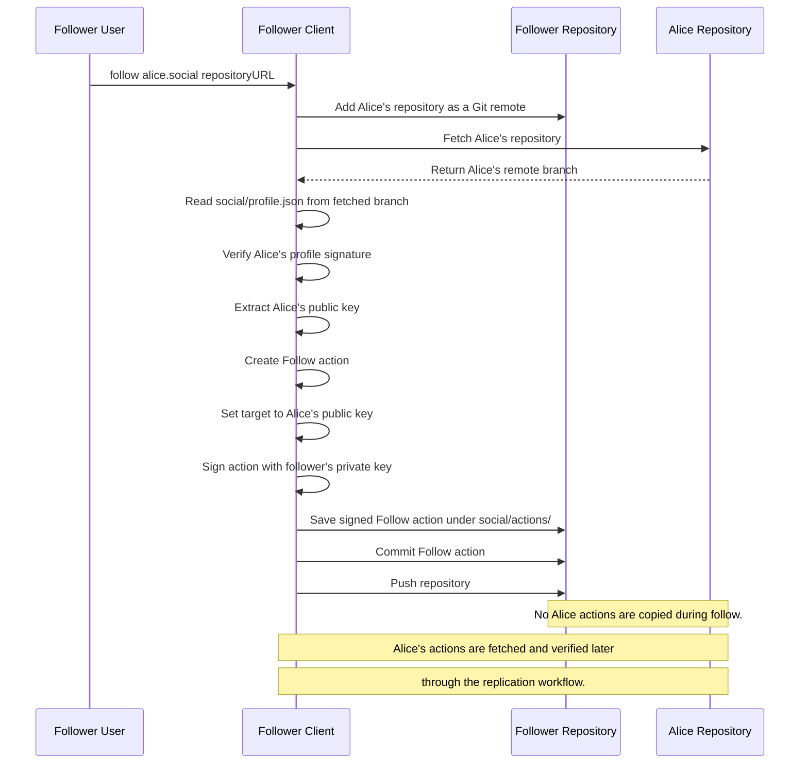
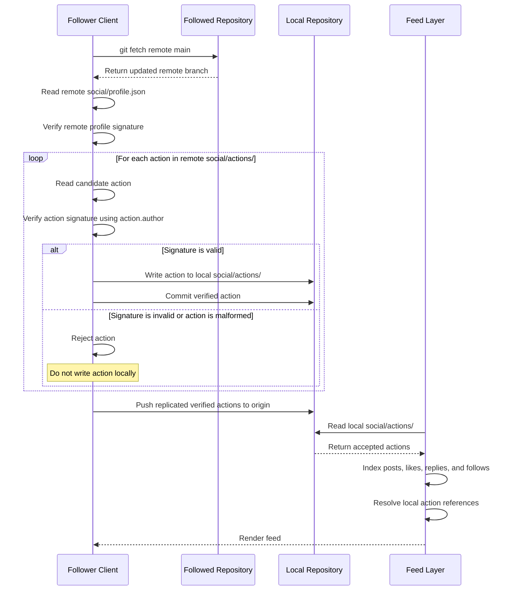
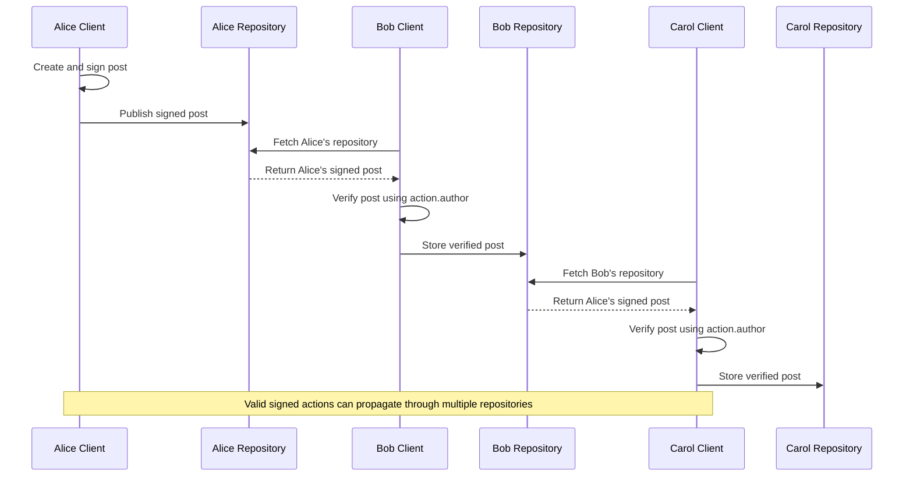

## Post

## Like

## Reply

## Follow

## Replication and Action Acceptance

The replication layer validates actions before accepting them into the local
action store. The feed operates above this layer by reading accepted local
actions, indexing their relationships, and rendering the result.

## Multi-hop Propagation

Actions are verified using the public key in each action's `author` field.
They are not required to match the profile key of the repository currently
relaying them. This allows valid signed actions to propagate through multiple
repositories.

## Protocol Validation Summary

Each social action is signed by its author before being committed to the
author's Git repository. During replication, the receiving client verifies the
remote profile and then validates each candidate action using the public key
specified by the action's `author` field. Only valid actions are written to
the local `social/actions/` directory. Invalid or malformed actions are
rejected before local acceptance.

Because verification is based on the action's own author key rather than the
repository currently relaying the action, valid actions can propagate through
multiple repositories. The feed operates above this protocol layer by reading
accepted local actions, indexing posts, likes, replies, and follows, resolving
local references, and rendering the resulting feed.

The current prototype re-reads and verifies the available action files from
each remote on every replication run. This preserves the validation invariant
but can be optimized in future work by tracking the last processed Git commit
or action identifiers and processing only newly observed actions.
