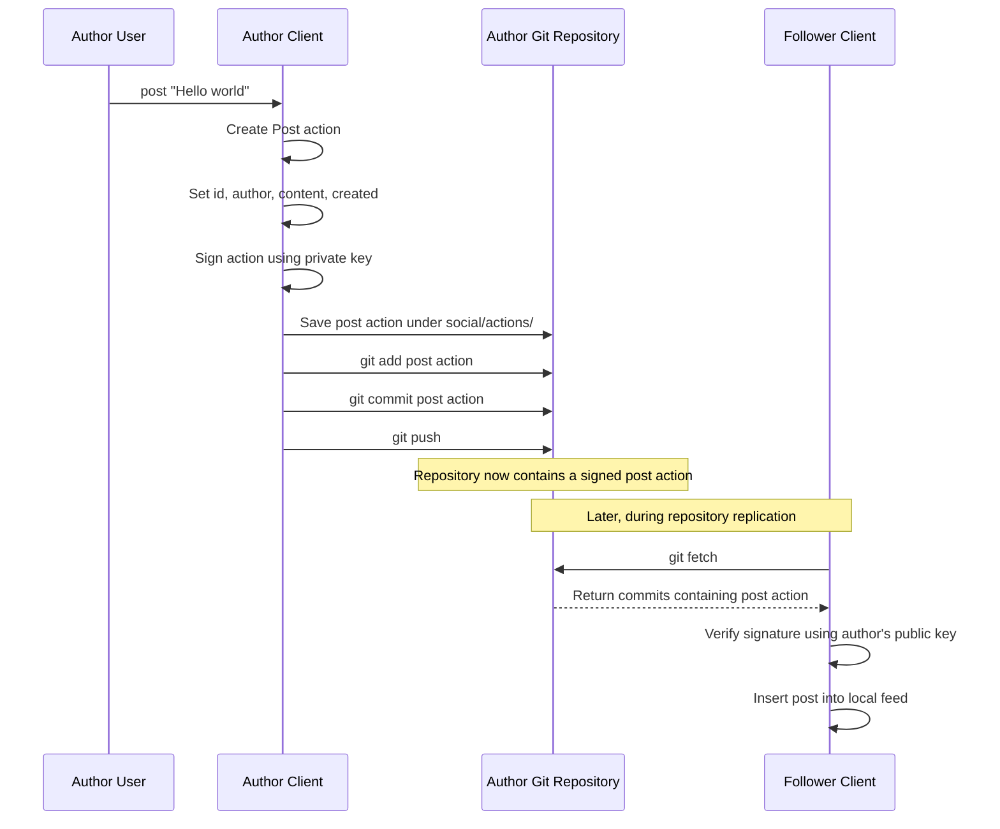
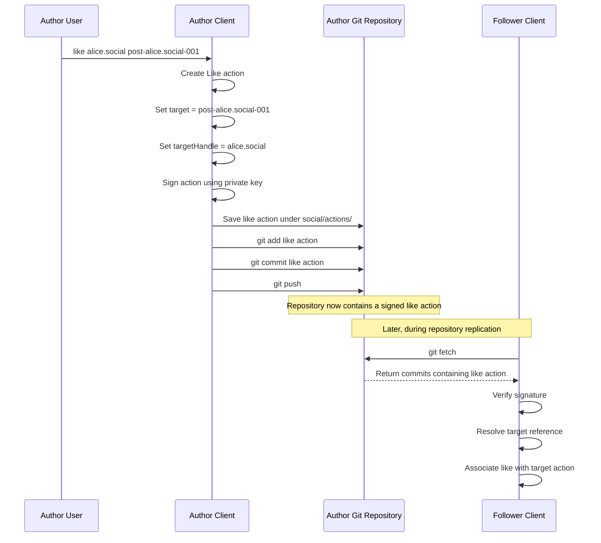
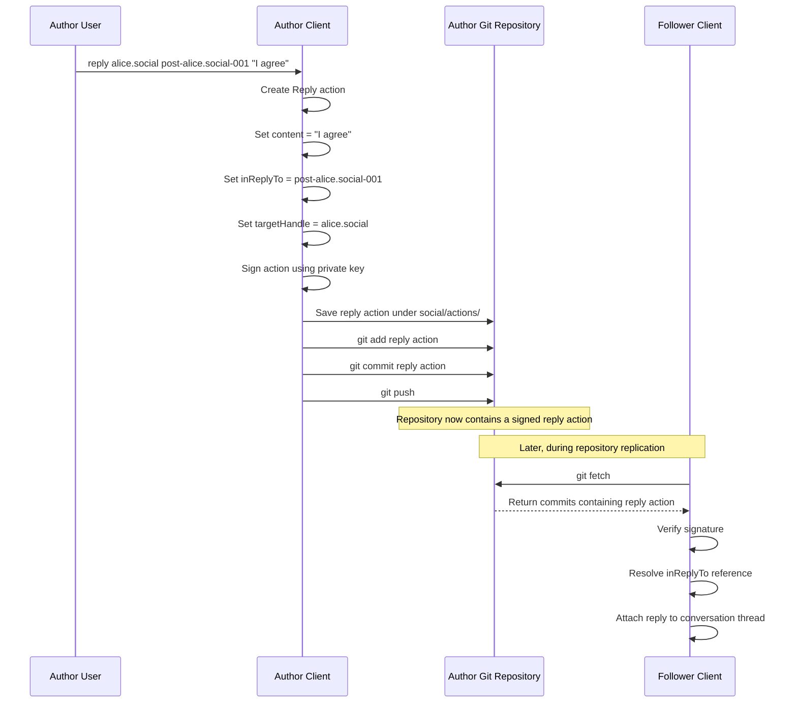
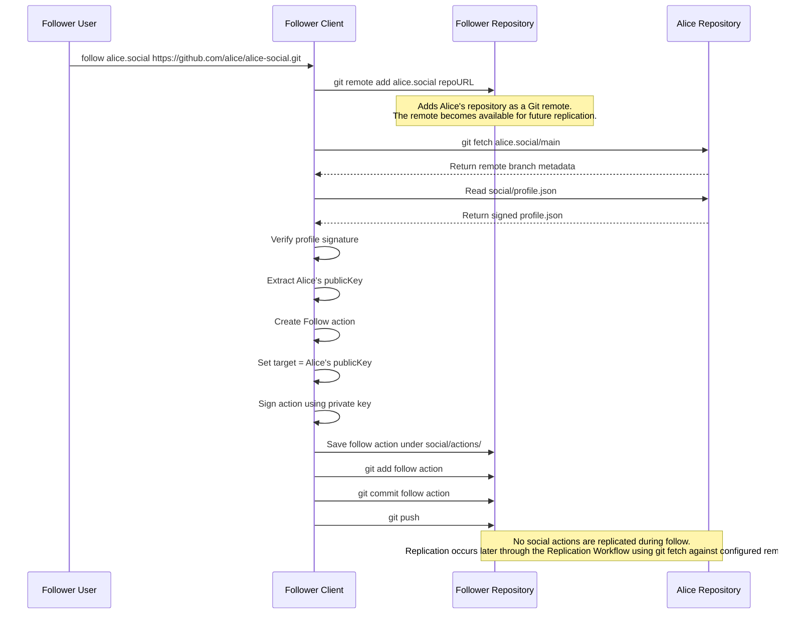

Post:

```mermaid
sequenceDiagram
    participant Author as Author User
    participant Client as Author Client
    participant Repo as Author Git Repository
    participant Follower as Follower Client

    Author->>Client: post "Hello world"

    Client->>Client: Create Post action
    Client->>Client: Set id, author, content, created
    Client->>Client: Sign action using private key

    Client->>Repo: Save post action under social/actions/
    Client->>Repo: git add post action
    Client->>Repo: git commit post action
    Client->>Repo: git push

    Note over Repo: Repository now contains a signed post action

    Note over Repo,Follower: Later, during repository replication

    Follower->>Repo: git fetch
    Repo-->>Follower: Return commits containing post action

    Follower->>Follower: Verify signature using author's public key
    Follower->>Follower: Insert post into local feed
```

Like:

```mermaid
sequenceDiagram
    participant Author as Author User
    participant Client as Author Client
    participant Repo as Author Git Repository
    participant Follower as Follower Client

    Author->>Client: like alice.social post-alice.social-001

    Client->>Client: Create Like action
    Client->>Client: Set target = post-alice.social-001
    Client->>Client: Set targetHandle = alice.social
    Client->>Client: Sign action using private key

    Client->>Repo: Save like action under social/actions/
    Client->>Repo: git add like action
    Client->>Repo: git commit like action
    Client->>Repo: git push

    Note over Repo: Repository now contains a signed like action

    Note over Repo,Follower: Later, during repository replication

    Follower->>Repo: git fetch
    Repo-->>Follower: Return commits containing like action

    Follower->>Follower: Verify signature
    Follower->>Follower: Resolve target reference
    Follower->>Follower: Associate like with target action
```

Reply:

```mermaid
sequenceDiagram
    participant Author as Author User
    participant Client as Author Client
    participant Repo as Author Git Repository
    participant Follower as Follower Client

    Author->>Client: reply alice.social post-alice.social-001 "I agree"

    Client->>Client: Create Reply action
    Client->>Client: Set content = "I agree"
    Client->>Client: Set inReplyTo = post-alice.social-001
    Client->>Client: Set targetHandle = alice.social
    Client->>Client: Sign action using private key

    Client->>Repo: Save reply action under social/actions/
    Client->>Repo: git add reply action
    Client->>Repo: git commit reply action
    Client->>Repo: git push

    Note over Repo: Repository now contains a signed reply action

    Note over Repo,Follower: Later, during repository replication

    Follower->>Repo: git fetch
    Repo-->>Follower: Return commits containing reply action

    Follower->>Follower: Verify signature
    Follower->>Follower: Resolve inReplyTo reference
    Follower->>Follower: Attach reply to conversation thread
```

Follow

```mermaid
sequenceDiagram
    participant User as Follower User
    participant Client as Follower Client
    participant Repo as Follower Repository
    participant Alice as Alice Repository

    User->>Client: follow alice.social https://github.com/alice/alice-social.git

    Client->>Repo: git remote add alice.social repoURL

    Note over Repo: Adds Alice's repository as a Git remote.<br/>The remote becomes available for future replication.

    Client->>Alice: git fetch alice.social/main
    Alice-->>Client: Return remote branch metadata

    Client->>Alice: Read social/profile.json
    Alice-->>Client: Return signed profile.json

    Client->>Client: Verify profile signature
    Client->>Client: Extract Alice's publicKey

    Client->>Client: Create Follow action
    Client->>Client: Set target = Alice's publicKey
    Client->>Client: Sign action using private key

    Client->>Repo: Save follow action under social/actions/
    Client->>Repo: git add follow action
    Client->>Repo: git commit follow action
    Client->>Repo: git push

    Note over Repo,Alice: No social actions are replicated during follow.<br/>Replication occurs later through the Replication Workflow using git fetch against configured remotes.
```
